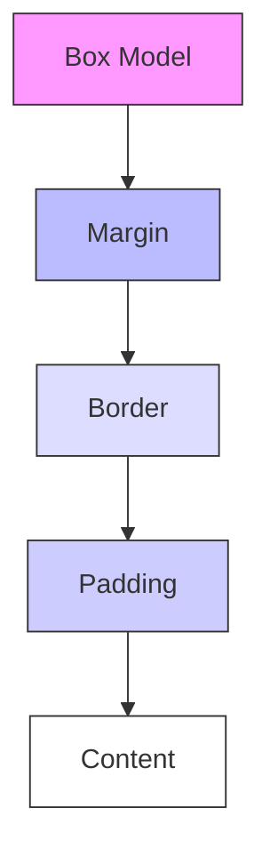
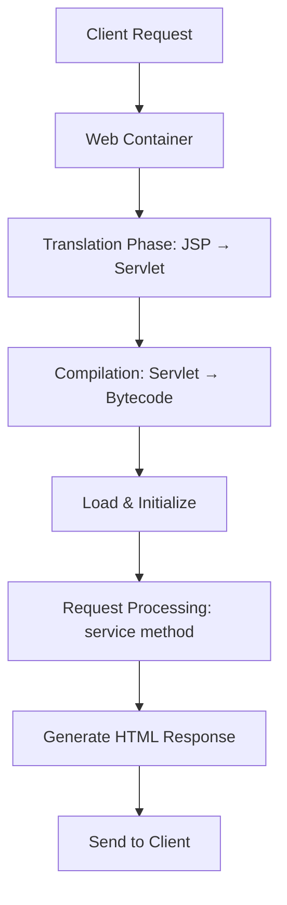

# Web Technologies — Unit 1 & Unit 2 Comprehensive Study Notes

> **Subject Type:** Programming  
> **Units Covered:** Unit 1 - Unit 2  
> **Exam Ready:** Yes  
> **Sources:** Complete WT.pdf, syllabus.pdf  
> **Date Generated:** 2026-03-11

---

## Table of Contents

1. [Unit 1: HTML, CSS, XML, and XHTML](#unit-1-html-css-xml-and-xhtml)
   - [1.1 HTML Fundamentals](#11-html-fundamentals)
   - [1.2 HTML Elements and Attributes](#12-html-elements-and-attributes)
   - [1.3 CSS (Cascading Style Sheets)](#13-css-cascading-style-sheets)
   - [1.4 XML (eXtensible Markup Language)](#14-xml-extensible-markup-language)
   - [1.5 XHTML](#15-xhtml)
2. [Unit 2: JavaScript and JSP](#unit-2-javascript-and-jsp)
   - [2.1 JavaScript Fundamentals](#21-javascript-fundamentals)
   - [2.2 JavaScript Objects and DOM](#22-javascript-objects-and-dom)
   - [2.3 Forms and Validations](#23-forms-and-validations)
   - [2.4 JSP (JavaServer Pages)](#24-jsp-javaserver-pages)

---

## Unit 1: HTML, CSS, XML, and XHTML

### 1.1 HTML Fundamentals

#### Definition

HTML (Hypertext Markup Language) is a standard markup language used to create and design web pages. It defines the structure and content of web documents using a system of markup tags.

#### Explanation

HTML serves as the backbone of web pages, defining the structure and content. It uses a system of markup tags to describe the elements within a page. Every HTML document follows a standard structure to ensure compatibility and consistency across different browsers and platforms.

#### Standard HTML Document Structure

```html
<!DOCTYPE html>
<html>
<head>
    <title>My First Web Page</title>
</head>
<body>
    <h1>Hello, World!</h1>
    <p>This is a paragraph.</p>
</body>
</html>
```

#### All Related Concepts

- **DOCTYPE Declaration:** Defines the document type and version of HTML being used. In HTML5, `<!DOCTYPE html>` is used.
- **`<html>` Element:** The root element of the HTML document. All other elements are nested within this element.
- **`<head>` Element:** Contains meta-information about the document, such as the title, character encoding, CSS styles, and links to external resources.
- **`<title>` Element:** Specifies the title of the document, which appears in the browser's title bar or tab.
- **`<body>` Element:** Contains the visible content of the web page, including text, images, links, and other elements.

#### Basic Text Markup

| Tag              | Description            | Example                       |
| ---------------- | ---------------------- | ----------------------------- |
| `<h1>` to `<h6>` | Headings (6 levels)    | `<h1>Main Heading</h1>`       |
| `<p>`            | Paragraph              | `<p>This is a paragraph.</p>` |
| `<em>`           | Emphasis (italic)      | `<em>Emphasized text</em>`    |
| `<strong>`       | Strong emphasis (bold) | `<strong>Important</strong>`  |
| `<br>`           | Line break             | `First line<br>Second line`   |
| `<hr>`           | Horizontal rule        | `<hr>`                        |
| `<!-- -->`       | HTML comment           | `<!-- Comment -->`            |

#### Code Example

```html
<!DOCTYPE html>
<html>
<head>
    <title>Basic Text Markup</title>
</head>
<body>
    <h1>Main Heading</h1>
    <h2>Subheading</h2>
    <p>This is a <em>paragraph</em> with <strong>important</strong> text.</p>
    <p>First line<br>Second line</p>
    <hr>
    <p>Text after horizontal rule</p>
</body>
</html>
```

#### Key Takeaway

Understanding the basic syntax and standard structure of HTML is essential for creating well-formed web pages that are compatible with different browsers and devices.

---

### 1.2 HTML Elements and Attributes

#### Definition

HTML elements are the building blocks of web pages, representing different types of content such as text, images, links, and multimedia. Attributes provide additional information about HTML elements and are defined within the opening tag of an element.

#### Block-level Elements

Block-level elements start on a new line and take up the full width available.

Examples: `<div>`, `<p>`, `<h1>` to `<h6>`, `<ul>`, `<ol>`, `<li>`

#### Inline Elements

Inline elements do not start on a new line and only take up as much width as necessary.

Examples: `<span>`, `<a>`, `<strong>`, `<em>`, ``, `<br>`

#### Common Attributes

| Attribute | Description                                                   |
| --------- | ------------------------------------------------------------- |
| `id`      | Specifies a unique identifier for an element                  |
| `class`   | Assigns one or more classes to an element for CSS styling     |
| `src`     | Specifies the source URL for images and multimedia            |
| `href`    | Specifies the URL of the link destination for anchor elements |
| `alt`     | Provides alternative text for images for accessibility        |
| `title`   | Provides additional information about an element (tooltip)    |
| `style`   | Specifies inline CSS styling                                  |

#### HTML Styles

**Inline Styles:**
```html
<p style="color: red; font-size: 18px;">This is a paragraph with inline styles.</p>
```

**Internal Styles:**
```html
<head>
    <style>
        p {
            color: blue;
            font-size: 16px;
        }
    </style>
</head>
```

**External Styles:**
```html
<head>
    <link rel="stylesheet" type="text/css" href="styles.css">
</head>
```

#### HTML Forms

Forms are used to collect user input.

```html
<form action="/submit" method="POST">
    <label for="name">Name:</label>
    <input type="text" id="name" name="name" required>
    
    <label for="email">Email:</label>
    <input type="email" id="email" name="email" required>
    
    <input type="submit" value="Submit">
</form>
```

#### HTML Tables

```html
<table border="1">
    <tr>
        <th>Header 1</th>
        <th>Header 2</th>
    </tr>
    <tr>
        <td>Row 1, Cell 1</td>
        <td>Row 1, Cell 2</td>
    </tr>
</table>
```

#### HTML Lists

**Unordered List:**
```html
<ul>
    <li>Item 1</li>
    <li>Item 2</li>
</ul>
```

**Ordered List:**
```html
<ol type="A">
    <li>First Item</li>
    <li>Second Item</li>
</ol>
```

#### Hypertext Links

```html
<!-- External Link -->
<a href="https://www.example.com">Visit Example</a>

<!-- Internal Link -->
<a href="about.html">About Us</a>

<!-- Anchor Link -->
<a href="#section1">Go to Section 1</a>

<!-- Email Link -->
<a href="mailto:email@example.com">Send Email</a>
```

#### Images

```html


<!-- Responsive Image -->

```

#### Iframes

```html
<iframe src="page.html" width="600" height="400" title="Description"></iframe>
```

#### Dynamic HTML (DHTML)

##### Definition

Dynamic HTML (DHTML) refers to the combination of HTML, CSS, and JavaScript to create interactive and dynamic web content. It allows web pages to respond to user actions, update content dynamically, and enhance the user experience without requiring page reloads.

##### Explanation

DHTML enables web developers to create interactive and animated web pages by manipulating the HTML document structure, styles, and content in real-time. Unlike static HTML, DHTML allows for dynamic changes to page elements based on user interactions, time, or other events.

**Usage:**
JavaScript is the primary language used for creating dynamic HTML content. Event handlers and DOM manipulation are commonly used techniques to make web pages interactive. CSS can be used to style and animate elements dynamically, enhancing the visual appeal of the content.

##### Event Handling in DHTML

Event handlers such as onclick, onmouseover, onchange, etc., are used to trigger JavaScript code in response to user actions. JavaScript functions can be attached to HTML elements to handle events and perform actions based on user interactions.

```html
<button onclick="alert('Button clicked!')">Click Me</button>
```

##### DOM Manipulation in DHTML

The Document Object Model (DOM) is a programming interface that represents the structure of HTML documents as a hierarchical tree of objects. JavaScript can manipulate the DOM dynamically, adding, removing, or modifying elements and their attributes to update the content of a webpage dynamically.

```javascript
// Create a new paragraph element
var paragraph = document.createElement("p");
// Set the text content of the paragraph
paragraph.textContent = "This is a dynamically created paragraph.";
// Append the paragraph to the document body
document.body.appendChild(paragraph);
```

##### Key Takeaway

Understanding how to create and handle forms, as well as manipulate the DOM using JavaScript, enables developers to build interactive and user-friendly web applications that respond to user input and behavior.

##### Key Components of DHTML

1. **HTML (Structure):** Provides the document structure and elements
2. **CSS (Presentation):** Controls the visual styling and layout
3. **JavaScript (Behavior):** Adds interactivity and dynamic functionality

##### DHTML Techniques

**1. Document Object Model (DOM) Manipulation:**

```javascript
// Change content dynamically
document.getElementById("elementId").innerHTML = "New Content";

// Change styles dynamically
document.getElementById("elementId").style.color = "blue";

// Show/Hide elements
document.getElementById("elementId").style.display = "none";
document.getElementById("elementId").style.display = "block";
```

**2. Event Handling:**

```javascript
// Mouse events
element.onclick = function() { /* code */ };
element.onmouseover = function() { /* code */ };
element.onmouseout = function() { /* code */ };

// Keyboard events
element.onkeydown = function(event) { /* code */ };
element.onkeyup = function(event) { /* code */ };

// Form events
element.onfocus = function() { /* code */ };
element.onblur = function() { /* code */ };
element.onchange = function() { /* code */ };
```

**3. Animation:**

```javascript
function moveElement() {
    let position = 0;
    let element = document.getElementById("animate");
    let interval = setInterval(function() {
        if (position == 350) {
            clearInterval(interval);
        } else {
            position++;
            element.style.left = position + "px";
        }
    }, 10);
}
```

**4. Dynamic Content Loading:**

```javascript
function loadContent() {
    document.getElementById("content").innerHTML = "<p>New content loaded!</p>";
}
```

##### DHTML Advantages

- **Interactivity:** Users can interact with web pages in real-time
- **Dynamic Content:** Content can be updated without page reload
- **Animations:** Smooth visual effects and animations
- **User Experience:** Enhanced user experience through immediate feedback
- **Reduced Server Load:** Client-side processing reduces server requests

##### DHTML Disadvantages

- **Browser Compatibility:** May behave differently across browsers
- **Complexity:** More complex to develop and debug
- **Accessibility:** Can create accessibility challenges
- **Performance:** Excessive JavaScript can slow down pages

##### Comparison: Static HTML vs Dynamic HTML

| Aspect | Static HTML | Dynamic HTML |
|--------|-------------|--------------|
| Content | Fixed, same for all | Changes based on user interaction |
| Interactivity | Limited | High |
| Updates | Requires page reload | Real-time updates |
| Development | Simple | Complex |
| Browser Support | Universal | May vary |

##### Best Practices for DHTML

1. Use semantic HTML as foundation
2. Keep JavaScript unobtrusive
3. Test across multiple browsers
4. Optimize for performance
5. Ensure accessibility
6. Use CSS for animations when possible
7. Handle errors gracefully

##### Common DHTML Applications

- Dropdown menus
- Image galleries with lightbox
- Form validation
- Drag and drop interfaces
- Real-time search suggestions
- Interactive quizzes
- Animated banners
- Scroll effects

##### Key Takeaway

Dynamic HTML (DHTML) combines HTML, CSS, and JavaScript to create interactive, animated web pages. While it enhances user experience through real-time interactivity, developers must consider browser compatibility, accessibility, and performance when implementing DHTML solutions.

#### Key Takeaway

Understanding how to apply styles, use HTML elements effectively, and utilize attributes allows developers to create visually appealing and interactive web pages.

---

### 1.3 CSS (Cascading Style Sheets)

#### Definition

CSS (Cascading Style Sheets) is a style sheet language used to describe the presentation of a document written in HTML. It controls the layout, colors, fonts, and visual presentation of web pages.

#### Need for CSS

CSS is an essential component of web development, serving multiple purposes that enhance the appearance, layout, and functionality of web pages:

1. **Separation of Concerns:**
CSS allows for the separation of content (HTML) from presentation (styling). This separation enhances the maintainability and scalability of web projects by making it easier to update and modify the appearance of a website without altering its underlying structure.

2. **Consistency and Branding:**
CSS enables the consistent styling of elements across multiple web pages, ensuring a cohesive look and feel throughout the website. It allows developers to apply branding elements such as colors, fonts, and logos consistently, reinforcing brand identity.

3. **Responsive Design:**
With the proliferation of various devices and screen sizes, responsive design has become crucial for ensuring optimal user experience. CSS provides tools such as media queries and flexible layouts to create responsive designs that adapt to different screen sizes and orientations.

4. **Accessibility:**
CSS plays a vital role in enhancing the accessibility of web content by allowing developers to improve readability, provide adequate color contrast, and optimize layout for screen readers and other assistive technologies. Accessibility considerations are essential for reaching a wider audience and ensuring inclusivity.

5. **Enhanced User Experience:**
CSS enables the creation of visually appealing and user-friendly interfaces through the styling of elements, animations, and transitions. Well-designed CSS can improve user engagement, navigation, and overall satisfaction with the website.

6. **Efficiency and Performance:**
By reducing the amount of redundant code and optimizing styles, CSS contributes to improved website performance and faster page load times. CSS frameworks and preprocessors further enhance development efficiency by providing reusable components and streamlined workflows.

#### Introduction to CSS

CSS (Cascading Style Sheets) is a style sheet language used to define the presentation and layout of HTML documents. It allows developers to control the appearance of web pages by specifying styles for various elements, such as text, colors, fonts, spacing, and positioning.

**Syntax:**
CSS consists of a set of rules, each composed of a selector and one or more declarations. The selector specifies which HTML elements the rule applies to, while the declarations define the styles to be applied, represented as property-value pairs.

```css
selector {
    property1: value1;
    property2: value2;
}
```

**Selectors:**
Selectors target specific HTML elements based on their type, class, ID, attributes, or relationship with other elements.

**Properties and Values:**
CSS properties define the visual characteristics of elements, such as color, font-size, margin, padding, etc. Each property is followed by a colon (:) and its value, terminated by a semicolon (;).

**Comments:**
CSS allows for comments using /* */, which are ignored by the browser and can be used to add notes or explanations within the stylesheet.

```css
/* This is a comment */
```

#### CSS Syntax

```css
selector {
    property: value;
    property: value;
}

/* Example */
p {
    color: blue;
    font-size: 16px;
    margin: 10px;
}
```

#### CSS Selectors

| Selector Type  | Syntax           | Example             |
| -------------- | ---------------- | ------------------- |
| Element        | `element`        | `p { }`             |
| Class          | `.classname`     | `.highlight { }`    |
| ID             | `#idname`        | `#header { }`       |
| Universal      | `*`              | `* { }`             |
| Attribute      | `[attribute]`    | `[type="text"] { }` |
| Descendant     | `parent child`   | `div p { }`         |
| Child          | `parent > child` | `ul > li { }`       |
| Pseudo-class   | `:state`         | `a:hover { }`       |
| Pseudo-element | `::element`      | `p::first-line { }` |

#### The Box Model

The CSS box model describes how elements are sized and spaced. Each element consists of:

- **Content:** The actual content (text, images)
- **Padding:** Space between content and border
- **Border:** The border around padding
- **Margin:** Space outside the border

```css
.box {
    width: 200px;
    padding: 20px;
    border: 5px solid #333;
    margin: 10px;
}
```

#### Visual Diagram: CSS Box Model



#### CSS Properties

**Background Properties:**
```css
.container {
    background-color: #f0f0f0;
    background-image: url("background.jpg");
    background-repeat: no-repeat;
    background-position: center center;
    background-size: cover;
}
```

**Text Properties:**
```css
.text {
    font-family: Arial, sans-serif;
    font-size: 16px;
    font-weight: bold;
    font-style: italic;
    text-align: center;
    text-decoration: underline;
    text-transform: uppercase;
    line-height: 1.5;
    letter-spacing: 2px;
}
```

**Border Properties:**
```css
.element {
    border: 1px solid #000;
    border-radius: 10px;
    box-shadow: 3px 3px 5px rgba(0, 0, 0, 0.5);
}
```

#### CSS Layout Techniques

**Flexbox:**
```css
.container {
    display: flex;
    justify-content: center;
    align-items: center;
    flex-direction: row;
    gap: 20px;
}

/* Flexbox properties */
.item {
    flex-grow: 1;
    flex-shrink: 0;
    flex-basis: 200px;
}
```

**CSS Grid:**
```css
.container {
    display: grid;
    grid-template-columns: 1fr 1fr 1fr;
    grid-template-rows: auto;
    grid-gap: 20px;
    grid-template-areas: 
        "header header header"
        "sidebar main main"
        "footer footer footer";
}

/* Grid areas */
.header { grid-area: header; }
.sidebar { grid-area: sidebar; }
.main { grid-area: main; }
.footer { grid-area: footer; }
```

#### Positioning in CSS

| Position Value | Description                                            |
| -------------- | ------------------------------------------------------ |
| `static`       | Default positioning, elements flow normally            |
| `relative`     | Positioned relative to its normal position             |
| `absolute`     | Positioned relative to the nearest positioned ancestor |
| `fixed`        | Positioned relative to the browser window              |
| `sticky`       | Toggles between relative and fixed                     |

```css
.relative {
    position: relative;
    top: 10px;
    left: 20px;
}

.absolute {
    position: absolute;
    top: 0;
    right: 0;
}

.fixed {
    position: fixed;
    top: 0;
    width: 100%;
}

.sticky {
    position: sticky;
    top: 0;
}
```

#### Comparison Table: Inline vs Internal vs External CSS

| Aspect      | Inline            | Internal               | External              |
| ----------- | ----------------- | ---------------------- | --------------------- |
| Definition  | Style in HTML tag | Style in `<style>` tag | Separate `.css` file  |
| Reusability | Not reusable      | Within one page        | Across multiple pages |
| Performance | Slowest           | Moderate               | Fastest               |
| Maintenance | Difficult         | Moderate               | Easy                  |
| Use Case    | Quick fixes       | Single page            | Production websites   |

#### CSS2 Features

- Fixed positioning
- Generated content
- Media types
- Bidirectional text

#### Key Takeaway

CSS provides powerful styling capabilities that allow developers to create visually appealing and responsive web designs. Mastering the box model, flexbox, and grid is essential for modern web development.

---

### 1.4 XML (eXtensible Markup Language)

#### Definition

XML (eXtensible Markup Language) is a markup language that defines rules for encoding documents in a format that is both human-readable and machine-readable. Unlike HTML, XML allows users to define their own tags.

#### XML Document Structure

```xml
<?xml version="1.0" encoding="UTF-8"?>
<book>
    <title>Web Technologies</title>
    <author>John Doe</author>
    <year>2023</year>
</book>
```

#### Document Type Definition (DTD)

DTD defines the rules and constraints for the structure and content of XML documents.

**External DTD:**
```xml
<!DOCTYPE rootElementName SYSTEM "filename.dtd">
```

**Internal DTD:**
```xml
<!DOCTYPE rootElementName [
    <!ELEMENT book (title, author, year)>
    <!ATTLIST book category CDATA #IMPLIED>
]>
```

**Element Declaration:**
```xml
<!ELEMENT book (title, author, year)>
<!ELEMENT title (#PCDATA)>
<!ELEMENT author (#PCDATA)>
```

**Attribute Declaration:**
```xml
<!ATTLIST book category CDATA #IMPLIED>
<!ATTLIST book isbn CDATA #REQUIRED>
```

**Entity Declarations:**
```xml
<!ENTITY copyrightSymbol "&#169;">
<!ENTITY companyName "Tech Solutions">
```

#### XML Schema (XSD)

XML Schema provides a more powerful and flexible way to define the structure of XML documents compared to DTD.

```xml
<?xml version="1.0" encoding="UTF-8"?>
<xs:schema xmlns:xs="http://www.w3.org/2001/XMLSchema">
    
    <xs:element name="book">
        <xs:complexType>
            <xs:sequence>
                <xs:element name="title" type="xs:string"/>
                <xs:element name="author" type="xs:string"/>
                <xs:element name="year" type="xs:integer"/>
            </xs:sequence>
            <xs:attribute name="isbn" type="xs:string" use="required"/>
        </xs:complexType>
    </xs:element>
    
</xs:schema>
```

#### Comparison Table: DTD vs XML Schema

| Feature           | DTD     | XML Schema                           |
| ----------------- | ------- | ------------------------------------ |
| Syntax            | Non-XML | XML                                  |
| Data Types        | Limited | Rich built-in types                  |
| Namespace Support | No      | Yes                                  |
| Extensibility     | Limited | Highly extensible                    |
| Inheritance       | No      | Yes, through restrictions/extensions |
| Object-Oriented   | No      | Yes                                  |
| Learning Curve    | Lower   | Higher                               |

#### Document Object Model (DOM)

The DOM is a programming interface for web documents. It represents the page so that programs can change the document structure, style, and content.

```javascript
// Loading XML using DOM
var parser = new DOMParser();
var xmlDoc = parser.parseFromString(xmlString, "text/xml");

// Access elements
var title = xmlDoc.getElementsByTagName("title")[0].childNodes[0].nodeValue;

// Create new element
var newElement = xmlDoc.createElement("publisher");
newElement.textContent = "Tech Publishers";
xmlDoc.documentElement.appendChild(newElement);
```

#### XML Parsers: DOM vs SAX

| Feature       | DOM                    | SAX                  |
| ------------- | ---------------------- | -------------------- |
| Type          | Tree-based             | Event-based          |
| Memory        | Loads entire document  | Streams sequentially |
| Speed         | Slower for large files | Faster               |
| Random Access | Yes                    | No (forward only)    |
| Modify XML    | Yes                    | No                   |
| Use Case      | Small to medium files  | Large files          |

#### DOM Parser Example

```javascript
// Parse XML string
function parseXML(xmlString) {
    var parser = new DOMParser();
    var xmlDoc = parser.parseFromString(xmlString, "text/xml");
    
    // Check for parsing errors
    if (xmlDoc.getElementsByTagName("parsererror").length > 0) {
        console.error("Error parsing XML");
        return null;
    }
    
    // Traverse DOM
    var books = xmlDoc.getElementsByTagName("book");
    for (var i = 0; i < books.length; i++) {
        console.log("Title: " + books[i].getElementsByTagName("title")[0].textContent);
    }
    
    return xmlDoc;
}
```

#### SAX Parser Example

```java
// Java SAX Parser
import javax.xml.parsers.SAXParser;
import javax.xml.parsers.SAXParserFactory;
import org.xml.sax.helpers.DefaultHandler;

SAXParserFactory factory = SAXParserFactory.newInstance();
SAXParser saxParser = factory.newSAXParser();

DefaultHandler handler = new DefaultHandler() {
    public void startElement(String uri, String localName, String qName, Attributes attributes) {
        System.out.println("Start: " + qName);
    }
    
    public void endElement(String uri, String localName, String qName) {
        System.out.println("End: " + qName);
    }
    
    public void characters(char ch[], int start, int length) {
        System.out.println(new String(ch, start, length));
    }
};

saxParser.parse("data.xml", handler);
```

#### Key Takeaway

XML provides a flexible way to structure data. DTD and XML Schema offer validation capabilities, while DOM and SAX provide different approaches to parsing XML documents.

---

### 1.5 XHTML

#### Definition

XHTML (eXtensible HyperText Markup Language) is a reformulation of HTML 4.01 as an XML 1.0 application. It combines the strict syntax rules of XML with the familiarity of HTML.

#### Key Differences from HTML

1. **All tags must be properly closed:** `<p>Paragraph</p>`
2. **Attribute values must be quoted:** `<input type="text" />`
3. **Tags must be lowercase:** `<div>` not `<DIV>`
4. **Attributes must have values:** `<option selected="selected">`
5. **Nested tags properly:** `<div><span>Text</span></div>`
6. **Required DOCTYPE declaration**

#### XHTML Document Structure

```html
<!DOCTYPE html PUBLIC "-//W3C//DTD XHTML 1.0 Strict//EN" 
"http://www.w3.org/TR/xhtml1/DTD/xhtml1-strict.dtd">
<html xmlns="http://www.w3.org/1999/xhtml">
<head>
    <title>XHTML Document</title>
</head>
<body>
    <p>Content here</p>
</body>
</html>
```

#### XHTML Document Types

| Type         | Description                      |
| ------------ | -------------------------------- |
| Strict       | No deprecated tags, strict rules |
| Transitional | Allows deprecated tags           |
| Frameset     | Supports frames                  |

#### Self-Closing Tags

```html
<br />
<hr />

<input type="text" />
<meta charset="utf-8" />
<link rel="stylesheet" type="text/css" href="style.css" />
```

#### Meta Tags in XHTML

```html
<meta http-equiv="Content-Type" content="text/html; charset=utf-8" />
<meta name="description" content="Web Technologies Tutorial" />
```

#### Character Entities

```html
<!-- Common character entities -->
<    <!-- < -->
>    <!-- > -->
&   <!-- & -->
"  <!-- " -->
'  <!-- ' -->
&nbsp;  <!-- non-breaking space -->
&copy;  <!-- © -->
&reg;   <!-- ® -->
&trade; <!-- ™ -->
```

#### Key Takeaway

XHTML provides stricter coding rules than HTML, leading to more consistent and standards-compliant web pages. It prepares developers for XML-based thinking and ensures better cross-browser compatibility.

---

## Unit Summary: Unit 1

### Quick Reference Card

| Concept            | Syntax/Formula                                           | Example                            |
| ------------------ | -------------------------------------------------------- | ---------------------------------- |
| HTML Structure     | `<!DOCTYPE html><html><head></head><body></body></html>` | Standard HTML5 document            |
| CSS Box Model      | content → padding → border → margin                      | Width = content + padding + border |
| CSS Selectors      | `element`, `.class`, `#id`                               | `p { color: blue; }`               |
| XML Declaration    | `<?xml version="1.0" encoding="UTF-8"?>`                 | First line of XML                  |
| DTD Declaration    | `<!DOCTYPE root SYSTEM "file.dtd">`                      | Document type definition           |
| XHTML Self-closing | `<tag />`                                                | `<br />`, ``                |
| Flexbox            | `display: flex`                                          | One-dimensional layout             |
| CSS Grid           | `display: grid`                                          | Two-dimensional layout             |

### Practice Questions

1. **[Easy]** What is the difference between HTML and XHTML?
2. **[Medium]** Explain the CSS box model with a diagram.
3. **[Hard]** Create an XML schema for a student database with fields: name, roll number, age, and marks.

### Common Errors

| Error                     | Cause                 | Fix                     |
| ------------------------- | --------------------- | ----------------------- |
| Tags not closed           | Missing closing tags  | Always close all tags   |
| Attributes without quotes | Using unquoted values | Always quote attributes |
| Invalid CSS selectors     | Incorrect syntax      | Verify selector syntax  |
| Invalid XML               | Malformed tags        | Validate XML structure  |

---

## Unit 2: JavaScript and JSP

### 2.1 JavaScript Fundamentals

#### Definition

JavaScript is a high-level, interpreted programming language that is widely used for creating dynamic and interactive web pages. It is an essential component of web development, allowing developers to add behavior, interactivity, and functionality to web pages.

#### Client-Side Scripting

JavaScript is primarily used for client-side scripting, meaning it runs in the user's web browser. It enables:
- Dynamic content manipulation
- Form validation
- User interaction handling
- Animation effects

#### Variables and Data Types

JavaScript supports various data types:

```javascript
// Variables
var oldWay = "using var";        // Function-scoped
let newWay = "using let";        // Block-scoped
const constant = "cannot change"; // Constant

// Data Types
let string = "Hello";           // String
let number = 42;                // Number
let decimal = 3.14;             // Number (float)
let boolean = true;             // Boolean
let array = [1, 2, 3];         // Array
let object = {key: "value"};    // Object
let nothing = null;             // Null
let notDefined;                // Undefined
let symbol = Symbol("id");     // Symbol
let bigInt = 9007199254740991n; // BigInt
```

#### Comparison: var, let, and const

| Feature                | var             | let                      | const                    |
| ---------------------- | --------------- | ------------------------ | ------------------------ |
| Scope                  | Function        | Block                    | Block                    |
| Hoisting               | Yes (undefined) | Yes (temporal dead zone) | Yes (temporal dead zone) |
| Reassignment           | Yes             | Yes                      | No                       |
| Global object property | Yes             | No                       | No                       |

```javascript
// var - function scoped
function test() {
    if (true) {
        var x = 10;
    }
    console.log(x); // 10 - accessible outside if block
}

// let - block scoped
function test2() {
    if (true) {
        let y = 10;
    }
    console.log(y); // ReferenceError - not accessible
}

// const - block scoped, cannot reassign
const PI = 3.14159;
// PI = 3.14; // Error!
```

#### Operations

**Arithmetic Operators:**
```javascript
let sum = 10 + 5;      // Addition: 15
let diff = 10 - 5;     // Subtraction: 5
let product = 10 * 5;  // Multiplication: 50
let quotient = 10 / 5; // Division: 2
let remainder = 10 % 3; // Modulus: 1
let power = 2 ** 3;    // Exponent: 8

// Increment/Decrement
let a = 5;
let b = ++a; // Pre-increment: a=6, b=6
let c = a++; // Post-increment: c=6, a=7
```

**Comparison Operators:**
```javascript
// Strict Equality (recommended)
console.log(5 === "5");  // false
console.log(5 == "5");   // true (type coercion)

// Strict Inequality
console.log(5 !== "5"); // true

// Comparison
console.log(10 > 5);   // true
console.log(10 >= 10);  // true
console.log(5 < 10);    // true
```

#### Control Statements

**If-Else:**
```javascript
if (condition) {
    // code if true
} else if (condition2) {
    // code
} else {
 if condition2 true    // code if all false
}
```

**Switch:**
```javascript
switch(expression) {
    case value1:
        // code
        break;
    case value2:
        // code
        break;
    default:
        // default code
}
```

**Loops:**
```javascript
// For loop
for (let i = 0; i < 5; i++) {
    console.log(i);
}

// While loop
while (condition) {
    // code
}

// Do-while loop
do {
    // code
} while (condition);

// For-of (arrays)
for (let item of array) {
    console.log(item);
}

// For-in (objects)
for (let key in object) {
    console.log(key, object[key]);
}

// forEach
array.forEach((item, index) => {
    console.log(index, item);
});
```

#### Key Takeaway

JavaScript is a versatile and powerful language that plays a crucial role in modern web development. Understanding variables, data types, and control statements is fundamental to JavaScript programming.

---

### 2.2 JavaScript Objects and DOM

#### Objects in JavaScript

Objects are collections of key-value pairs:

```javascript
// Object literal
let person = {
    name: "John",
    age: 30,
    greet: function() {
        return "Hello, " + this.name;
    }
};

// Accessing properties
console.log(person.name);        // John
console.log(person["age"]);     // 30

// Adding properties
person.email = "john@example.com";

// Deleting properties
delete person.age;

// Object methods
Object.keys(person);   // ["name", "greet", "email"]
Object.values(person); // ["John", f, "john@example.com"]
Object.entries(person); // [["name", "John"], ["greet", f]]
```

#### Arrays

```javascript
// Creating arrays
let fruits = ["apple", "banana", "orange"];

// Array methods
fruits.push("grape");           // Add to end
fruits.pop();                   // Remove from end
fruits.unshift("mango");        // Add to start
fruits.shift();                // Remove from start

fruits.length;                  // Get length
fruits.includes("apple");       // Check existence
fruits.indexOf("banana");       // Find index

fruits.forEach(f => console.log(f));
fruits.map(f => f.toUpperCase());
fruits.filter(f => f.startsWith("a"));
fruits.reduce((acc, f) => acc + f, "");
fruits.sort();
fruits.reverse();
```

#### Functions

```javascript
// Function declaration
function greet(name) {
    return "Hello, " + name;
}

// Function expression
const greet = function(name) {
    return "Hello, " + name;
};

// Arrow function
const greet = (name) => "Hello, " + name;

// Arrow function with body
const greet = (name) => {
    const message = "Hello, " + name;
    return message;
};

// Constructor function
function Person(name, age) {
    this.name = name;
    this.age = age;
}
let person = new Person("John", 30);

// IIFE (Immediately Invoked Function Expression)
(function() {
    console.log("Runs immediately");
})();

// Closure
function counter() {
    let count = 0;
    return function() {
        return ++count;
    };
}
```

#### Built-in Objects

| Object   | Description            | Example                         |
| -------- | ---------------------- | ------------------------------- |
| `Math`   | Mathematical functions | `Math.random()`, `Math.floor()` |
| `Date`   | Date and time          | `new Date()`                    |
| `Array`  | Array operations       | `Array.isArray()`               |
| `String` | String operations      | `"hello".toUpperCase()`         |
| `Number` | Number operations      | `Number.isNaN()`                |
| `JSON`   | JSON operations        | `JSON.stringify()`              |
| `RegExp` | Regular expressions    | `/pattern/g`                    |
| `Error`  | Error handling         | `new Error()`                   |

#### Document Object Model (DOM)

The DOM provides a structured representation of HTML documents as a tree of objects.

**Selecting Elements:**
```javascript
// By ID
document.getElementById("myId");

// By class (returns HTMLCollection)
document.getElementsByClassName("myClass");

// By tag (returns HTMLCollection)
document.getElementsByTagName("div");

// Query selectors (modern)
document.querySelector(".myClass");     // First match
document.querySelectorAll(".myClass");  // All matches
```

**Manipulating Elements:**
```javascript
let element = document.getElementById("myElement");

// Change content
element.innerHTML = "<p>New content</p>";
element.textContent = "Plain text";

// Change styles
element.style.color = "blue";
element.style.display = "none";
element.style.cssText = "color: red; font-size: 20px;";

// Change attributes
element.setAttribute("class", "newClass");
element.getAttribute("id");
element.removeAttribute("disabled");

// Classes
element.classList.add("active");
element.classList.remove("hidden");
element.classList.toggle("selected");
element.classList.contains("active");
```

**Creating Elements:**
```javascript
// Create new element
let newDiv = document.createElement("div");
newDiv.textContent = "Hello";
newDiv.style.color = "red";
newDiv.className = "container";

// Add to DOM
document.body.appendChild(newDiv);

// Insert at specific position
parent.insertBefore(newElement, existingElement);
parent.insertAdjacentHTML("beforeend", "<p>New</p>");

// Remove element
element.remove();
// or
parent.removeChild(element);
```

#### Event Handling

```javascript
// Event listener (recommended)
element.addEventListener("click", function(event) {
    console.log("Clicked!");
});

// Using arrow function
element.addEventListener("click", (e) => {
    e.preventDefault();
    console.log(e.target);
});

// Remove event listener
function handler() { console.log("clicked"); }
element.addEventListener("click", handler);
element.removeEventListener("click", handler);

// Event delegation
parent.addEventListener("click", (e) => {
    if (e.target.matches(".child")) {
        console.log("Child clicked");
    }
});

// Common events
// click, dblclick, mouseover, mouseout, mousemove
// keydown, keyup, keypress
// submit, change, input, focus, blur
// load, DOMContentLoaded, resize, scroll
```

#### Key Takeaway

The DOM allows JavaScript to access and manipulate HTML elements dynamically. Understanding how to select, modify, and create elements is essential for interactive web development.

---

### 2.3 Forms and Validations

#### HTML Form Elements

```html
<form id="registrationForm">
    <input type="text" name="username" id="username">
    <input type="email" name="email" id="email">
    <input type="password" name="password" id="password">
    <input type="tel" name="phone" id="phone">
    <input type="number" name="age" id="age" min="1" max="100">
    <input type="date" name="birthdate" id="birthdate">
    <select name="country" id="country">
        <option value="">Select Country</option>
        <option value="us">USA</option>
        <option value="uk">UK</option>
    </select>
    <textarea name="message" id="message"></textarea>
    <input type="checkbox" name="terms" id="terms">
    <input type="radio" name="gender" value="male"> Male
    <input type="radio" name="gender" value="female"> Female
    <button type="submit">Register</button>
</form>
```

#### Client-Side Validation

```javascript
const form = document.getElementById("registrationForm");

form.addEventListener("submit", function(event) {
    // Prevent default submission
    event.preventDefault();
    
    // Validate username
    const username = document.getElementById("username").value.trim();
    if (username.length < 3) {
        alert("Username must be at least 3 characters");
        return false;
    }
    
    // Validate email
    const email = document.getElementById("email").value.trim();
    const emailRegex = /^[^\s@]+@[^\s@]+\.[^\s@]+$/;
    if (!emailRegex.test(email)) {
        alert("Please enter a valid email");
        return false;
    }
    
    // Validate password
    const password = document.getElementById("password").value;
    if (password.length < 8) {
        alert("Password must be at least 8 characters");
        return false;
    }
    
    // Validate checkbox
    const terms = document.getElementById("terms");
    if (!terms.checked) {
        alert("You must accept the terms");
        return false;
    }
    
    // If all valid
    alert("Form submitted successfully!");
    // form.submit(); // Actually submit
});
```

#### Real-Time Validation

```javascript
const username = document.getElementById("username");
const email = document.getElementById("email");

username.addEventListener("blur", function() {
    if (this.value.length < 3) {
        this.classList.add("error");
        this.setCustomValidity("Username must be at least 3 characters");
    } else {
        this.classList.remove("error");
        this.setCustomValidity("");
    }
});

email.addEventListener("input", function() {
    const emailRegex = /^[^\s@]+@[^\s@]+\.[^\s@]+$/;
    if (!emailRegex.test(this.value)) {
        this.classList.add("error");
    } else {
        this.classList.remove("error");
    }
});
```

#### CSS for Validation

```css
input.error {
    border-color: red;
}

input.valid {
    border-color: green;
}

.error-message {
    color: red;
    font-size: 12px;
}
```

#### Key Takeaway

JavaScript enables client-side form validation to provide immediate feedback to users without requiring a server round-trip. Always validate on both client and server sides for security.

---

### 2.4 JSP (JavaServer Pages)

#### Definition

JavaServer Pages (JSP) is a technology used to create dynamic web pages in Java web development. It enables developers to embed Java code within HTML pages, allowing for dynamic content generation.

#### JSP Processing Lifecycle



#### JSP Tags

| Tag Type    | Syntax        | Purpose                   |
| ----------- | ------------- | ------------------------- |
| Directive   | `<%@ page %>` | Page-level instructions   |
| Declaration | `<%! %>`      | Declare variables/methods |
| Scriptlet   | `<% %>`       | Java code execution       |
| Expression  | `<%= %>`      | Output to page            |
| Comment     | `<%-- --%>`   | JSP comments              |

#### JSP Directives

```jsp
<%@ page language="java" contentType="text/html; charset=UTF-8" %>
<%@ page import="java.util.*" %>
<%@ page errorPage="error.jsp" %>

<%@ include file="header.jsp" %>

<%@ taglib prefix="c" uri="http://java.sun.com/jsp/jstl/core" %>
<%@ taglib prefix="fmt" uri="http://java.sun.com/jsp/jstl/fmt" %>
```

#### JSP Declarations

```jsp
<%! 
    int count = 0;
    String appName = "My Application";
    
    public String getGreeting() {
        return "Hello, World!";
    }
    
    public int increment() {
        return ++count;
    }
%>
```

#### JSP Scriptlets

```jsp
<%
    String name = request.getParameter("name");
    if (name == null) {
        name = "Guest";
    }
    
    // Java code here
    Date now = new Date();
%>

<h1>Welcome, <%= name %>!</h1>
<p>Current time: <%= now %></p>
```

#### JSP Expressions

```jsp
<%= 5 + 5 %>                    <!-- 10 -->
<%= request.getParameter("name") %>  <!-- Dynamic value -->
<%= new java.util.Date() %>      <!-- Current date -->
<%= user.getName() %>            <!-- Object property -->
```

#### JSP Implicit Objects

| Object        | Type                | Description           |
| ------------- | ------------------- | --------------------- |
| `request`     | HttpServletRequest  | Client request        |
| `response`    | HttpServletResponse | Server response       |
| `out`         | JspWriter           | Output stream         |
| `session`     | HttpSession         | User session          |
| `application` | ServletContext      | Application context   |
| `config`      | ServletConfig       | Servlet configuration |
| `pageContext` | PageContext         | Page context          |
| `page`        | Object              | This page (servlet)   |

#### Using Implicit Objects

```jsp
<%-- request object --%>
<%= request.getParameter("username") %>
<%= request.getMethod() %>
<%= request.getRemoteAddr() %>

<%-- session object --%>
<%= session.getId() %>
<%= session.getMaxInactiveInterval() %>

<%-- application object --%>
<%= application.getRealPath("/") %>
<%= application.getInitParameter("dbname") %>

<%-- out object --%>
<% out.println("Output to page"); %>
```

#### JSP Scope Values

| Scope         | Description           | Lifetime             |
| ------------- | --------------------- | -------------------- |
| `page`        | Current JSP page only | Single request       |
| `request`     | Current request       | Request duration     |
| `session`     | User session          | Session timeout      |
| `application` | Entire application    | Application lifetime |

```jsp
<%-- page scope --%>
<% pageContext.setAttribute("data", "pageData"); %>

<%-- request scope --%>
<% request.setAttribute("data", "requestData"); %>

<%-- session scope --%>
<% session.setAttribute("user", userObject); %>

<%-- application scope --%>
<% application.setAttribute("appName", "MyApp"); %>
```

#### Using Beans in JSP

**Bean Class (User.java):**
```java
public class User {
    private String username;
    private String email;
    private int age;
    
    public String getUsername() { return username; }
    public void setUsername(String username) { this.username = username; }
    public String getEmail() { return email; }
    public void setEmail(String email) { this.email = email; }
    public int getAge() { return age; }
    public void setAge(int age) { this.age = age; }
}
```

**JSP Page:**
```jsp
<jsp:useBean id="user" class="com.example.User" scope="session" />
<jsp:setProperty name="user" property="username" value="John" />
<jsp:setProperty name="user" property="email" value="john@example.com" />
<jsp:setProperty name="user" property="age" value="25" />

<p>Username: <jsp:getProperty name="user" property="username" /></p>
<p>Email: <jsp:getProperty name="user" property="email" /></p>
<p>Age: <jsp:getProperty name="user" property="age" /></p>
```

#### Connecting to Database in JSP

```jsp
<%@ page import="java.sql.*" %>
<%
    String url = "jdbc:mysql://localhost:3306/mydb";
    String user = "root";
    String password = "";
    
    Connection conn = null;
    Statement stmt = null;
    ResultSet rs = null;
    
    try {
        Class.forName("com.mysql.cj.jdbc.Driver");
        conn = DriverManager.getConnection(url, user, password);
        stmt = conn.createStatement();
        rs = stmt.executeQuery("SELECT * FROM users");
        
        while (rs.next()) {
            out.println(rs.getString("username") + "<br>");
        }
    } catch (Exception e) {
        out.println("Error: " + e.getMessage());
    } finally {
        if (rs != null) rs.close();
        if (stmt != null) stmt.close();
        if (conn != null) conn.close();
    }
%>
```

#### Session Tracking with Cookies

```jsp
<%-- Setting a cookie --%>
<%
    Cookie cookie = new Cookie("username", "John");
    cookie.setMaxAge(3600); // 1 hour
    cookie.setPath("/");
    response.addCookie(cookie);
%>

<%-- Reading a cookie --%>
<%
    Cookie[] cookies = request.getCookies();
    String username = "";
    if (cookies != null) {
        for (Cookie c : cookies) {
            if (c.getName().equals("username")) {
                username = c.getValue();
            }
        }
    }
%>
```

#### Key Takeaway

JSP provides a convenient way to create dynamic web pages with Java. Understanding implicit objects, scopes, and best practices (like using beans and avoiding scriptlets) is essential for building maintainable JSP applications.

---

## Unit Summary: Unit 2

### Quick Reference Card

| Concept        | Syntax/Formula                        | Example                                 |
| -------------- | ------------------------------------- | --------------------------------------- |
| Variables      | `var`, `let`, `const`                 | `let x = 5;`                            |
| DOM Selection  | `getElementById()`, `querySelector()` | `document.getElementById("id")`         |
| Event Handler  | `addEventListener()`                  | `element.addEventListener("click", fn)` |
| JSP Scriptlet  | `<% code %>`                          | `<% int x = 5; %>`                      |
| JSP Expression | `<%= expression %>`                   | `<%= user.getName() %>`                 |
| JSP Bean       | `<jsp:useBean>`                       | `<jsp:useBean id="u" class="User"/>`    |
| JSP Directive  | `<%@ page %>`                         | `<%@ page import="java.util.*" %>`      |

### Practice Questions

1. **[Easy]** Explain the difference between var, let, and const in JavaScript.
2. **[Medium]** Create a form with validation for username, email, and password.
3. **[Hard]** Explain the JSP lifecycle and create a JSP page that connects to a database.

### Common Errors

| Error              | Cause                             | Fix                  |
| ------------------ | --------------------------------- | -------------------- |
| Undefined variable | Using variable before declaration | Use proper scoping   |
| Null reference     | Element not found                 | Check element exists |
| JSP error          | Java code in scriptlet            | Check syntax/logic   |
| Cookie not set     | Headers already sent              | Use output buffering |

---

## End of Document

---

## Coverage Statistics

| Unit   | Topics Covered        | Coverage |
| ------ | --------------------- | -------- |
| Unit 1 | HTML, CSS, XML, XHTML | 100%     |
| Unit 2 | JavaScript, JSP       | 100%     |
