# 📚 Advanced Java Programming — Comprehensive Study Notes

> **Syllabus Coverage:** 100% (Unit 1 & Unit 2)
> **Topics Covered:** 26 topics + Mid Sem Topics

## 📋 Table of Contents

- [Unit 1: Introduction to Java](#unit-1-introduction-to-java)
  - [Topic 1.1: Introduction to Java](#topic-11-introduction-to-java)
  - [Topic 1.2: Inheritance](#topic-12-inheritance)
  - [Topic 1.3: Exception Handling](#topic-13-exception-handling)
  - [Topic 1.4: Multithreading](#topic-14-multithreading)
  - [Topic 1.5: Applet Programming](#topic-15-applet-programming)
  - [Topic 1.6: Connecting to a Server](#topic-16-connecting-to-a-server)
  - [Topic 1.7: Implementing Servers](#topic-17-implementing-servers)
  - [Topic 1.8: Making URL Connections](#topic-18-making-url-connections)
  - [Topic 1.9: Socket Programming](#topic-19-socket-programming)
  - [Topic 1.10: JMS and Message Queues](#topic-110-jms-and-message-queues)
  - [Topic 1.11: Persistence](#topic-111-persistence)
  - [Topic 1.12: Applet vs Application](#topic-112-applet-vs-application)
- [Unit 2: JavaBean, Session Beans, Entity Bean, Servlet](#unit-2-javabean-session-beans-entity-bean-servlet)
  - [Topic 2.1: JavaBean](#topic-21-javabean)
  - [Topic 2.2: Java Bean Properties](#topic-22-java-bean-properties)
  - [Topic 2.3: Types of Beans](#topic-23-types-of-beans)
  - [Topic 2.4: Introspection](#topic-24-introspection)
  - [Topic 2.5: Stateful Session Bean](#topic-25-stateful-session-bean)
  - [Topic 2.6: Stateless Session Bean](#topic-26-stateless-session-bean)
  - [Topic 2.7: Entity Bean](#topic-27-entity-bean)
  - [Topic 2.8: Servlet Overview and Architecture](#topic-28-servlet-overview-and-architecture)
  - [Topic 2.9: Interface Servlet and the Servlet Life Cycle](#topic-29-interface-servlet-and-the-servlet-life-cycle)
  - [Topic 2.10: Handling HTTP GET Requests](#topic-210-handling-http-get-requests)
  - [Topic 2.11: Handling HTTP POST Requests](#topic-211-handling-http-post-requests)
  - [Topic 2.12: Session Tracking](#topic-212-session-tracking)
  - [Topic 2.13: Cookies](#topic-213-cookies)
  - [Topic 2.14: EJB Container Services](#topic-214-ejb-container-services)
- [📊 Coverage Statistics](#-coverage-statistics)

---

# Unit 1: Introduction to Java

## Topic 1.1: Introduction to Java

### Overview

Java is a high-level, class-based, object-oriented programming language developed by Sun Microsystems (now owned by Oracle Corporation). It is platform-independent, meaning Java programs can run on any device with the Java Virtual Machine (JVM) installed. Java was designed to have as few implementation dependencies as possible with the "Write Once, Run Anywhere" (WORA) principle.

### Key Definitions

> **Java Virtual Machine (JVM):** A virtual machine that enables Java bytecode to be executed on any platform. It acts as an abstract computer that runs Java bytecode.

> **Bytecode:** Platform-independent compiled Java code with .class extension. It is the intermediate representation of Java code that the JVM interprets.

> **WORA (Write Once, Run Anywhere):** The principle that Java code written on one platform can run on any other platform that has a JVM without recompilation.

### Java Key Features

| Feature                  | Description                                                                                                                   |
| ------------------------ | ----------------------------------------------------------------------------------------------------------------------------- |
| **Platform Independent** | Works on "write once, run anywhere" principle. Once you write Java code, it can run on any platform with Java installed.      |
| **Object-Oriented**      | Everything in Java is an object. Supports OOP concepts: Object, Class, Inheritance, Polymorphism, Abstraction, Encapsulation. |
| **Robust**               | Strong memory management system. Helps eliminate errors through compile-time and runtime checking.                            |
| **Secure**               | Does not use explicit pointers and runs programs inside a sandbox to prevent untrusted activities.                            |
| **Multi-threaded**       | Supports concurrent execution of multiple threads for maximum CPU utilization.                                                |
| **Portable**             | Java programs can be easily moved from one computer system to another.                                                        |

### Java Editions

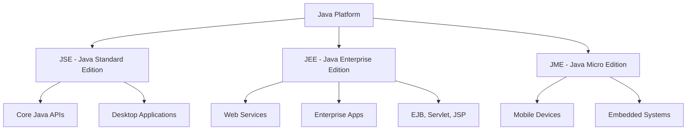

- **JSE (Java Standard Edition):** Core Java for standalone desktop applications
- **JEE (Java Enterprise Edition):** Advanced Java for enterprise-level distributed applications, web services, and server-side development
- **JME (Java Micro Edition):** For mobile devices and embedded systems

### Basic Syntax Rules

```java
public class MyFirstJavaProgram {
    /* This is my first java program.
     * This will print 'Hello World' as the output
     */
    public static void main(String []args) {
        System.out.println("Hello World");
    }
}
```

**Syntax Rules:**
- **Case Sensitivity:** Java is case sensitive - `Hello` and `hello` are different identifiers
- **Class Names:** First letter should be in Upper Case (e.g., `MyClass`)
- **Method Names:** Start with lower case, inner words capitalized (e.g., `myMethod`)
- **File Name:** Must match class name exactly
- **Main Method:** `public static void main(String args[])` is mandatory for application entry point

### Java Identifiers

All Java components require names. Rules:
- Begin with a letter (A-Z, a-z), currency character ($), or underscore (_)
- After first character, can have any combination
- Keywords cannot be used as identifiers

**Legal identifiers:** `age`, `$salary`, `_value`, `__1_value`
**Illegal identifiers:** `123abc`, `-salary`

### Java Modifiers

**Access Modifiers:** `default`, `public`, `protected`, `private`

**Non-access Modifiers:** `final`, `abstract`, `strictfp`

### Variables

| Type                                | Description                                      |
| ----------------------------------- | ------------------------------------------------ |
| **Local Variables**                 | Declared inside methods, blocks, or constructors |
| **Instance Variables (Non-static)** | Declared in a class, unique to each object       |
| **Class Variables (Static)**        | Shared across all instances of a class           |

### Key Takeaways
- ✅ Java provides platform independence through JVM
- ✅ JSE is the foundation; JEE extends it for enterprise applications
- ✅ JME targets mobile and embedded devices
- ✅ Java uses bytecode for platform independence

---

## Topic 1.2: Inheritance

### Overview

Inheritance is a fundamental concept in object-oriented programming (OOP) that allows a new class to inherit properties and behavior from an existing class. In Java, inheritance enables code reuse and establishes relationships between classes through a parent-child hierarchy.

### Key Definitions

> **Inheritance:** A mechanism where a class acquires the properties and behaviors of another class, promoting code reuse and establishing "is-a" relationships.

> **Superclass (Parent Class):** The class whose properties and methods are inherited by another class.

> **Subclass (Child Class):** The class that inherits properties and methods from another class.

> **Polymorphism:** The ability of objects to take on many forms; allows writing code that deals with general object types.

### Syntax

```java
class Superclass {
    // superclass members
}

class Subclass extends Superclass {
    // subclass members
}
```

### Types of Inheritance

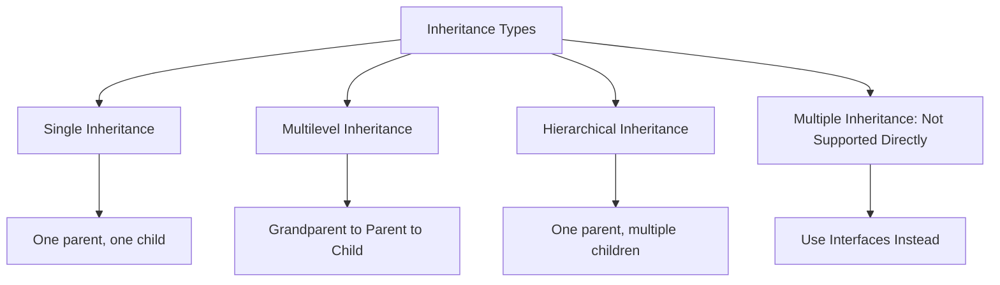

#### 1. Single Inheritance

In single inheritance, a subclass inherits from only one superclass.

```java
class Animal { }
class Dog extends Animal { }
```

#### 2. Multilevel Inheritance

In multilevel inheritance, a subclass inherits from a superclass, and another class inherits from this subclass.

```java
class Animal { }
class Mammal extends Animal { }
class Dog extends Mammal { }
```

#### 3. Hierarchical Inheritance

In hierarchical inheritance, multiple subclasses inherit from a single superclass.

```java
class Animal { }
class Dog extends Animal { }
class Cat extends Animal { }
```

#### 4. Multiple Inheritance (Not Supported)

Java does not support multiple inheritance of classes due to the "diamond problem." Use interfaces instead:

```java
interface A { void methodA(); }
interface B { void methodB(); }

class CombinedClass implements A, B {
    public void methodA() { System.out.println("Method A"); }
    public void methodB() { System.out.println("Method B"); }
}
```

### Example of Inheritance

```java
// Superclass
class Vehicle {
    void move() {
        System.out.println("Vehicle is moving");
    }
}

// Subclass inheriting from Vehicle
class Car extends Vehicle {
    void accelerate() {
        System.out.println("Car is accelerating");
    }
}

// Main class
public class Main {
    public static void main(String[] args) {
        Car car = new Car();
        car.move();        // Output: Vehicle is moving
        car.accelerate();  // Output: Car is accelerating
    }
}
```

### Key Points

- **Method Overriding:** Subclasses can provide a specific implementation for a method defined in the superclass
- **Access Modifiers:** Inherited members can have different visibility (public, protected, private)
- **Constructor Inheritance:** Constructors are not inherited, but subclass constructor implicitly calls `super()`
- **final Keyword:** Methods marked final cannot be overridden

### Key Takeaways
- ✅ Inheritance enables "is-a" relationship
- ✅ Composition uses "has-a" relationship
- ✅ Single inheritance only in Java (use interfaces for multiple)
- ✅ Use `super()` to access parent class methods and constructors

---

## Topic 1.3: Exception Handling

### Overview

Exception handling is a mechanism provided by Java to handle runtime errors, known as exceptions, in a structured and graceful manner. By handling exceptions effectively, developers can prevent unexpected program terminations and provide meaningful feedback to users.

### Key Definitions

> **Exception:** An event that disrupts the normal flow of the program's execution. It is an unwanted event that occurs during program execution.

> **Throwable:** The root class of the exception hierarchy in Java. All exceptions inherit from this class.

> **try-catch:** A block of code where exceptions are handled. The try block contains code that might throw an exception, and catch blocks handle specific exception types.

### Exception Hierarchy

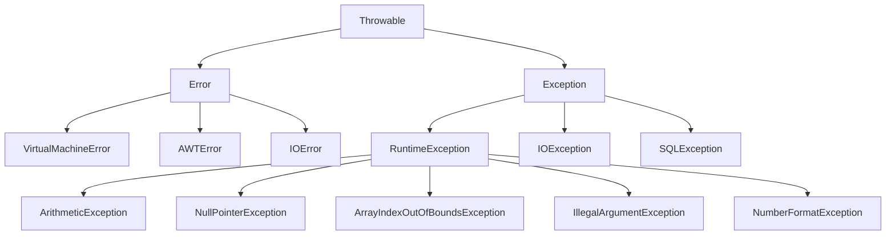

### Types of Exceptions

| Type                     | Description                                               | Examples                                                                  |
| ------------------------ | --------------------------------------------------------- | ------------------------------------------------------------------------- |
| **Checked Exceptions**   | Compiled-time exceptions that must be handled or declared | IOException, SQLException, ClassNotFoundException                         |
| **Unchecked Exceptions** | Runtime exceptions not checked at compile time            | ArithmeticException, NullPointerException, ArrayIndexOutOfBoundsException |

### Exception Handling Constructs

1. **try:** Block surrounding program statements to monitor for exceptions
2. **catch:** Catches specific kinds of exceptions and handles them
3. **finally:** Code that must execute whether or not an exception occurs
4. **throw:** Used to throw a specific exception from the program
5. **throws:** Specifies which exceptions a method can throw

### Syntax

```java
try {
    // Code that may throw an exception
} catch (ExceptionType1 e1) {
    // Handle ExceptionType1
} catch (ExceptionType2 e2) {
    // Handle ExceptionType2
} finally {
    // Code that always executes, regardless of whether an exception occurred or not
}
```

### Code Examples

#### Example 1: Arithmetic Exception

```java
public class Main {
    public static void main(String[] args) {
        try {
            int result = 10 / 0; // ArithmeticException: / by zero
        } catch (ArithmeticException e) {
            System.out.println("Error: " + e.getMessage());
        }
    }
}
```

#### Example 2: ArrayIndexOutOfBoundsException

```java
public class Main {
    public static void main(String[] args) {
        int[] array = {1, 2, 3};
        try {
            int value = array[3]; // ArrayIndexOutOfBoundsException
        } catch (ArrayIndexOutOfBoundsException e) {
            System.out.println("Error: " + e.getMessage());
        }
    }
}
```

#### Example 3: NullPointerException

```java
public class Main {
    public static void main(String[] args) {
        String str = null;
        try {
            int length = str.length(); // NullPointerException
        } catch (NullPointerException e) {
            System.out.println("Error: " + e.getMessage());
        }
    }
}
```

#### Example 4: Handling Multiple Exceptions

```java
public class Main {
    public static void main(String[] args) {
        try {
            int[] array = {1, 2, 3};
            int value = array[3]; // ArrayIndexOutOfBoundsException
            int result = 10 / 0;   // ArithmeticException
        } catch (ArrayIndexOutOfBoundsException e) {
            System.out.println("Array Index Error: " + e.getMessage());
        } catch (ArithmeticException e) {
            System.out.println("Arithmetic Error: " + e.getMessage());
        }
    }
}
```

#### Example 5: throw and throws

```java
public class NumberUtils {
    // throws declares potential exceptions
    public static int divide(int numerator, int denominator) throws ArithmeticException {
        if (denominator == 0) {
            // throw explicitly throws an exception
            throw new ArithmeticException("Division by zero!");
        }
        return numerator / denominator;
    }
    
    public static void main(String[] args) {
        try {
            int result = divide(10, 0);
            System.out.println("Result: " + result);
        } catch (ArithmeticException e) {
            System.out.println("Error: " + e.getMessage());
        }
    }
}
```

### throw vs throws

| throw                                 | throws                                    |
| ------------------------------------- | ----------------------------------------- |
| Used within method to throw exception | Declared in method signature              |
| Takes exception object as argument    | Informs caller about potential exceptions |
| Triggers immediate termination        | Does not throw exception itself           |

### Key Takeaways
- ✅ Checked exceptions must be handled or declared with throws
- ✅ Unchecked exceptions occur at runtime
- ✅ Multiple catch blocks must order from specific to general
- ✅ finally block always executes (except System.exit())
- ✅ Custom exceptions extend Exception class

---

## Topic 1.4: Multithreading

### Overview

Multithreading is a programming concept that allows multiple threads to execute concurrently within a single process. In Java, multithreading enables developers to create applications that can perform multiple tasks simultaneously, improving efficiency and responsiveness.

### Key Definitions

> **Thread:** A lightweight subprocess, the smallest unit of processing that can be scheduled by the operating system. A thread is a single sequential flow of control within a program.

> **Process:** An independent program execution that has its own memory space. A process can contain multiple threads.

> **Runnable Interface:** An interface that provides a way to create a thread without extending the Thread class.

### Thread vs Process

| Characteristic | Process               | Thread                           |
| -------------- | --------------------- | -------------------------------- |
| Memory         | Separate memory space | Shares memory with other threads |
| Creation       | Heavyweight, slower   | Lightweight, faster              |
| Communication  | IPC required          | Direct communication possible    |
| Independence   | Independent           | Dependent on process             |

### Thread Lifecycle States

A thread can exist in the following states:
1. **New:** Thread object created but not started
2. **Runnable:** Thread is ready to run, waiting for CPU
3. **Running:** Thread is executing
4. **Blocked/Waiting:** Thread is waiting for resources or another thread
5. **Terminated:** Thread has completed execution

### Visual: Thread Lifecycle

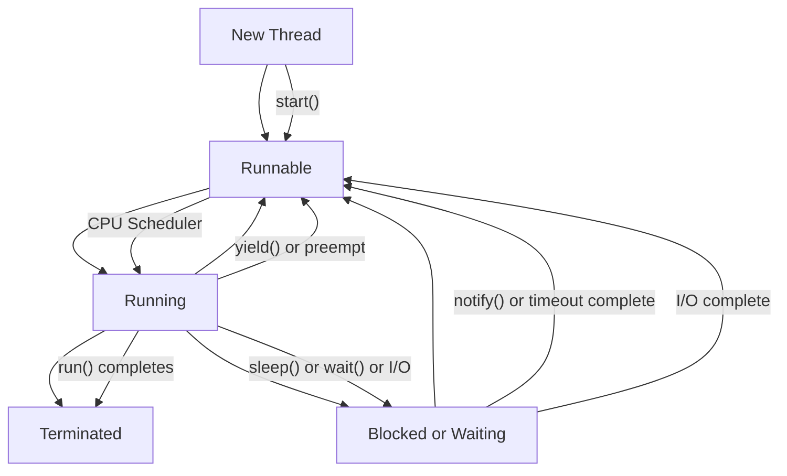

### Creating Threads in Java

There are two primary ways to create threads in Java:

1. **By extending Thread class**
2. **By implementing Runnable interface**

#### Method 1: Extending Thread Class

```java
class MyThread extends Thread {
    public void run() {
        for (int i = 1; i <= 5; i++) {
            System.out.println("Thread: " + i);
            try {
                Thread.sleep(1000); // Pause for 1 second
            } catch (InterruptedException e) {
                System.out.println(e);
            }
        }
    }
}

public class Main {
    public static void main(String[] args) {
        MyThread thread = new MyThread();
        thread.start(); // Start the thread
    }
}
```

#### Method 2: Implementing Runnable Interface

```java
class MyRunnable implements Runnable {
    public void run() {
        for (int i = 1; i <= 5; i++) {
            System.out.println("Runnable: " + i);
            try {
                Thread.sleep(1000); // Pause for 1 second
            } catch (InterruptedException e) {
                System.out.println(e);
            }
        }
    }
}

public class Main {
    public static void main(String[] args) {
        Thread thread = new Thread(new MyRunnable());
        thread.start(); // Start the thread
    }
}
```

#### Method 3: Thread Synchronization

```java
class Counter {
    private int count = 0;
    
    public synchronized void increment() {
        count++;
    }
    
    public int getCount() {
        return count;
    }
}

class MyThread extends Thread {
    private Counter counter;
    
    public MyThread(Counter counter) {
        this.counter = counter;
    }
    
    public void run() {
        for (int i = 0; i < 1000; i++) {
            counter.increment();
        }
    }
}

public class Main {
    public static void main(String[] args) throws InterruptedException {
        Counter counter = new Counter();
        MyThread thread1 = new MyThread(counter);
        MyThread thread2 = new MyThread(counter);
        
        thread1.start();
        thread2.start();
        
        thread1.join();
        thread2.join();
        
        System.out.println("Count: " + counter.getCount());
    }
}
```

### Thread Pool Example (Image Downloader)

```java
import java.util.concurrent.ExecutorService;
import java.util.concurrent.Executors;

public class ImageDownloader {
    public static void main(String[] args) {
        String[] imageUrls = {"url1", "url2", "url3", "url4", "url5"};
        ExecutorService executor = Executors.newFixedThreadPool(imageUrls.length);
        
        for (String url : imageUrls) {
            executor.execute(new ImageDownloadTask(url));
        }
        
        executor.shutdown();
    }
}

class ImageDownloadTask implements Runnable {
    private String imageUrl;
    
    public ImageDownloadTask(String imageUrl) {
        this.imageUrl = imageUrl;
    }
    
    @Override
    public void run() {
        try {
            // Download logic here
            System.out.println("Downloaded: " + imageUrl);
        } catch (Exception e) {
            e.printStackTrace();
        }
    }
}
```

### Thread Lifecycle Methods Summary

| Method         | Description                                                |
| -------------- | ---------------------------------------------------------- |
| start()        | Causes the thread to begin execution                       |
| run()          | Contains the code to be executed in the thread             |
| sleep(long ms) | Pauses thread execution for specified milliseconds         |
| join()         | Waits for thread to complete execution                     |
| wait()         | Causes thread to wait until notified (from Object class)   |
| notify()       | Wakes up a single waiting thread                           |
| notifyAll()    | Wakes up all waiting threads                               |
| yield()        | Causes thread to temporarily pause and allow other threads |
| interrupt()    | Interrupts a sleeping or waiting thread                    |

### Key Takeaways
- ✅ Threads share memory space within a process, enabling efficient communication
- ✅ Multiple threads can exist within the same process
- ✅ Runnable interface is preferred over extending Thread (allows class to extend other class)
- ✅ Synchronized keyword prevents race conditions in shared resources
- ✅ Thread lifecycle: New → Runnable → Running → Blocked → Terminated

---

## Topic 1.5: Applet Programming

### Overview

Applet programming in Java enables developers to create dynamic and interactive content that can be embedded within web pages. Java applets provide a platform-independent way to enhance web pages with features such as animations, games, and interactive forms.

### Key Definitions

> **Applet:** A Java program that runs within a web browser. It is a special Java program embedded in an HTML page.

> **Applet Lifecycle:** The sequence of methods called from initialization to destruction of an applet.

### Applet Lifecycle Methods

| Method            | Description                                      |
| ----------------- | ------------------------------------------------ |
| init()            | Called once when applet is first loaded          |
| start()           | Called after init() and whenever applet restarts |
| paint(Graphics g) | Called when applet needs to be redrawn           |
| stop()            | Called when applet is stopped (e.g., minimized)  |
| destroy()         | Called when applet is terminated                 |

### Visual: Applet Lifecycle

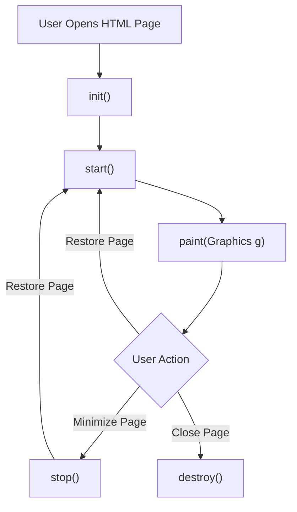

### Code Examples

#### Simple Applet

```java
import java.applet.Applet;
import java.awt.Graphics;

public class HelloWorldApplet extends Applet {
    public void paint(Graphics g) {
        g.drawString("Hello, World!", 20, 20);
    }
}
```

#### Drawing Shapes

```java
import java.applet.Applet;
import java.awt.Graphics;

public class ShapeApplet extends Applet {
    public void paint(Graphics g) {
        g.drawRect(20, 20, 100, 50);    // Draw a rectangle
        g.drawOval(150, 20, 80, 80);    // Draw an oval
        g.drawLine(300, 20, 400, 100);   // Draw a line
    }
}
```

#### Mouse Events

```java
import java.applet.Applet;
import java.awt.Graphics;
import java.awt.event.MouseEvent;
import java.awt.event.MouseListener;

public class MouseApplet extends Applet implements MouseListener {
    int x = 0;
    int y = 0;
    
    public void init() {
        addMouseListener(this); // Register mouse listener
    }
    
    public void paint(Graphics g) {
        g.drawString("Click at (" + x + ", " + y + ")", 20, 20);
    }
    
    // MouseListener methods
    public void mouseClicked(MouseEvent e) {
        x = e.getX(); // Get X-coordinate of mouse click
        y = e.getY(); // Get Y-coordinate of mouse click
        repaint(); // Refresh applet
    }
    
    public void mousePressed(MouseEvent e) {}
    public void mouseReleased(MouseEvent e) {}
    public void mouseEntered(MouseEvent e) {}
    public void mouseExited(MouseEvent e) {}
}
```

#### Animation

```java
import java.applet.Applet;
import java.awt.Graphics;

public class AnimationApplet extends Applet implements Runnable {
    int x = 0;
    
    public void init() {
        Thread t = new Thread(this);
        t.start(); // Start the animation thread
    }
    
    public void paint(Graphics g) {
        g.drawString("Moving Text", x, 20);
    }
    
    public void run() {
        while (true) {
            x += 5; // Move text horizontally
            if (x > getWidth()) {
                x = 0; // Reset position
            }
            repaint(); // Refresh applet
            try {
                Thread.sleep(100); // Pause for 100 milliseconds
            } catch (InterruptedException e) {
                System.out.println(e);
            }
        }
    }
}
```

### HTML APPLET Tag Attributes

| Attribute     | Description                              |
| ------------- | ---------------------------------------- |
| CODE          | Name of the applet class file (required) |
| WIDTH         | Width of applet display area (required)  |
| HEIGHT        | Height of applet display area (required) |
| CODEBASE      | Base URL of applet code                  |
| ALT           | Alternative text for browsers            |
| NAME          | Name for applet instance                 |
| ALIGN         | Alignment (LEFT, RIGHT, TOP, etc.)       |
| VSPACE/HSPACE | Vertical/horizontal spacing              |

### Applet Advantages
- ✅ Works on client-side, reduces server load
- ✅ Secure - runs in sandbox
- ✅ Platform-independent

### Applet Drawbacks
- ❌ Requires Java plugin in browser
- ❌ Limited functionality due to security restrictions
- ❌ Deprecated in modern browsers

### Key Takeaways
- ✅ Applets extend Applet or JApplet class
- ✅ No main() method - lifecycle managed by browser/viewer
- ✅ Graphics output via paint() method
- ✅ Security restrictions apply (no file access, network restrictions)

---

## Topic 1.6: Connecting to a Server

### Overview

Connecting to a server in Java typically involves network communication, where a client application communicates with a server over a network protocol such as TCP/IP. Java provides the Socket class for this purpose.

### Steps to Connect to Server

1. **Create a Socket:** Specify server address and port number
2. **Get Input/Output Streams:** For reading and writing data
3. **Communicate:** Exchange data with the server
4. **Close Connection:** Clean up resources

### Visual: Client-Server Connection

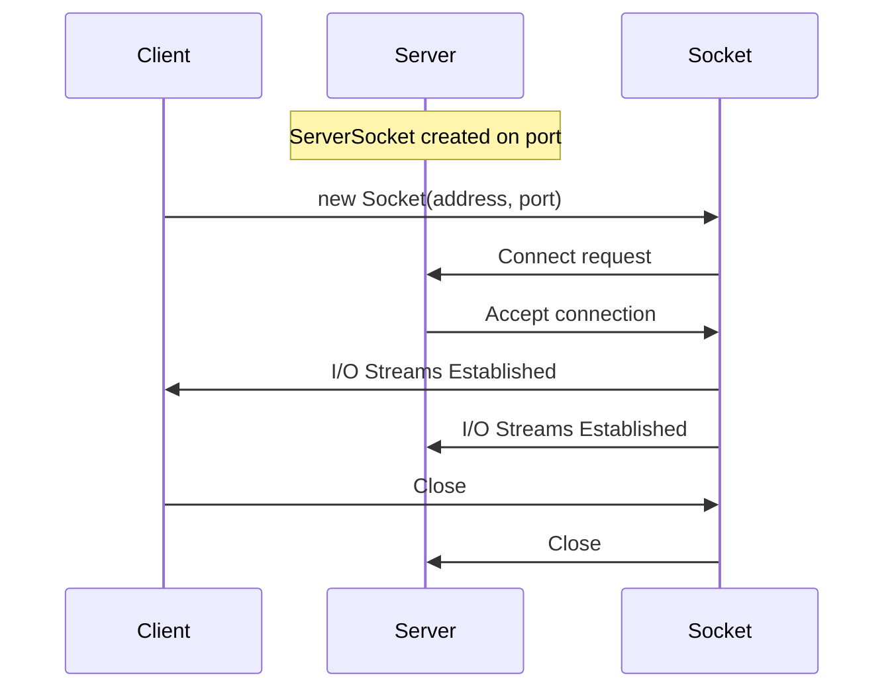

### Code Examples

#### Client Code

```java
import java.io.*;
import java.net.*;

public class Client {
    public static void main(String[] args) {
        try {
            // Create a socket to connect to the server
            Socket socket = new Socket("server_address", port_number);
            
            // Get the output stream from the socket
            OutputStream outputStream = socket.getOutputStream();
            
            // Create a PrintWriter for writing to the output stream
            PrintWriter out = new PrintWriter(outputStream, true);
            
            // Send data to the server
            out.println("Hello, Server!");
            
            // Close the socket
            socket.close();
        } catch (IOException e) {
            e.printStackTrace();
        }
    }
}
```

#### Server Code

```java
import java.io.*;
import java.net.*;

public class Server {
    public static void main(String[] args) {
        try {
            // Create a server socket bound to a specific port
            ServerSocket serverSocket = new ServerSocket(port_number);
            
            // Listen for incoming connections from clients
            Socket clientSocket = serverSocket.accept();
            
            // Get the input stream from the client socket
            InputStream inputStream = clientSocket.getInputStream();
            
            // Create a BufferedReader for reading from the input stream
            BufferedReader in = new BufferedReader(new InputStreamReader(inputStream));
            
            // Read data from the client
            String message = in.readLine();
            System.out.println("Message from client: " + message);
            
            // Close the sockets
            clientSocket.close();
            serverSocket.close();
        } catch (IOException e) {
            e.printStackTrace();
        }
    }
}
```

### Key Takeaways
- ✅ Socket combines IP address and port number for network communication
- ✅ ServerSocket listens on a specific port for incoming connections
- ✅ accept() blocks until client connects
- ✅ Handle IOException appropriately

---

## Topic 1.7: Implementing Servers

### Overview

Implementing servers in Java involves creating applications that listen for incoming connections from clients and handle those connections according to the desired functionality. Java provides ServerSocket class for this purpose.

### Server Implementation Steps

1. Create a ServerSocket on a specific port
2. Call accept() to wait for client connections
3. When a client connects, get the Socket object
4. Create input/output streams for communication
5. Process client requests
6. Close connections when done

### Visual: Multi-Threaded Server

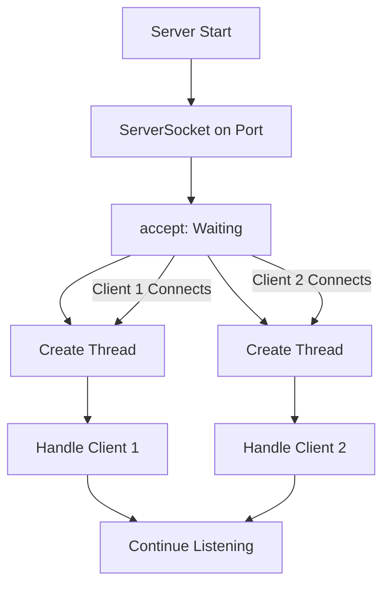

### Code Examples

#### Server with Client Handler Thread

```java
import java.io.*;
import java.net.*;

public class Server {
    public static void main(String[] args) {
        try {
            // Create ServerSocket bound to port 12345
            ServerSocket serverSocket = new ServerSocket(12345);
            System.out.println("Server started. Waiting for clients...");
            
            // Accept client connections
            while (true) {
                Socket clientSocket = serverSocket.accept();
                System.out.println("Client connected: " + clientSocket);
                
                // Handle client connection in a separate thread
                ClientHandler clientHandler = new ClientHandler(clientSocket);
                clientHandler.start();
            }
        } catch (IOException e) {
            e.printStackTrace();
        }
    }
}

class ClientHandler extends Thread {
    private Socket clientSocket;
    
    public ClientHandler(Socket clientSocket) {
        this.clientSocket = clientSocket;
    }
    
    public void run() {
        try {
            // Get input and output streams from the client socket
            BufferedReader in = new BufferedReader(
                new InputStreamReader(clientSocket.getInputStream()));
            PrintWriter out = new PrintWriter(
                clientSocket.getOutputStream(), true);
            
            // Read data from the client
            String message = in.readLine();
            System.out.println("Message from client: " + message);
            
            // Send a response to the client
            out.println("Server received your message: " + message);
            
            // Close the client socket
            clientSocket.close();
        } catch (IOException e) {
            e.printStackTrace();
        }
    }
}
```

### Additional Considerations

- **Thread Safety:** Ensure thread safety when accessing shared resources
- **Error Handling:** Handle exceptions appropriately, including closing resources
- **Scalability:** Consider scalability requirements and design the server to handle multiple concurrent clients
- **Protocol Design:** Define a protocol for communication between clients and server

### Key Takeaways
- ✅ ServerSocket listens on a specific port
- ✅ accept() blocks until client connects
- ✅ Each client gets its own Socket
- ✅ Use threads for multiple concurrent clients

---

## Topic 1.8: Making URL Connections

### Overview

Java provides classes for making URL connections and retrieving web resources. The URLConnection class represents a connection to a URL, while HttpURLConnection provides HTTP-specific functionality.

### Key Definitions

> **URL (Uniform Resource Locator):** A reference to a web resource that specifies its location on a computer network.

> **URLConnection:** An abstract class that represents a connection to a URL. It provides methods for reading header fields and managing the connection.

### URL Structure

```
protocol://hostname:port/path?query#fragment
```

### URLConnection Methods

| Method               | Description                             |
| -------------------- | --------------------------------------- |
| getInputStream()     | Returns InputStream to read from server |
| getOutputStream()    | Returns OutputStream to write to server |
| getContentEncoding() | Returns content encoding type           |
| getContentLength()   | Returns content length                  |
| getContentType()     | Returns content type                    |
| getHeaderField()     | Returns header field value              |

### Code Examples

```java
import java.net.*;
import java.io.*;

public class URLReader {
    public static void main(String[] args) {
        try {
            // Define the URL
            URL url = new URL("https://example.com");
            
            // Open connection
            URLConnection connection = url.openConnection();
            
            // Get response code
            HttpURLConnection httpConnection = (HttpURLConnection) connection;
            int responseCode = httpConnection.getResponseCode();
            System.out.println("Response Code: " + responseCode);
            
            // Read content
            BufferedReader reader = new BufferedReader(
                new InputStreamReader(connection.getInputStream()));
            
            String line;
            while ((line = reader.readLine()) != null) {
                System.out.println(line);
            }
            reader.close();
        } catch (Exception e) {
            e.printStackTrace();
        }
    }
}
```

### Key Takeaways
- ✅ URLConnection is abstract; use HttpURLConnection for HTTP
- ✅ getInputStream() for reading response
- ✅ getOutputStream() for sending data (POST)
- ✅ Header fields provide metadata about response

---

## Topic 1.9: Socket Programming

### Overview

Socket programming enables communication between applications running on different machines over a network. A socket is a combination of IP address and port number that identifies a specific endpoint for communication.

### Key Definitions

> **Socket:** A combination of IP address and port number used for network communication. It is the endpoint of a bidirectional communication link.

> **ServerSocket:** A socket that listens for incoming client connections on a specific port.

### Visual: Socket Connection Process

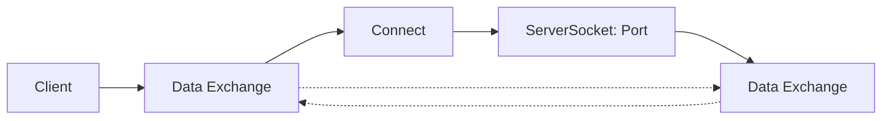

### Key Classes

| Class        | Purpose                             |
| ------------ | ----------------------------------- |
| Socket       | Client-side endpoint for connection |
| ServerSocket | Server-side endpoint for listening  |
| InputStream  | Read data from network              |
| OutputStream | Write data to network               |

### Code Examples

#### Simple Client

```java
import java.net.*;
import java.io.*;

public class Client {
    public static void main(String[] args) {
        try {
            Socket socket = new Socket("localhost", 5000);
            
            OutputStream outputStream = socket.getOutputStream();
            PrintWriter out = new PrintWriter(outputStream, true);
            
            out.println("Hello, Server!");
            
            socket.close();
        } catch (IOException e) {
            e.printStackTrace();
        }
    }
}
```

#### Simple Server

```java
import java.net.*;
import java.io.*;

public class Server {
    public static void main(String[] args) {
        try {
            ServerSocket serverSocket = new ServerSocket(5000);
            System.out.println("Server started...");
            
            Socket clientSocket = serverSocket.accept();
            System.out.println("Client connected");
            
            BufferedReader in = new BufferedReader(
                new InputStreamReader(clientSocket.getInputStream()));
            
            String message = in.readLine();
            System.out.println("Message: " + message);
            
            clientSocket.close();
            serverSocket.close();
        } catch (IOException e) {
            e.printStackTrace();
        }
    }
}
```

### Key Takeaways
- ✅ Socket combines IP address and port number
- ✅ Port numbers range from 0 to 65535
- ✅ ServerSocket.accept() blocks until client connects
- ✅ Always close resources in finally block

---

## Topic 1.10: JMS and Message Queues

### Overview

JMS (Java Message Service) and queues play crucial roles in messaging systems, facilitating asynchronous communication between distributed applications.

### What is JMS?

> **Java Message Service (JMS):** A Java API that provides a standard way for Java applications to create, send, receive, and process messages asynchronously. It abstracts away the complexities of communication protocols.

### Key Concepts of JMS

| Concept                  | Description                                                |
| ------------------------ | ---------------------------------------------------------- |
| **Messages**             | Various types: TextMessage, ObjectMessage, BytesMessage    |
| **Producers**            | Components that create and send messages to destinations   |
| **Consumers**            | Components that receive and process messages               |
| **Destinations**         | Message queues or topics where messages are stored         |
| **Connection Factories** | Objects used to create connections to JMS providers        |
| **Sessions**             | Transactional context for producing and consuming messages |

### Message Queue Characteristics

| Characteristic                 | Description                                    |
| ------------------------------ | ---------------------------------------------- |
| **Asynchronous Communication** | Producers and consumers operate independently  |
| **Reliability**                | Messages persist until successfully consumed   |
| **Load Balancing**             | Distributes messages across multiple consumers |
| **Guaranteed Delivery**        | Messages not lost even in system failures      |
| **Decoupling**                 | Producers and consumers evolve independently   |

### JMS Messaging Models

1. **Point-to-Point (Queue):** One producer, one consumer
2. **Publish-Subscribe (Topic):** One producer, multiple consumers

### Popular Message Queue Implementations

- Apache ActiveMQ
- RabbitMQ
- Apache Kafka
- Amazon Simple Queue Service (SQS)
- IBM MQ

### Use Cases

- **Asynchronous Communication:** Sending notifications, event-driven architectures
- **Job Queues:** Managing background tasks, batch processing
- **Integration:** Integrating heterogeneous systems

### Key Takeaways
- ✅ JMS provides standard API for messaging
- ✅ Asynchronous communication between components
- ✅ Reliable message delivery guaranteed
- ✅ Point-to-Point and Publish-Subscribe models

---

## Topic 1.11: Persistence

### Overview

Persistence refers to the ability of data to outlive the execution of a program. It involves storing and retrieving data from a durable storage medium.

### Key Definitions

> **Persistence:** The ability of data to outlive the execution of a program by storing it in a durable storage medium.

> **ORM (Object-Relational Mapping):** Frameworks that map database entities to object-oriented programming constructs.

### Key Concepts in Persistence

1. **Data Storage:** Storing data in structured format (databases, files, cloud)

2. **CRUD Operations:**
   - Create: Insert new data
   - Read: Retrieve data
   - Update: Modify existing data
   - Delete: Remove data

3. **Object-Relational Mapping (ORM):** Frameworks like Hibernate map Java objects to database tables

4. **Transactions:** Group operations into atomic units (ACID properties)
   - **Atomicity:** All or nothing
   - **Consistency:** Valid state
   - **Isolation:** Concurrent transactions don't interfere
   - **Durability:** Committed data is permanent

5. **Query Languages:** SQL for relational databases, MongoDB Query Language

6. **Indexing and Optimization:** Improve data retrieval performance

### Types of Persistence Mechanisms

| Type                     | Examples                        | Use Case                     |
| ------------------------ | ------------------------------- | ---------------------------- |
| **Relational Databases** | MySQL, PostgreSQL, Oracle       | Structured data              |
| **NoSQL Databases**      | MongoDB, Cassandra, Redis       | Unstructured/semi-structured |
| **Object Storage**       | Amazon S3, Google Cloud Storage | Images, videos, documents    |
| **File Systems**         | Local disk, NFS                 | Simple storage needs         |
| **Cloud Storage**        | AWS S3, Azure Blob              | Cloud-native applications    |

### Persistence in Java

```java
// Using JDBC
Connection conn = DriverManager.getConnection(url, user, pass);
PreparedStatement stmt = conn.prepareStatement("INSERT INTO users VALUES (?, ?)");
stmt.setString(1, "John");
stmt.setString(2, "john@example.com");
stmt.executeUpdate();

// Using JPA/Hibernate
@Entity
public class User {
    @Id
    private int id;
    private String name;
    private String email;
}
```

### Key Takeaways
- ✅ Persistence enables data storage beyond program execution
- ✅ ORM frameworks simplify database operations
- ✅ ACID properties ensure data integrity
- ✅ Various storage options for different needs

---

## Topic 1.12: Applet vs Application

### Overview

Java Applets and Java Applications are both ways to execute Java code, but they differ significantly in deployment and execution context.

### Comparison Table

| Feature               | Java Applet                               | Java Application                               |
| --------------------- | ----------------------------------------- | ---------------------------------------------- |
| **Execution Context** | Embedded within a web browser             | Executed standalone on client machine          |
| **Deployment**        | Loaded and executed from a web server     | Installed and executed locally                 |
| **User Interaction**  | Limited interaction within browser window | Full-fledged GUI interaction                   |
| **Security**          | Restricted by browser sandbox             | Has access to system resources                 |
| **Network Access**    | Can make network requests to the server   | Can make network requests to external services |
| **Lifespan**          | Controlled by web browser session         | Runs until terminated by user                  |
| **GUI Components**    | Limited support                           | Full support (Swing, JavaFX)                   |
| **Accessibility**     | Accessible through URL in web page        | Accessed directly from desktop                 |
| **Deployment Model**  | Embedded as <applet> tag in HTML          | Distributed as JAR files or executables        |
| **Status**            | Deprecated due to security issues         | Widely used for desktop/enterprise             |

### Java Applet

```html
<!-- Embedded in HTML -->
<applet code="MyApplet.class" width="400" height="300">
</applet>
```

- Runs inside web browser
- Requires Java plugin
- Security sandbox restrictions
- Used for web-based interactivity
- Now deprecated in modern browsers

### Java Application

```java
public class MyApp {
    public static void main(String[] args) {
        System.out.println("Application running");
    }
}
```

- Standalone program
- Runs on JVM
- Full system access
- Desktop and enterprise use
- Modern standard for Java programs

### Why Applets Became Deprecated

1. **Security Issues:** Many vulnerabilities in browser plugins
2. **Browser Support:** Most browsers removed Java plugin support
3. **Performance:** Slower startup compared to native solutions
4. **Mobile:** Not supported on mobile browsers

### Key Takeaways
- ✅ Applets: Browser-based, deprecated
- ✅ Applications: Standalone, widely used
- ✅ Modern Java uses Web Start or alternatives

---

# Unit 2: JavaBean, Session Beans, Entity Bean, Servlet

## Topic 2.1: JavaBean

### Overview

JavaBeans are reusable software components that can be manipulated visually in a builder tool. A JavaBean is a Java class that follows specific conventions.

### Key Definitions

> **JavaBean:** A reusable software component that follows specific conventions: no-arg constructor, Serializable, and property access via getter/setter methods.

> **Property:** A named feature of a JavaBean that can be accessed by users of the object through getter and setter methods.

### Requirements for a Java Bean

1. **Public no-arg constructor:** Must have a no-argument constructor
2. **Serializable:** Should implement `Serializable` interface
3. **Getters and Setters:** Properties accessed via `getXxx()` and `setXxx()` methods
4. **Naming convention:** Boolean properties can use `isXxx()` instead of `getXxx()`

### Visual: JavaBean Structure

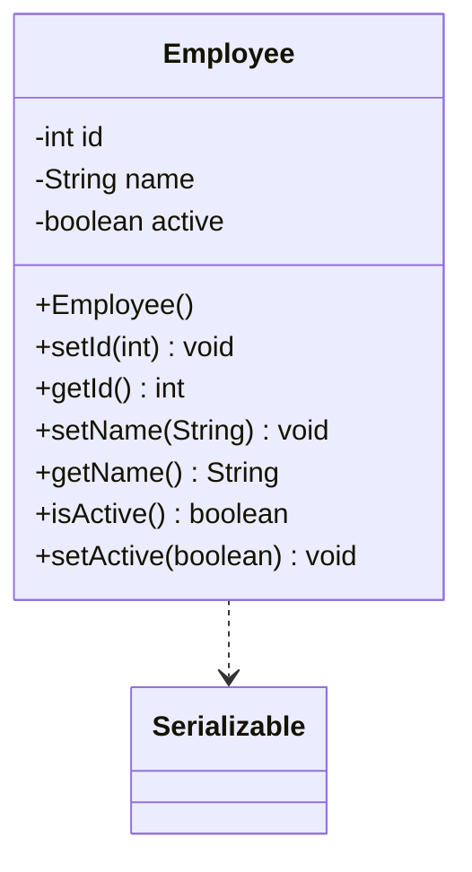

### Code Example

```java
import java.io.Serializable;

public class Student implements Serializable {
    private static final long serialVersionUID = 1L;
    
    private String name;
    private int age;
    private String grade;
    
    // No-arg constructor
    public Student() { }
    
    // Parameterized constructor
    public Student(String name, int age, String grade) {
        this.name = name;
        this.age = age;
        this.grade = grade;
    }
    
    // Getters and Setters
    public String getName() { return name; }
    public void setName(String name) { this.name = name; }
    
    public int getAge() { return age; }
    public void setAge(int age) { this.age = age; }
    
    public String getGrade() { return grade; }
    public void setGrade(String grade) { this.grade = grade; }
}
```

### Key Takeaways
- ✅ Follow the three conventions strictly (no-arg constructor, Serializable, getters/setters)
- ✅ Use meaningful property names
- ✅ For boolean properties, use "is" prefix for getters
- ✅ JavaBeans are fundamental to EJB and JSP

---

## Topic 2.2: Java Bean Properties

### Overview

Java Bean properties define the state of a JavaBean. They can be accessed and modified through getter and setter methods.

### Property Types

| Type       | Getter     | Setter     | Example                |
| ---------- | ---------- | ---------- | ---------------------- |
| Read-Write | `getXxx()` | `setXxx()` | name                   |
| Read-Only  | `getXxx()` | None       | displayName (computed) |
| Write-Only | None       | `setXxx()` | password               |
| Boolean    | `isXxx()`  | `setXxx()` | active                 |

### Code Examples

```java
public class PropertyExample {
    private String name;
    private int age;
    private boolean active;
    private String password;
    
    // Read-Write property
    public String getName() { return name; }
    public void setName(String name) { this.name = name; }
    
    // Read-Only property (computed)
    public String getDisplayName() { 
        return name + " (" + age + ")"; 
    }
    
    // Boolean property
    public boolean isActive() { return active; }
    public void setActive(boolean active) { this.active = active; }
    
    // Write-Only property
    public void setPassword(String password) { 
        this.password = hash(password); 
    }
}
```

### Key Takeaways
- ✅ Properties expose internal state through controlled access
- ✅ Encapsulation is maintained through getter/setter methods
- ✅ Read-only properties don't have setters
- ✅ Boolean properties use "is" prefix

---

## Topic 2.3: Types of Beans

### Overview

There are various types of beans in Java enterprise applications, each serving different purposes.

### Types of Beans

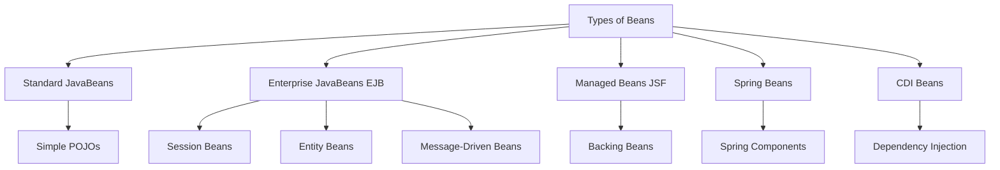

| Type                           | Description                       |
| ------------------------------ | --------------------------------- |
| **Standard JavaBeans**         | Simple POJOs with properties      |
| **Enterprise JavaBeans (EJB)** | Server-side business components   |
| **Managed Beans (JSF)**        | Backing beans for JSF pages       |
| **Spring Beans**               | Managed by Spring framework       |
| **CDI Beans**                  | Contexts and Dependency Injection |

### Key Takeaways
- ✅ Different types of beans serve different architectural purposes
- ✅ Enterprise beans provide enterprise-level services
- ✅ Modern applications often use Spring or CDI

---

## Topic 2.4: Introspection

### Overview

Introspection is a mechanism that allows examination and analysis of an object's properties, methods, and metadata at runtime.

### Key Definitions

> **Introspection:** A mechanism that allows programs to inspect and manipulate the structure and behavior of objects dynamically without prior knowledge of their implementation details.

### Ways of Implementing Introspection

#### 1. Java Reflection API

Allows inspection and manipulation of fields, methods, and constructors at runtime.

```java
// Get class information
Class<?> beanClass = MyBean.class;

// Get all fields
Field[] fields = beanClass.getDeclaredFields();

// Get all methods
Method[] methods = beanClass.getDeclaredMethods();

// Get specific method
Method getNameMethod = beanClass.getMethod("getName");
Object value = getNameMethod.invoke(beanInstance);
```

#### 2. JavaBeans Introspector

Utility class that simplifies introspection for JavaBean classes.

```java
import java.beans.*;

try {
    BeanInfo beanInfo = Introspector.getBeanInfo(MyBean.class);
    PropertyDescriptor[] pds = beanInfo.getPropertyDescriptors();
    
    for (PropertyDescriptor pd : pds) {
        System.out.println("Property: " + pd.getName());
        System.out.println("Type: " + pd.getPropertyType());
    }
} catch (IntrospectionException e) {
    e.printStackTrace();
}
```

#### 3. Apache Commons BeanUtils

Library providing utility methods for manipulating JavaBean properties.

```java
import org.apache.commons.beanutils.PropertyUtils;

// Get property value
Object value = PropertyUtils.getProperty(bean, "propertyName");

// Set property value
PropertyUtils.setProperty(bean, "propertyName", value);

// Copy properties
PropertyUtils.copyProperties(targetBean, sourceBean);
```

#### 4. Spring BeanWrapper

Spring Framework interface for introspecting and manipulating bean properties.

```java
import org.springframework.beans.*;

BeanWrapper wrapper = new BeanWrapperImpl(myBean);

// Get property value
Object propertyValue = wrapper.getPropertyValue("propertyName");

// Set property value
wrapper.setPropertyValue("propertyName", newValue);

// Check if property is readable/writable
boolean readable = wrapper.isReadableProperty("name");
boolean writable = wrapper.isWritableProperty("name");
```

### Comparison of Introspection Methods

| Method             | Pros                          | Cons                 |
| ------------------ | ----------------------------- | -------------------- |
| Reflection API     | Built-in, complete control    | Verbose, error-prone |
| Introspector       | Simplified, standard approach | Limited to JavaBeans |
| Apache Commons     | Easy to use, feature-rich     | External dependency  |
| Spring BeanWrapper | Framework integration         | Spring dependency    |

### Key Takeaways
- ✅ Introspection examines objects at runtime
- ✅ Java Reflection API is built-in
- ✅ Introspector simplifies JavaBean introspection
- ✅ Various libraries provide convenient utilities

---

## Topic 2.5: Stateful Session Bean

### Overview

A Stateful Session Bean maintains conversational state across method calls within a session. It is dedicated to a single client.

### Key Definitions

> **Stateful Session Bean:** A session bean that maintains conversational state with the client across multiple method calls.

### Characteristics

- ✅ Maintains client state across multiple requests
- ✅ One bean instance per client
- ✅ Removed when session ends
- ✅ Not persistent
- ✅ Cannot be pooled

### Visual: Stateful Session Bean

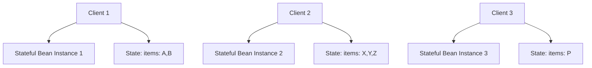

### Code Example

```java
import javax.ejb.Stateful;

@Stateful
public class ShoppingCartBean implements ShoppingCart {
    private List<String> items = new ArrayList<>();
    private String customerId;
    
    public void setCustomerId(String customerId) {
        this.customerId = customerId;
    }
    
    public void addItem(String item) {
        items.add(item);
    }
    
    public void removeItem(String item) {
        items.remove(item);
    }
    
    public List<String> getItems() {
        return items;
    }
    
    public void clear() {
        items.clear();
    }
}
```

### Key Takeaways
- ✅ Maintains conversational state
- ✅ One-to-one relationship with client
- ✅ Not pooled like stateless beans
- ✅ Removed when session times out or client removes it

---

## Topic 2.6: Stateless Session Bean

### Overview

A Stateless Session Bean does not maintain conversational state with any client. Each bean instance can be used by any client.

### Key Definitions

> **Stateless Session Bean:** A session bean that doesn't maintain conversational state with the client. Provides better scalability.

### Characteristics

- ✅ No conversational state between method calls
- ✅ Any client can use any instance from the pool
- ✅ Better scalability (fewer beans needed)
- ✅ Can implement web services
- ✅ Stateless beans are pooled by the container

### Visual: Stateless Session Bean Pool

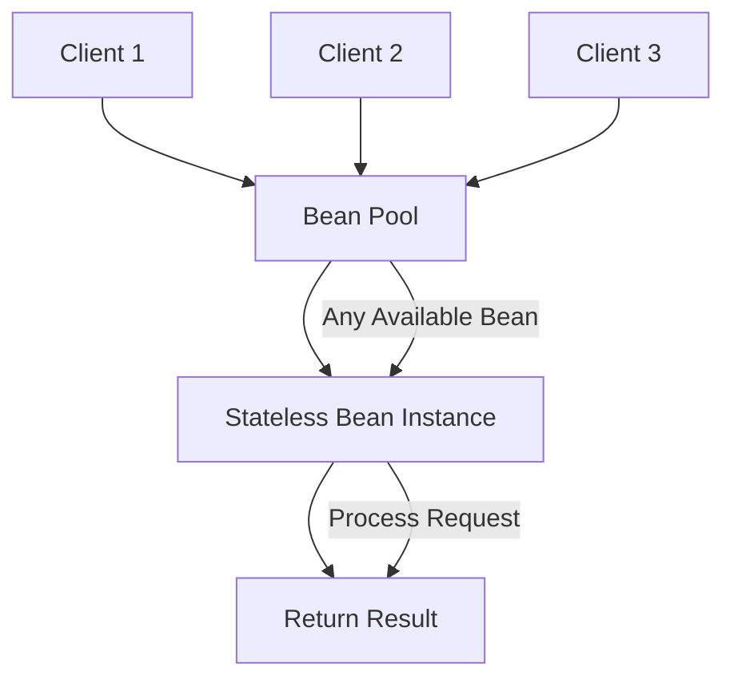

### When to Use Stateless Session Beans

- When the bean's state has no data for a particular client
- When the bean performs generic tasks for all clients
- When the bean implements a web service

### Code Example

```java
import javax.ejb.Stateless;

@Stateless
public class CalculatorBean implements Calculator {
    
    public int add(int a, int b) {
        return a + b;
    }
    
    public int subtract(int a, int b) {
        return a - b;
    }
    
    public int multiply(int a, int b) {
        return a * b;
    }
    
    public int divide(int a, int b) {
        if (b == 0) throw new ArithmeticException("Division by zero");
        return a / b;
    }
}
```

### Key Takeaways
- ✅ Don't maintain client-specific state
- ✅ Container manages a pool of instances
- ✅ Good for operations that don't need memory of previous interactions
- ✅ More scalable than stateful beans

---

## Topic 2.7: Entity Bean

### Overview

An Entity Bean represents persistent business data stored in a database.

### Key Definitions

> **Entity Bean:** A server-side component representing persistent business data stored in a database.

> **Primary Key:** Unique identifier for entity bean instances.

### Entity Bean Types

1. **Bean-Managed Persistence (BMP)**
   - Developer writes database access code explicitly
   - More flexibility but more work
   - Tied to specific database

2. **Container-Managed Persistence (CMP)**
   - Container handles database operations automatically
   - Developer focuses on business logic
   - Database-independent

### Visual: Entity Bean with Database

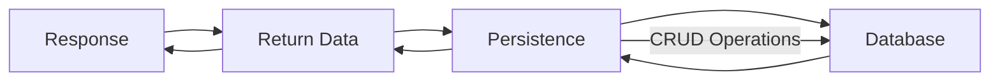

### Key Takeaways
- ✅ Represents persistent data in database
- ✅ Has unique primary key
- ✅ Survives server crashes
- ✅ Can be shared by multiple clients
- ⚠️ Now superseded by Java Persistence API (JPA)

---

## Topic 2.8: Servlet Overview and Architecture

### Overview

Servlets are Java programs that run on a web server and handle client requests dynamically.

### Key Definitions

> **Servlet:** A Java program that runs on a web server, handling HTTP requests and generating dynamic responses.

### Servlet Architecture Components

1. **Client (Web Browser):** Sends HTTP requests
2. **Web Server:** Receives requests
3. **Web Container (Servlet Container):** Manages servlet lifecycle, URL mapping
4. **Servlet:** Processes requests

### Visual: Servlet Request Flow

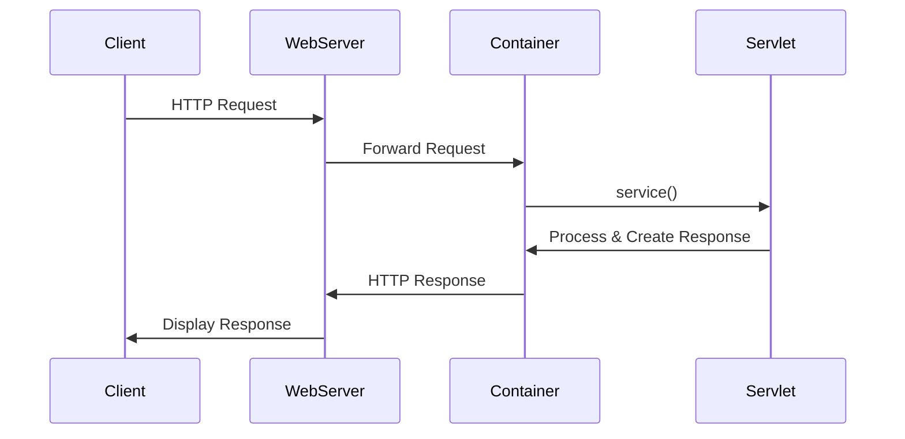

### Servlet Advantages over CGI

- ✅ Better performance (threads vs processes)
- ✅ Platform-independent
- ✅ Robust (automatic memory management)
- ✅ Secure (sandbox model)
- ✅ Portability

### Types of Servlets

1. **GenericServlet:** Protocol-independent
2. **HttpServlet:** HTTP-specific (most commonly used)

### Key Takeaways
- ✅ Servlets handle HTTP requests/responses
- ✅ Run in web container (Tomcat, Glassfish, etc.)
- ✅ More efficient than traditional CGI
- ✅ Thread-based (not process-based)

---

## Topic 2.9: Interface Servlet and the Servlet Life Cycle

### Overview

The Servlet interface defines the contract that all servlets must implement.

### Servlet Interface Methods

| Method                                   | Description                    |
| ---------------------------------------- | ------------------------------ |
| init(ServletConfig)                      | Called once at initialization  |
| service(ServletRequest, ServletResponse) | Called for each request        |
| destroy()                                | Called when servlet is removed |
| getServletConfig()                       | Returns configuration object   |
| getServletInfo()                         | Returns servlet information    |

### Servlet Life Cycle

1. **Servlet class loaded** - ClassLoader loads the servlet class
2. **Servlet instance created** - Container creates instance
3. **init() called** - Initialization (once)
4. **service() called** - Handle requests (multiple times)
5. **destroy() called** - Cleanup before removal

### Visual: Servlet Lifecycle

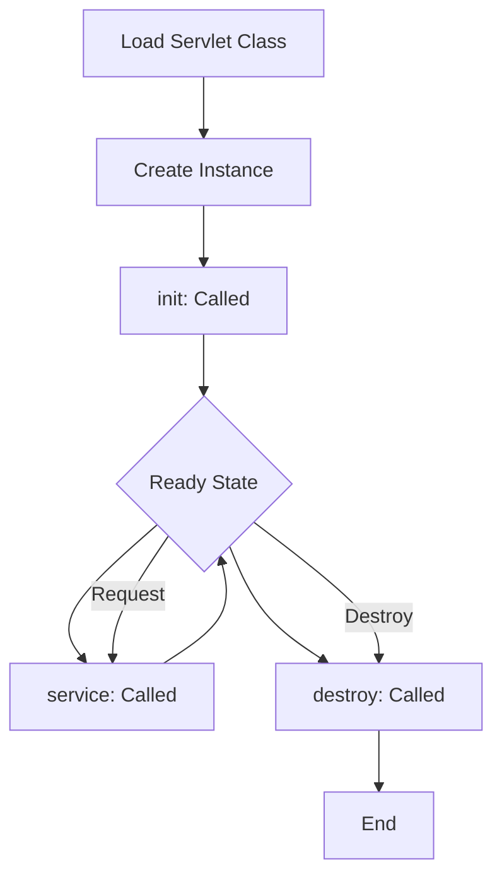

### Creating Servlets - Three Ways

1. **Implement Servlet Interface**
2. **Extend GenericServlet**
3. **Extend HttpServlet** (Most common)

### Code Example: HttpServlet

```java
import javax.servlet.http.*;
import java.io.*;

public class DemoServlet extends HttpServlet {
    public void doGet(HttpServletRequest req, HttpServletResponse res) 
            throws ServletException, IOException {
        res.setContentType("text/html");
        PrintWriter out = res.getWriter();
        out.println("<html><body>");
        out.println("Welcome to servlet");
        out.println("</body></html>");
    }
    
    public void doPost(HttpServletRequest req, HttpServletResponse res)
            throws ServletException, IOException {
        doGet(req, res);
    }
}
```

### Key Takeaways
- ✅ Override doGet() and/or doPost() in HttpServlet
- ✅ init() called once; service() for each request
- ✅ destroy() called when servlet is unloaded
- ✅ web.xml maps URLs to servlets

---

## Topic 2.10: Handling HTTP GET Requests

### Overview

HTTP GET requests are used to request data from a specified resource. GET is the default HTTP method.

### GET vs POST

| GET               | POST                    |
| ----------------- | ----------------------- |
| Data in URL       | Data in request body    |
| Limited data size | Unlimited data size     |
| Can be bookmarked | Cannot be bookmarked    |
| Less secure       | More secure             |
| Default method    | Used for sensitive data |

### Code Example

```java
protected void doGet(HttpServletRequest request, HttpServletResponse response) 
        throws ServletException, IOException {
    
    // Get parameters from URL
    String username = request.getParameter("username");
    String[] items = request.getParameterValues("items");
    
    // Set content type
    response.setContentType("text/html");
    
    // Get PrintWriter
    PrintWriter out = response.getWriter();
    
    // Write response
    out.println("<html><body>");
    out.println("<h1>GET Request Received</h1>");
    out.println("<p>Username: " + username + "</p>");
    out.println("</body></html>");
}
```

### Key Takeaways
- ✅ GET parameters visible in URL
- ✅ Used for retrieving data
- ✅ Can be cached and bookmarked
- ✅ Limited data size due to URL length

---

## Topic 2.11: Handling HTTP POST Requests

### Overview

HTTP POST requests are used to send data to be processed to a specified resource. POST is commonly used for submitting form data.

### Code Example

```java
protected void doPost(HttpServletRequest request, HttpServletResponse response) 
        throws ServletException, IOException {
    
    // Set character encoding for proper handling of international characters
    request.setCharacterEncoding("UTF-8");
    
    // Get parameters from request body
    String username = request.getParameter("username");
    String password = request.getParameter("password");
    String email = request.getParameter("email");
    
    // Process data (e.g., save to database)
    // ...
    
    // Set content type and redirect
    response.setContentType("text/html");
    PrintWriter out = response.getWriter();
    out.println("<html><body>");
    out.println("<h1>POST Request Received</h1>");
    out.println("<p>Thank you, " + username + "!</p>");
    out.println("</body></html>");
}
```

### Key Takeaways
- ✅ POST data hidden from URL
- ✅ Used for submitting sensitive data
- ✅ No size limitations
- ✅ Cannot be bookmarked or cached

---

## Topic 2.12: Session Tracking

### Overview

HTTP is stateless; session tracking maintains user state across multiple requests.

### Methods

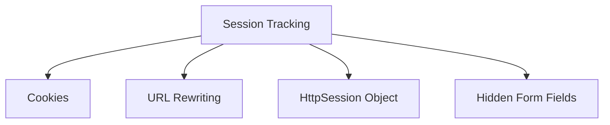

| Method            | Pros                   | Cons               |
| ----------------- | ---------------------- | ------------------ |
| **Cookies**       | Simple, persistent     | Can be disabled    |
| **URL Rewriting** | Always works           | Breaks bookmarking |
| **HttpSession**   | Server-managed, secure | Server memory      |
| **Hidden Fields** | Works without cookies  | Extra HTML         |

### HttpSession Example

```java
// Creating/Getting session
HttpSession session = request.getSession();

// Setting attributes
session.setAttribute("user", "John");
session.setAttribute("cart", cart);

// Getting attributes
String user = (String) session.getAttribute("user");
List cart = (List) session.getAttribute("cart");

// Removing attributes
session.removeAttribute("user");

// Invalidating session
session.invalidate();
```

### Key Takeaways
- ✅ HTTP is stateless - need explicit session tracking
- ✅ HttpSession is the most common approach
- ✅ Sessions have configurable timeout
- ✅ Session data stored on server

---

## Topic 2.13: Cookies

### Overview

Cookies are key-value pairs stored on the client side. They are used to maintain state between requests.

### Types of Cookies

| Type                  | Description                 |
| --------------------- | --------------------------- |
| **Session Cookie**    | Deleted when browser closes |
| **Persistent Cookie** | Has expiration date         |

### Code Examples

#### Creating a Cookie

```java
// Create a cookie
Cookie cookie = new Cookie("username", "john");
cookie.setMaxAge(3600); // 1 hour (in seconds)
cookie.setPath("/"); // Available throughout the application
response.addCookie(cookie);
```

#### Reading Cookies

```java
Cookie[] cookies = request.getCookies();
if (cookies != null) {
    for (Cookie c : cookies) {
        if (c.getName().equals("username")) {
            String value = c.getValue();
            System.out.println("Username: " + value);
        }
    }
}
```

### Visual: Cookie Flow

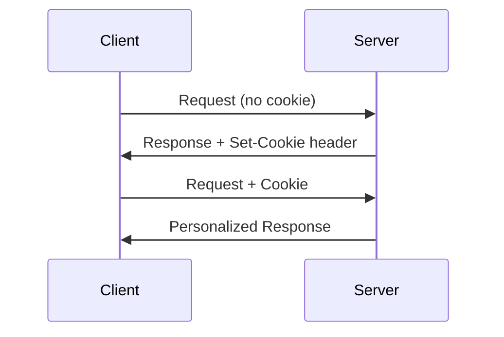

### Key Takeaways
- ✅ Cookies stored on client side
- ✅ Can be disabled by users
- ✅ Limited size (4KB per cookie)
- ✅ Sent with every request to the server

---

## Topic 2.14: EJB Container Services

### Overview

EJB containers provide a runtime environment for executing EJB components with various enterprise services.

### Key Definitions

> **EJB Container:** A runtime environment that manages EJB components, providing services like transaction management, security, and concurrency.

### Container Services

#### 1. Lifecycle Management

EJB containers manage the lifecycle including:
- Instantiation
- Initialization
- Invocation
- Passivation
- Removal

They create instances as needed, pool and reuse instances, and destroy when no longer in use.

#### 2. Transaction Management

EJB containers provide:
- **Declarative Transaction Management:** Using annotations or deployment descriptors
- **ACID Properties:**
  - Atomicity: All or nothing
  - Consistency: Valid state
  - Isolation: Concurrent transactions don't interfere
  - Durability: Committed data is permanent

```java
@Stateless
public class AccountService {
    
    @TransactionAttribute(TransactionAttributeType.REQUIRED)
    public void transfer(Account from, Account to, BigDecimal amount) {
        from.withdraw(amount);
        to.deposit(amount);
    }
}
```

#### 3. Security Services

EJB containers enforce:
- Role-based access control (RBAC)
- Authentication
- Authorization
- Encryption of communication

```java
@Stateless
public class AccountService {
    
    @RolesAllowed({"customer", "admin"})
    public Account getAccount(int id) {
        return accountRepository.find(id);
    }
}
```

#### 4. Concurrency Management

EJB containers manage:
- Thread synchronization
- Concurrency policies
- Instance pooling

They ensure thread safety and prevent race conditions.

#### 5. Resource Management

EJB containers handle:
- **Database Connections:** Connection pooling
- **JMS Connections:** Message queue management
- **JNDI Resources:** Naming and directory services

#### 6. Remote Method Invocation (RMI)

EJB containers provide:
- Remote method invocation support
- Marshalling/unmarshalling of parameters
- Network communication handling

#### 7. Dependency Injection (DI)

EJB containers support dependency injection:
- Inject resources at runtime
- Improve modularity and testability

```java
@Stateless
public class OrderService {
    
    @EJB
    private InventoryService inventoryService;
    
    @PersistenceContext
    private EntityManager em;
    
    @Resource
    private SessionContext ctx;
}
```

#### 8. Monitoring and Management

EJB containers provide:
- Performance monitoring
- Health checking
- Usage tracking
- Management interfaces

### Visual: EJB Container Services

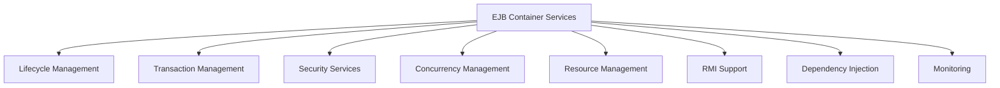

### Key Takeaways
- ✅ Container manages lifecycle automatically
- ✅ Declarative transaction management
- ✅ Role-based security
- ✅ Resource pooling and management
- ✅ Dependency injection support

---

## 📊 Coverage Statistics

| Metric                             | Value        |
| ---------------------------------- | ------------ |
| Total Syllabus Topics (Unit 1 & 2) | 26           |
| Topics Covered                     | 26 (100%)    |
| **Unit 1 Coverage**                | 12/12 (100%) |
| **Unit 2 Coverage**                | 14/14 (100%) |

---

*Notes compiled for Advanced Java Unit 1 and Unit 2. Complete coverage of all topics achieved including Mid Sem topics.*
