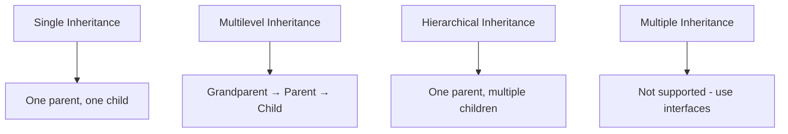
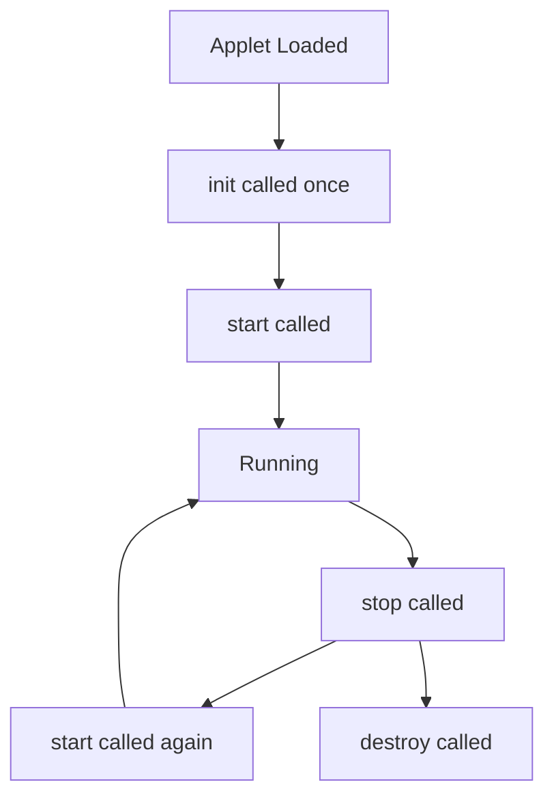
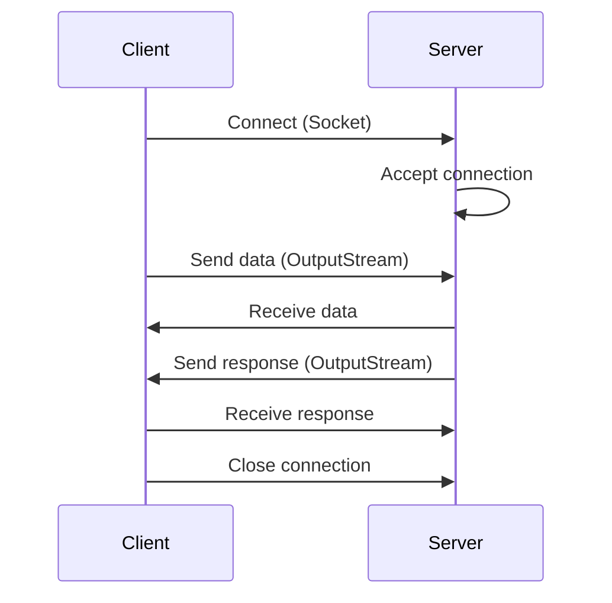
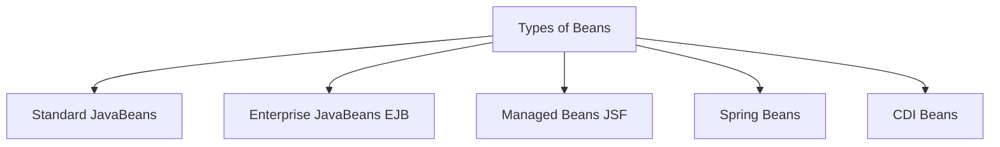
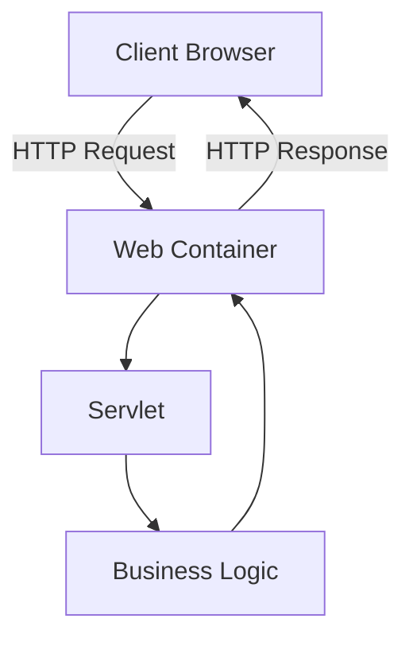
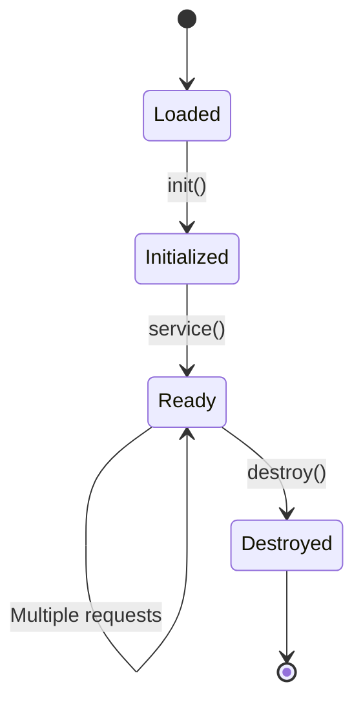
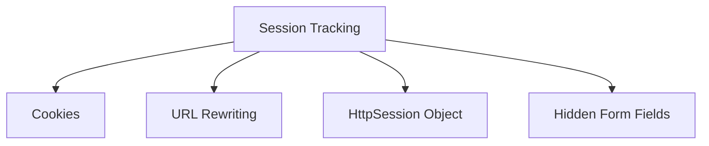

# Advanced Java Programming - Comprehensive Study Notes

## Unit 1 & Unit 2

---

# Unit 1: Advanced Java Programming Fundamentals

## 1. Introduction to Java

### Overview
Java is a high-level, class-based, object-oriented programming language developed by Sun Microsystems (now owned by Oracle Corporation). It is designed to have as few implementation dependencies as possible, enabling "Write Once, Run Anywhere" (WORA).

### Key Features of Java

| Feature | Description |
|---------|-------------|
| **Platform Independent** | Java works on "write once, run anywhere" principle. Compiled code runs on any platform with JVM |
| **Object-Oriented** | Everything is an object. Supports OOP concepts: Object, Class, Inheritance, Polymorphism, Abstraction, Encapsulation |
| **Robust** | Strong memory management system. Checks code during compile and runtime |
| **Secure** | No explicit pointers. Runs in sandbox to prevent untrusted activities |
| **Multi-threaded** | Can perform many tasks simultaneously through multithreading |
| **Portable** | Programs easily moved between computer systems |

### Basic Syntax Rules

```java
public class MyFirstJavaProgram {
    /* This is my first java program.
     * This will print 'Hello World' as the output
     */
    public static void main(String []args) {
        System.out.println("Hello World");
    }
}
```

**Syntax Rules:**
- **Case Sensitivity**: `Hello` and `hello` are different
- **Class Names**: First letter should be Upper Case (e.g., `MyClass`)
- **Method Names**: Start with lower case, inner words capitalized (e.g., `myMethod`)
- **File Name**: Must match class name exactly
- **Main Method**: `public static void main(String args[])` is mandatory

### Java Identifiers

All Java components require names. Rules:
- Begin with a letter (A-Z, a-z), currency character ($), or underscore (_)
- After first character, can have any combination
- Keywords cannot be used as identifiers

**Legal identifiers:** `age`, `$salary`, `_value`, `__1_value`
**Illegal identifiers:** `123abc`, `-salary`

### Java Modifiers

**Access Modifiers:** `default`, `public`, `protected`, `private`

**Non-access Modifiers:** `final`, `abstract`, `strictfp`

### Variables

- **Local Variables**: Declared inside methods
- **Class Variables (Static Variables)**: Shared across all instances
- **Instance Variables (Non-static)**: Unique to each object

---

## 2. Inheritance

### Overview
Inheritance is a fundamental OOP concept that allows a new class to inherit properties and behavior from an existing class, enabling code reuse and establishing class relationships.

### Superclass and Subclass

- **Superclass (Parent Class)**: The class whose properties and methods are inherited
- **Subclass (Child Class)**: The class that inherits from another class

### Syntax

```java
class Superclass {
    // superclass members
}

class Subclass extends Superclass {
    // subclass members
}
```

### Types of Inheritance



#### 1. Single Inheritance
```java
class Animal { }
class Dog extends Animal { }
```

#### 2. Multilevel Inheritance
```java
class Animal { }
class Mammal extends Animal { }
class Dog extends Mammal { }
```

#### 3. Hierarchical Inheritance
```java
class Animal { }
class Dog extends Animal { }
class Cat extends Animal { }
```

#### 4. Multiple Inheritance (Not Supported)
Java doesn't support multiple inheritance of classes due to the "diamond problem". Use interfaces instead:

```java
interface A { void methodA(); }
interface B { void methodB(); }

class CombinedClass implements A, B {
    public void methodA() { System.out.println("Method A"); }
    public void methodB() { System.out.println("Method B"); }
}
```

### Key Points

1. Promotes code reuse and maintains hierarchical structure
2. Subclasses can extend functionality by adding new methods or overriding existing ones
3. Constructors are not inherited but subclass constructor calls `super()`
4. Access modifiers affect visibility of inherited members

---

## 3. Exception Handling

### Overview
Exception handling is a mechanism to handle runtime errors in a structured manner, preventing unexpected program terminations.

### Key Terms

| Term | Description |
|------|-------------|
| **Exception** | Event that disrupts normal program flow |
| **try-catch** | Block where exceptions are handled |
| **throw** | Keyword to explicitly throw an exception |
| **throws** | Keyword to declare method may throw exceptions |

### Syntax

```java
try {
    // Code that may throw an exception
} catch (ExceptionType1 e1) {
    // Handle ExceptionType1
} catch (ExceptionType2 e2) {
    // Handle ExceptionType2
} finally {
    // Always executes regardless of exception
}
```

### Examples

#### Example 1: Arithmetic Exception
```java
public class Main {
    public static void main(String[] args) {
        try {
            int result = 10 / 0; // ArithmeticException
        } catch (ArithmeticException e) {
            System.out.println("Error: " + e.getMessage());
        }
    }
}
```

#### Example 2: ArrayIndexOutOfBoundsException
```java
int[] array = {1, 2, 3};
try {
    int value = array[3]; // ArrayIndexOutOfBoundsException
} catch (ArrayIndexOutOfBoundsException e) {
    System.out.println("Error: " + e.getMessage());
}
```

#### Example 3: NullPointerException
```java
String str = null;
try {
    int length = str.length(); // NullPointerException
} catch (NullPointerException e) {
    System.out.println("Error: " + e.getMessage());
}
```

### throw vs throws

| throw | throws |
|-------|--------|
| Used within method to throw exception | Declared in method signature |
| Takes exception object as argument | Informs caller about potential exceptions |
| Triggers immediate termination | Does not throw exception itself |

```java
public class NumberUtils {
    public static int divide(int numerator, int denominator) throws ArithmeticException {
        if (denominator == 0) {
            throw new ArithmeticException("Division by zero!");
        }
        return numerator / denominator;
    }
    
    public static void main(String[] args) {
        try {
            int result = divide(10, 0);
        } catch (ArithmeticException e) {
            System.out.println("Error: " + e.getMessage());
        }
    }
}
```

### Additional Points

- **Checked vs Unchecked Exceptions**: Checked must be caught or declared; unchecked don't need explicit handling
- **Custom Exceptions**: Create by extending `Exception` class
- **Best Practices**: Handle at appropriate level, provide informative messages, log exceptions

---

## 4. Multithreading

### Overview
Multithreading allows multiple threads to execute concurrently within a single process, improving efficiency and responsiveness.

### Key Concepts

| Concept | Description |
|---------|-------------|
| **Thread** | Lightweight process executing independently |
| **Concurrency** | Multiple threads execute simultaneously |
| **Synchronization** | Controls access to shared resources |
| **Thread States** | New, Runnable, Blocked, Waiting, Timed Waiting, Terminated |

### Creating Threads

#### Method 1: Extending Thread Class
```java
class MyThread extends Thread {
    public void run() {
        for (int i = 1; i <= 5; i++) {
            System.out.println("Thread: " + i);
            try {
                Thread.sleep(1000);
            } catch (InterruptedException e) {
                System.out.println(e);
            }
        }
    }
}

public class Main {
    public static void main(String[] args) {
        MyThread thread = new MyThread();
        thread.start();
    }
}
```

#### Method 2: Implementing Runnable Interface
```java
class MyRunnable implements Runnable {
    public void run() {
        for (int i = 1; i <= 5; i++) {
            System.out.println("Runnable: " + i);
            try {
                Thread.sleep(1000);
            } catch (InterruptedException e) {
                System.out.println(e);
            }
        }
    }
}

public class Main {
    public static void main(String[] args) {
        Thread thread = new Thread(new MyRunnable());
        thread.start();
    }
}
```

### Thread Synchronization
```java
class Counter {
    private int count = 0;
    
    public synchronized void increment() {
        count++;
    }
    
    public int getCount() {
        return count;
    }
}

class MyThread extends Thread {
    private    public MyThread(Counter counter) {
        this.counter = counter;
    }
    
    public void run() {
 Counter counter;
    
        for (int i = 0; i < 1000; i++) {
            counter.increment();
        }
    }
}

public class Main {
    public static void main(String[] args) throws InterruptedException {
        Counter counter = new Counter();
        MyThread thread1 = new MyThread(counter);
        MyThread thread2 = new MyThread(counter);
        
        thread1.start();
        thread2.start();
        
        thread1.join();
        thread2.join();
        
        System.out.println("Count: " + counter.getCount());
    }
}
```

### Thread Pool Example (Image Downloader)
```java
import java.util.concurrent.ExecutorService;
import java.util.concurrent.Executors;

public class ImageDownloader {
    public static void main(String[] args) {
        String[] imageUrls = {"url1", "url2", "url3", "url4", "url5"};
        ExecutorService executor = Executors.newFixedThreadPool(imageUrls.length);
        
        for (String url : imageUrls) {
            executor.execute(new ImageDownloadTask(url));
        }
        
        executor.shutdown();
    }
}

class ImageDownloadTask implements Runnable {
    private String imageUrl;
    
    public ImageDownloadTask(String imageUrl) {
        this.imageUrl = imageUrl;
    }
    
    @Override
    public void run() {
        // Download logic here
        System.out.println("Downloaded: " + imageUrl);
    }
}
```

---

## 5. Applet Programming

### Overview
Applet programming enables creating dynamic, interactive content embedded in web pages.

### Key Terms

- **Applet**: Java program running within a web browser
- **Applet Class**: Base class for creating applets
- **Lifecycle Methods**: `init()`, `start()`, `stop()`, `destroy()`
- **paint(Graphics g)**: Used to render graphics

### Applet Lifecycle



### Examples

#### Simple Applet
```java
import java.applet.Applet;
import java.awt.Graphics;

public class HelloWorldApplet extends Applet {
    public void paint(Graphics g) {
        g.drawString("Hello, World!", 20, 20);
    }
}
```

#### Drawing Shapes
```java
import java.applet.Applet;
import java.awt.Graphics;

public class ShapeApplet extends Applet {
    public void paint(Graphics g) {
        g.drawRect(20, 20, 100, 50);    // Rectangle
        g.drawOval(150, 20, 80, 80);    // Oval
        g.drawLine(300, 20, 400, 100);  // Line
    }
}
```

#### Mouse Events
```java
import java.applet.Applet;
import java.awt.Graphics;
import java.awt.event.MouseEvent;
import java.awt.event.MouseListener;

public class MouseApplet extends Applet implements MouseListener {
    int x = 0, y = 0;
    
    public void init() {
        addMouseListener(this);
    }
    
    public void paint(Graphics g) {
        g.drawString("Click at (" + x + ", " + y + ")", 20, 20);
    }
    
    public void mouseClicked(MouseEvent e) {
        x = e.getX();
        y = e.getY();
        repaint();
    }
    
    public void mousePressed(MouseEvent e) {}
    public void mouseReleased(MouseEvent e) {}
    public void mouseEntered(MouseEvent e) {}
    public void mouseExited(MouseEvent e) {}
}
```

#### Animation
```java
import java.applet.Applet;
import java.awt.Graphics;

public class AnimationApplet extends Applet implements Runnable {
    int x = 0;
    
    public void init() {
        Thread t = new Thread(this);
        t.start();
    }
    
    public void paint(Graphics g) {
        g.drawString("Moving Text", x, 20);
    }
    
    public void run() {
        while (true) {
            x += 5;
            if (x > getWidth()) x = 0;
            repaint();
            try { Thread.sleep(100); }
            catch (InterruptedException e) { }
        }
    }
}
```

### Additional Points

- **Applet Parameters**: Accept parameters from HTML for customization
- **Security**: Modern browsers have deprecated applets due to security concerns

---

## 6. Socket Programming

### Overview
Socket programming enables client-server communication over TCP/IP networks.

### Client-Server Communication



### Client Code
```java
import java.io.*;
import java.net.*;

public class Client {
    public static void main(String[] args) {
        try {
            Socket socket = new Socket("server_address", port_number);
            OutputStream outputStream = socket.getOutputStream();
            PrintWriter out = new PrintWriter(outputStream, true);
            
            out.println("Hello, Server!");
            
            socket.close();
        } catch (IOException e) {
            e.printStackTrace();
        }
    }
}
```

### Server Code
```java
import java.io.*;
import java.net.*;

public class Server {
    public static void main(String[] args) {
        try {
            ServerSocket serverSocket = new ServerSocket(port_number);
            System.out.println("Server started...");
            
            while (true) {
                Socket clientSocket = serverSocket.accept();
                System.out.println("Client connected: " + clientSocket);
                
                // Handle client in separate thread
                ClientHandler handler = new ClientHandler(clientSocket);
                handler.start();
            }
        } catch (IOException e) {
            e.printStackTrace();
        }
    }
}

class ClientHandler extends Thread {
    private Socket clientSocket;
    
    public ClientHandler(Socket clientSocket) {
        this.clientSocket = clientSocket;
    }
    
    public void run() {
        try {
            BufferedReader in = new BufferedReader(
                new InputStreamReader(clientSocket.getInputStream()));
            PrintWriter out = new PrintWriter(
                clientSocket.getOutputStream(), true);
            
            String message = in.readLine();
            System.out.println("Message from client: " + message);
            
            out.println("Server received: " + message);
            
            clientSocket.close();
        } catch (IOException e) {
            e.printStackTrace();
        }
    }
}
```

### Key Classes

| Class | Purpose |
|-------|---------|
| `Socket` | Client-side endpoint for connection |
| `ServerSocket` | Server-side endpoint for listening |
| `InputStream` | Read data from network |
| `OutputStream` | Write data to network |

---

## 7. URL Connections

### Overview
Java provides classes for making URL connections and retrieving web resources.

### Making URL Connections
```java
import java.net.*;
import java.io.*;

public class URLReader {
    public static void main(String[] args) {
        try {
            URL url = new URL("https://example.com");
            URLConnection connection = url.openConnection();
            BufferedReader reader = new BufferedReader(
                new InputStreamReader(connection.getInputStream()));
            
            String line;
            while ((line = reader.readLine()) != null) {
                System.out.println(line);
            }
            reader.close();
        } catch (Exception e) {
            e.printStackTrace();
        }
    }
}
```

---

# Unit 2: Enterprise Java Components

## 1. Java Beans

### Overview
JavaBeans are reusable software components that can be manipulated visually in a builder tool.

### Requirements for a Java Bean

1. **Public no-arg constructor**: Must have a no-argument constructor
2. **Serializable**: Should implement `Serializable` interface
3. **Getters and Setters**: Properties accessed via `getXxx()` and `setXxx()` methods
4. **Naming convention**: Boolean properties can use `isXxx()` instead of `getXxx()`

### Java Bean Example
```java
import java.io.Serializable;

public class Student implements Serializable {
    private static final long serialVersionUID = 1L;
    private String name;
    private int age;
    private String grade;
    
    // No-arg constructor
    public Student() { }
    
    // Parameterized constructor
    public Student(String name, int age, String grade) {
        this.name = name;
        this.age = age;
        this.grade = grade;
    }
    
    // Getters and Setters
    public String getName() { return name; }
    public void setName(String name) { this.name = name; }
    
    public int getAge() { return age; }
    public void setAge(int age) { this.age = age; }
    
    public String getGrade() { return grade; }
    public void setGrade(String grade) { this.grade = grade; }
}
```

### Java Bean Properties

| Property Type | Getter | Setter |
|---------------|--------|--------|
| Read-Write | `getXxx()` | `setXxx()` |
| Read-Only | `getXxx()` | None |
| Write-Only | None | `setXxx()` |
| Boolean | `isXxx()` | `setXxx()` |

### Types of Beans



1. **Standard JavaBeans**: Simple POJOs with properties
2. **Enterprise JavaBeans (EJB)**: Server-side business components
3. **Managed Beans (JSF)**: Backing beans for JSF pages
4. **Spring Beans**: Managed by Spring framework
5. **CDI Beans**: Contexts and Dependency Injection

---

## 2. Session Beans

### Overview
Session beans are enterprise beans that represent business logic and run on the server.

### Stateful Session Bean

Maintains conversational state across method calls within a session.

```java
import javax.ejb.Stateful;

@Stateful
public class ShoppingCartBean implements ShoppingCart {
    private List<String> items = new ArrayList<>();
    
    public void addItem(String item) {
        items.add(item);
    }
    
    public void removeItem(String item) {
        items.remove(item);
    }
    
    public List<String> getItems() {
        return items;
    }
    
    public void clear() {
        items.clear();
    }
}
```

**Characteristics:**
- Maintains client state across multiple requests
- One bean per client
- Removed when session ends
- Not persistent

### Stateless Session Bean

Does not maintain client state; used for operations that don't require persistence.

```java
import javax.ejb.Stateless;

@Stateless
public class CalculatorBean implements Calculator {
    
    public int add(int a, int b) {
        return a + b;
    }
    
    public int subtract(int a, int b) {
        return a - b;
    }
    
    public int multiply(int a, int b) {
        return a * b;
    }
    
    public int divide(int a, int b) {
        if (b == 0) throw new ArithmeticException("Division by zero");
        return a / b;
    }
}
```

**Characteristics:**
- No client state maintained
- Pooled and reused
- Better performance and scalability
- Suitable for stateless operations

---

## 3. Entity Beans

### Overview
Entity beans represent persistent data stored in a database.

### Key Features
- Represent data in database
- Survive application crashes
- Managed by EJB container
- Use CMP (Container-Managed Persistence) or BMP (Bean-Managed Persistence)

```java
import javax.ejb.EntityBean;
import javax.ejb.EntityContext;

public class EmployeeBean implements EntityBean {
    private EntityContext context;
    private int id;
    private String name;
    private String department;
    private double salary;
    
    // Entity lifecycle methods
    public void setEntityContext(EntityContext context) {
        this.context = context;
    }
    
    public void unsetEntityContext() {
        this.context = null;
    }
    
    public Integer ejbCreate(int id, String name) {
        this.id = id;
        this.name = name;
        return null;
    }
    
    public void ejbPostCreate(int id, String name) { }
    
    // Business methods
    public int getId() { return id; }
    public void setName(String name) { this.name = name; }
    public String getName() { return name; }
    // ... other getters and setters
}
```

---

## 4. Servlets

### Overview
Servlets are Java programs that run on web servers, handling HTTP requests and generating dynamic responses.

### Servlet Architecture



### Servlet Interface

```java
public interface Servlet {
    public void init(ServletConfig config) throws ServletException;
    public void service(ServletRequest request, ServletResponse response) 
        throws ServletException, IOException;
    public void destroy();
    public ServletConfig getServletConfig();
}
```

### Servlet Life Cycle



| Phase | Method | Description |
|-------|--------|-------------|
| Loading | - | Servlet class loaded |
| Initialization | `init()` | Called once, initializes servlet |
| Request Handling | `service()` | Called for each request |
| Destruction | `destroy()` | Called once, cleanup resources |

### HTTP Servlet Example
```java
import java.io.*;
import javax.servlet.*;
import javax.servlet.http.*;

public class HelloServlet extends HttpServlet {
    
    @Override
    public void init() throws ServletException {
        // Initialization code
    }
    
    @Override
    protected void doGet(HttpServletRequest request, HttpServletResponse response) 
            throws ServletException, IOException {
        response.setContentType("text/html");
        PrintWriter out = response.getWriter();
        out.println("<html><body>");
        out.println("<h1>Hello, World!</h1>");
        out.println("</body></html>");
    }
    
    @Override
    protected void doPost(HttpServletRequest request, HttpServletResponse response) 
            throws ServletException, IOException {
        // Handle POST request
    }
    
    @Override
    public void destroy() {
        // Cleanup code
    }
}
```

### Handling HTTP GET Requests

```java
protected void doGet(HttpServletRequest request, HttpServletResponse response) 
        throws ServletException, IOException {
    
    String param = request.getParameter("name");
    String[] params = request.getParameterValues("items");
    
    response.setContentType("text/html");
    PrintWriter out = response.getWriter();
    out.println("GET Parameter: " + param);
}
```

### Handling HTTP POST Requests

```java
protected void doPost(HttpServletRequest request, HttpServletResponse response) 
        throws ServletException, IOException {
    
    request.setCharacterEncoding("UTF-8");
    String username = request.getParameter("username");
    String password = request.getParameter("password");
    
    // Process data
    response.setContentType("text/html");
    PrintWriter out = response.getWriter();
    out.println("POST Data received");
}
```

---

## 5. Session Tracking

### Overview
HTTP is stateless; session tracking maintains user state across multiple requests.

### Methods



### 1. Cookies

```java
// Creating a cookie
Cookie cookie = new Cookie("username", "john");
cookie.setMaxAge(3600); // 1 hour
response.addCookie(cookie);

// Reading cookies
Cookie[] cookies = request.getCookies();
if (cookies != null) {
    for (Cookie c : cookies) {
        if (c.getName().equals("username")) {
            String value = c.getValue();
        }
    }
}
```

**Types of Cookies:**
- **Session Cookie**: Deleted when browser closes
- **Persistent Cookie**: Has expiration date

### 2. URL Rewriting

```java
// Encode URL with session ID
String encodedURL = response.encodeURL("nextpage.jsp");
out.println("<a href=\"" + encodedURL + "\">Next Page</a>");
```

### 3. HttpSession

```java
// Creating/Getting session
HttpSession session = request.getSession();

// Setting attributes
session.setAttribute("user", "John");
session.setAttribute("cart", cart);

// Getting attributes
String user = (String) session.getAttribute("user");
List cart = (List) session.getAttribute("cart");

// Removing attributes
session.removeAttribute("user");

// Invalidating session
session.invalidate();
```

---

## 6. Session Tracking Summary

| Method | Pros | Cons |
|--------|------|------|
| **Cookies** | Simple, persistent | Can be disabled |
| **URL Rewriting** | Always works | Breaks bookmarking |
| **HttpSession** | Server-managed, secure | Server memory |
| **Hidden Fields** | Works without cookies | Extra HTML |

---

# Quick Reference Summary

## Unit 1 Key Points

| Topic | Key Concept |
|-------|-------------|
| Java Features | Platform Independent, OOP, Robust, Secure |
| Inheritance | Single, Multilevel, Hierarchical (Multiple via Interfaces) |
| Exception Handling | try-catch-finally, throw vs throws |
| Multithreading | Thread class, Runnable, Synchronization |
| Applet | init(), start(), stop(), destroy(), paint() |
| Socket Programming | ServerSocket, Socket, InputStream, OutputStream |

## Unit 2 Key Points

| Topic | Key Concept |
|-------|-------------|
| Java Beans | Serializable, getters/setters, no-arg constructor |
| Stateful Session | Maintains client state, one-per-client |
| Stateless Session | No state, pooled for performance |
| Entity Bean | Represents database data, persistent |
| Servlet | doGet(), doPost(), service(), lifecycle |
| Session Tracking | Cookies, URL Rewriting, HttpSession |

---

*Generated from: Advanced Java Programming document*
*Source: Complete AJP.pdf (128 pages)*
