# 📚 Principles of Management for Engineers — Comprehensive Study Notes

## 📋 Table of Contents

- [📚 Principles of Management for Engineers — Comprehensive Study Notes](#-principles-of-management-for-engineers--comprehensive-study-notes)
  - [📋 Table of Contents](#-table-of-contents)
- [Unit 1: Introduction to Managers and Management](#unit-1-introduction-to-managers-and-management)
  - [Topic 1.1: Management Overview - Introduction and Definition](#topic-11-management-overview---introduction-and-definition)
    - [Overview](#overview)
    - [Key Definitions](#key-definitions)
    - [Functions of Management](#functions-of-management)
    - [Evolution of Management Thought](#evolution-of-management-thought)
    - [Key Takeaways](#key-takeaways)
    - [Cross-References](#cross-references)
  - [Topic 1.2: Role of Management](#topic-12-role-of-management)
    - [Overview](#overview-1)
    - [Key Definitions](#key-definitions-1)
    - [Managerial Roles](#managerial-roles)
    - [Key Takeaways](#key-takeaways-1)
    - [Cross-References](#cross-references-1)
  - [Topic 1.3: Functions of Managers](#topic-13-functions-of-managers)
    - [Overview](#overview-2)
    - [Key Definitions](#key-definitions-2)
    - [Integration of Functions](#integration-of-functions)
    - [Key Takeaways](#key-takeaways-2)
    - [Cross-References](#cross-references-2)
  - [Topic 1.4: Levels of Management](#topic-14-levels-of-management)
    - [Overview](#overview-3)
    - [Key Definitions](#key-definitions-3)
    - [Comparison of Management Levels](#comparison-of-management-levels)
    - [Organizational Hierarchy](#organizational-hierarchy)
    - [Key Takeaways](#key-takeaways-3)
    - [Cross-References](#cross-references-3)
  - [Topic 1.5: Management Skills](#topic-15-management-skills)
    - [Overview](#overview-4)
    - [Key Definitions](#key-definitions-4)
    - [Skills by Management Level](#skills-by-management-level)
    - [Comparison of Skills](#comparison-of-skills)
    - [Key Takeaways](#key-takeaways-4)
    - [Cross-References](#cross-references-4)
  - [Topic 1.6: Organizational Hierarchy](#topic-16-organizational-hierarchy)
    - [Overview](#overview-5)
    - [Key Definitions](#key-definitions-5)
    - [Organizational Structures](#organizational-structures)
    - [Key Takeaways](#key-takeaways-5)
    - [Cross-References](#cross-references-5)
  - [Topic 1.7: Social and Ethical Responsibilities of Management](#topic-17-social-and-ethical-responsibilities-of-management)
    - [Overview](#overview-6)
    - [Key Definitions](#key-definitions-6)
    - [Arguments For and Against Social Responsibility](#arguments-for-and-against-social-responsibility)
    - [Key Takeaways](#key-takeaways-6)
    - [Cross-References](#cross-references-6)
  - [Topic 1.8: Social Stakeholders](#topic-18-social-stakeholders)
    - [Overview](#overview-7)
    - [Key Definitions](#key-definitions-7)
    - [Types of Social Stakeholders](#types-of-social-stakeholders)
    - [Key Takeaways](#key-takeaways-7)
    - [Cross-References](#cross-references-7)
  - [Topic 1.9: Measuring Social Responsiveness and Managerial Ethics](#topic-19-measuring-social-responsiveness-and-managerial-ethics)
    - [Overview](#overview-8)
    - [Key Definitions](#key-definitions-8)
    - [Measurement Tools](#measurement-tools)
    - [Key Takeaways](#key-takeaways-8)
    - [Cross-References](#cross-references-8)
  - [Topic 1.10: Omnipotent and Symbolic View](#topic-110-omnipotent-and-symbolic-view)
    - [Overview](#overview-9)
    - [Key Definitions](#key-definitions-9)
    - [Comparison: Omnipotent vs Symbolic View](#comparison-omnipotent-vs-symbolic-view)
    - [Key Takeaways](#key-takeaways-9)
    - [Cross-References](#cross-references-9)
  - [Topic 1.11: Characteristics and Importance of Organizational Culture](#topic-111-characteristics-and-importance-of-organizational-culture)
    - [Overview](#overview-10)
    - [Key Definitions](#key-definitions-10)
    - [Characteristics of Organizational Culture](#characteristics-of-organizational-culture)
    - [Key Takeaways](#key-takeaways-10)
    - [Cross-References](#cross-references-10)
  - [Topic 1.12: Relevance of Political, Legal, Economic and Cultural Environments to Global Business](#topic-112-relevance-of-political-legal-economic-and-cultural-environments-to-global-business)
    - [Overview](#overview-11)
    - [Key Definitions](#key-definitions-11)
    - [Business Environments](#business-environments)
    - [Key Takeaways](#key-takeaways-11)
    - [Cross-References](#cross-references-11)
  - [Topic 1.13: Structures and Techniques Organizations Use as They Go International](#topic-113-structures-and-techniques-organizations-use-as-they-go-international)
    - [Overview](#overview-12)
    - [Key Definitions](#key-definitions-12)
    - [International Expansion Structures](#international-expansion-structures)
    - [Key Takeaways](#key-takeaways-12)
    - [Cross-References](#cross-references-12)
  
  
- [Unit 2: Planning and Directing](#unit-2-planning-and-directing)
  - [Topic 2.1: Nature and Purpose of Planning](#topic-21-nature-and-purpose-of-planning)
    - [Overview](#overview-13)
    - [Key Definitions](#key-definitions-13)
    - [Types of Planning](#types-of-planning)
    - [Key Takeaways](#key-takeaways-13)
    - [Cross-References](#cross-references-13)
  - [Topic 2.2: Steps Involved in Planning](#topic-22-steps-involved-in-planning)
    - [Overview](#overview-14)
    - [Key Definitions](#key-definitions-14)
    - [Planning Process](#planning-process)
    - [Key Takeaways](#key-takeaways-14)
    - [Cross-References](#cross-references-14)
  - [Topic 2.3: Objectives and Setting Objectives](#topic-23-objectives-and-setting-objectives)
    - [Overview](#overview-15)
    - [Key Definitions](#key-definitions-15)
    - [Steps in Setting Objectives](#steps-in-setting-objectives)
    - [Key Takeaways](#key-takeaways-15)
    - [Cross-References](#cross-references-15)
  - [Topic 2.4: Process of Managing by Objectives (MBO)](#topic-24-process-of-managing-by-objectives-mbo)
    - [Overview](#overview-16)
    - [Key Definitions](#key-definitions-16)
    - [MBO Process](#mbo-process)
    - [Key Takeaways](#key-takeaways-16)
    - [Cross-References](#cross-references-16)
  - [Topic 2.5: Strategies](#topic-25-strategies)
    - [Overview](#overview-17)
    - [Key Definitions](#key-definitions-17)
    - [Types of Strategies](#types-of-strategies)
    - [Key Takeaways](#key-takeaways-17)
    - [Cross-References](#cross-references-17)
  - [Topic 2.6: Policies and Planning Premises](#topic-26-policies-and-planning-premises)
    - [Overview](#overview-18)
    - [Key Definitions](#key-definitions-18)
    - [Types of Policies and Premises](#types-of-policies-and-premises)
    - [Key Takeaways](#key-takeaways-18)
    - [Cross-References](#cross-references-18)
  - [Topic 2.7: Competitor Intelligence](#topic-27-competitor-intelligence)
    - [Overview](#overview-19)
    - [Key Definitions](#key-definitions-19)
    - [Competitor Intelligence Process](#competitor-intelligence-process)
    - [Key Takeaways](#key-takeaways-19)
    - [Cross-References](#cross-references-19)
  - [Topic 2.8: Benchmarking](#topic-28-benchmarking)
    - [Overview](#overview-20)
    - [Key Definitions](#key-definitions-20)
    - [Types of Benchmarking](#types-of-benchmarking)
    - [Key Takeaways](#key-takeaways-20)
    - [Cross-References](#cross-references-20)
  - [Topic 2.9: Forecasting](#topic-29-forecasting)
    - [Overview](#overview-21)
    - [Key Definitions](#key-definitions-21)
    - [Forecasting Methods](#forecasting-methods)
    - [Key Takeaways](#key-takeaways-21)
    - [Cross-References](#cross-references-21)
  - [Topic 2.10: Decision-Making](#topic-210-decision-making)
    - [Overview](#overview-22)
    - [Key Definitions](#key-definitions-22)
    - [Decision-Making Process](#decision-making-process)
    - [Decision-Making Techniques](#decision-making-techniques)
    - [Key Takeaways](#key-takeaways-22)
    - [Cross-References](#cross-references-22)
  - [Topic 2.11: Directing in Management](#topic-211-directing-in-management)
    - [Overview](#overview-23)
    - [Key Definitions](#key-definitions-23)
    - [Scope of Directing](#scope-of-directing)
    - [Human Factors in Management](#human-factors-in-management)
      - [Overview](#overview-24)
      - [Key Areas](#key-areas)
      - [Importance](#importance)
      - [Key Definitions](#key-definitions-24)
    - [Creativity and Innovation in Management](#creativity-and-innovation-in-management)
      - [Overview](#overview-25)
      - [Importance](#importance-1)
      - [Strategies](#strategies)
      - [Implementation Process](#implementation-process)
      - [Key Definitions](#key-definitions-25)
    - [Harmonizing Objectives in Management](#harmonizing-objectives-in-management)
      - [Overview](#overview-26)
      - [Importance](#importance-2)
      - [Strategies](#strategies-1)
      - [Key Definitions](#key-definitions-26)
    - [Leadership and Types of Leadership](#leadership-and-types-of-leadership)
      - [Overview](#overview-27)
      - [Types](#types)
      - [Key Definitions](#key-definitions-27)
    - [Early Leadership Theories: Trait Theories](#early-leadership-theories-trait-theories)
      - [Overview](#overview-28)
      - [Key Concepts](#key-concepts)
      - [Contributors](#contributors)
      - [Criticisms](#criticisms)
      - [Key Definitions](#key-definitions-28)
    - [Behavioral Theories of Leadership](#behavioral-theories-of-leadership)
      - [Overview](#overview-29)
      - [Key Theories](#key-theories)
      - [Managerial Grid](#managerial-grid)
      - [Key Definitions](#key-definitions-29)
    - [Contingency Theories of Leadership](#contingency-theories-of-leadership)
      - [Overview](#overview-30)
      - [Key Theories](#key-theories-1)
      - [Criticisms](#criticisms-1)
      - [Key Definitions](#key-definitions-30)
    - [Path-Goal Theory](#path-goal-theory)
      - [Overview](#overview-31)
      - [Components](#components)
      - [Key Definitions](#key-definitions-31)
    - [Contemporary Views of Leadership](#contemporary-views-of-leadership)
      - [Types](#types-1)
      - [Key Definitions](#key-definitions-32)
    - [Cross-Cultural Leadership](#cross-cultural-leadership)
      - [Overview](#overview-32)
      - [Understanding Differences](#understanding-differences)
      - [Practices](#practices)
      - [Benefits](#benefits)
      - [Key Definitions](#key-definitions-33)
    - [Leadership Training](#leadership-training)
      - [Importance](#importance-3)
      - [Components](#components-1)
      - [Key Definitions](#key-definitions-34)
    - [Substitutes of Leadership](#substitutes-of-leadership)
      - [Examples](#examples)
      - [Implications](#implications)
      - [Key Definitions](#key-definitions-35)
  - [Topic 2.12: Summary of Management Functions](#topic-212-summary-of-management-functions)
    - [Overview](#overview-33)
    - [Key Takeaways](#key-takeaways-23)
    - [Cross-References](#cross-references-23)
  
---

# Unit 1: Introduction to Managers and Management

## Topic 1.1: Management Overview - Introduction and Definition

**📍 Syllabus Reference:** Unit 1 → Topic 1.1
**📄 Sources:** Complete PME (1).pdf (Pages 3-12)

### Overview

Management is a fundamental aspect of organizing and coordinating resources within an organization to achieve predetermined objectives efficiently and effectively. It encompasses various functions, roles, and skills crucial for organizational success. Management can be defined as the process of planning, organizing, leading, and controlling resources to achieve organizational goals. It involves decision-making, communication, and coordination to ensure the smooth functioning of the organization.

**Why Effective Management is Essential:**

- **Goal Achievement:** Ensures the achievement of organizational goals by clearly defining and pursuing them. Example: A company achieving its annual revenue target through systematic planning.
- **Resource Optimization:** Facilitates optimal resource utilization through efficient allocation of human, financial, and material resources. Example: Allocating budget to departments based on strategic priorities.
- **Environmental Adaptation:** Helps organizations adapt to dynamic environments by anticipating and responding to changes effectively. Example: Pivoting business model during the COVID-19 pandemic.
- **Enhanced Productivity:** Through proper planning, organizing, and leading, management enhances productivity and performance. Example: Implementing efficient workflows to increase output.
- **Conflict Resolution:** Managers play a crucial role in resolving conflicts and maintaining a harmonious work environment. Example: Mediating team disputes to maintain productivity.
- **Innovation and Growth:** Effective management fosters innovation and facilitates organizational growth and development. Example: Creating R&D departments to drive new product development.

**Evolution of Management Thought:**
- **Classical Approach:** Emphasizes principles of scientific management (Taylor) and bureaucratic management (Weber), administrative principles (Fayol).
- **Behavioral Approach:** Focuses on understanding human behavior within organizations, including Hawthorne studies and motivation theories (Maslow, Herzberg, McGregor).
- **Quantitative Approach:** Utilizes mathematical models and statistical techniques for decision-making, including operations research and management science.
- **Modern Management:** Incorporates contemporary perspectives such as systems theory, contingency theory, and total quality management (TQM).

### Key Definitions

> **Management:** The process of planning, organizing, leading, and controlling resources (human, financial, physical, and informational) to achieve organizational goals effectively and efficiently.
> *— : Complete PME (1).pdf, Page 3*

> **Planning:** Setting organizational objectives and determining the best course of action to achieve them.
> *— : Complete PME (1).pdf, Page 4*

> **Organizing:** Arranging resources and tasks to accomplish objectives efficiently.
> *— : Complete PME (1).pdf, Page 4*

> **Leading:** Motivating and guiding employees towards goal attainment.
> *— : Complete PME (1).pdf, Page 4*

> **Controlling:** Monitoring performance and taking corrective actions to ensure objectives are met.
> *— : Complete PME (1).pdf, Page 4*

### Functions of Management

| Function        | Description                                | Key Activities                                  |
| --------------- | ------------------------------------------ | ----------------------------------------------- |
| **Planning**    | Setting objectives and determining actions | Goal setting, forecasting, strategy formulation |
| **Organizing**  | Arranging resources and tasks              | Designing structure, delegation, coordination   |
| **Leading**     | Motivating and guiding employees           | Communication, motivation, leadership           |
| **Controlling** | Monitoring and regulating performance      | Measurement, evaluation, corrective action      |

### Evolution of Management Thought

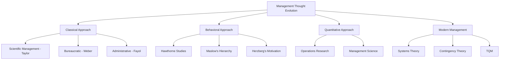

### Key Takeaways
- ✅ Management is the process of coordinating resources to achieve organizational goals
- ✅ Four primary functions: Planning, Organizing, Leading, Controlling
- ✅ Management theories evolved from classical to modern approaches
- ✅ Effective management ensures goal achievement, resource optimization, and organizational growth

### Cross-References
- Related to: Topic 1.3 (Functions of Managers), Topic 2.1 (Planning)

---

## Topic 1.2: Role of Management

**📍 Syllabus Reference:** Unit 1 → Topic 1.2
**📄 Sources:** Complete PME (1).pdf (Pages 12-15)

### Overview

Management plays a pivotal role in coordinating and directing organizational resources towards the achievement of predetermined goals. It involves planning, organizing, leading, and controlling activities to ensure efficiency and effectiveness within the organization.

The role of management encompasses:

- **Coordination:** Ensuring harmonious integration of various organizational functions and resources. Example: Aligning marketing and sales teams for product launches.
- **Direction:** Providing guidance and direction to employees, aligning their efforts with organizational objectives. Example: Setting team targets and expectations.
- **Decision-Making:** Making informed decisions based on analysis and evaluation of available information. Example: Choosing between investment options.
- **Resource Utilization:** Facilitating efficient allocation and utilization of resources. Example: Optimizing budget allocation across departments.
- **Leadership:** Fostering leadership within the organization, motivating employees. Example: Developing future leaders through mentoring.
- **Adaptability:** Anticipating and responding to changes in the internal and external environment. Example: Pivoting strategy during market downturns.
- **Conflict Resolution:** Addressing conflicts and disputes, maintaining a cohesive work environment. Example: Mediating disputes between team members.

Coordination is essential as management ensures the harmonious integration of various organizational functions and resources. Direction provides guidance and direction to employees, aligning their efforts with organizational objectives. Decision-making involves managers making informed decisions based on analysis and evaluation of available information. Resource utilization facilitates efficient allocation and utilization of resources through effective management. Leadership fosters leadership within the organization, motivating employees to perform at their best. Adaptability enables managers to anticipate and respond to changes in the internal and external environment, ensuring organizational adaptability. Management also addresses conflicts and disputes, maintaining a cohesive work environment.

### Key Definitions

> **Coordination:** The harmonious integration of various organizational functions and resources to achieve common goals.
> *— : Complete PME (1).pdf, Page 12*

> **Direction:** Providing guidance and guidance to employees, aligning their efforts with organizational objectives.
> *— : Complete PME (1).pdf, Page 12*

### Managerial Roles

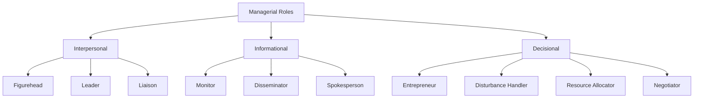

### Key Takeaways
- ✅ Management coordinates organizational resources towards goals
- ✅ Managers perform interpersonal, informational, and decisional roles
- ✅ Effective management ensures adaptation to environmental changes

### Cross-References
- Related to: Topic 1.1 (Management Overview), Topic 1.3 (Functions of Managers)

---

## Topic 1.3: Functions of Managers

**📍 Syllabus Reference:** Unit 1 → Topic 1.3
**📄 Sources:** Complete PME (1).pdf (Pages 15-25)

### Overview

The functions of management provide a framework for managerial activities:

- **Planning:** Setting organizational objectives and determining the best course of action to achieve them. Example: Creating an annual budget and sales targets.
- **Organizing:** Arranging resources and tasks to accomplish objectives efficiently. Example: Designing the organizational chart and job roles.
- **Leading:** Motivating and guiding employees towards goal attainment. Example: Giving team pep talks and performance feedback.
- **Controlling:** Monitoring performance and taking corrective actions to ensure objectives are met. Example: Comparing actual sales with targets.

**Planning Details:**
- Establishing goals, identifying alternative courses of action, evaluating options, and selecting the best course of action
- Types: Strategic, tactical, operational, and contingency planning
- Provides a roadmap for the organization, guiding decision-making and resource allocation

**Organizing Details:**
- Designing the organizational structure, defining roles and responsibilities, and establishing communication channels
- Elements: Division of labor, delegation of authority, span of control, and coordination
- Ensures efficient utilization of resources and facilitates achievement of organizational goals

**Leading Details:**
- Influencing and motivating employees to work towards organizational goals
- Essential aspects: Communication, motivation, delegation, and conflict resolution
- Leadership styles: Autocratic, democratic, laissez-faire, transformational, and situational
- Inspires commitment, enhances employee morale, and fosters a positive work culture

**Controlling Details:**
- Monitoring performance, comparing it with predetermined standards, and taking corrective actions
- Process: Setting performance standards, measuring actual performance, comparing both, implementing corrective actions
- Methods: Budgetary control, financial ratios, performance appraisals, and quality control

### Key Definitions

> **Planning:** The function of management that involves setting objectives and determining the actions required to achieve them.
> *— : Complete PME (1).pdf, Page 16*

> **Organizing:** The function of management that involves arranging resources and tasks to accomplish organizational objectives.
> *— : Complete PME (1).pdf, Page 17*

> **Leading:** The function of management that focuses on influencing and motivating employees to work towards organizational goals.
> *— : Complete PME (1).pdf, Page 18*

> **Controlling:** The function of management that involves monitoring performance and taking corrective actions to ensure objectives are met.
> *— : Complete PME (1).pdf, Page 19*

### Integration of Functions

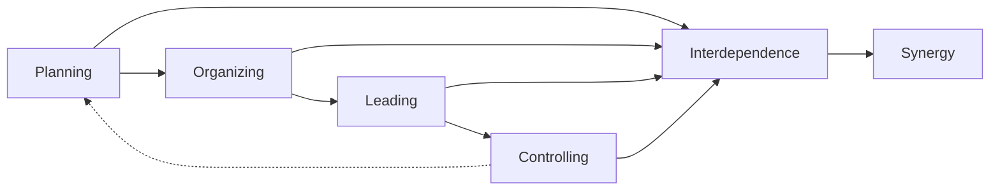

### Key Takeaways
- ✅ Four fundamental functions: Planning, Organizing, Leading, Controlling
- ✅ These functions are interrelated and mutually dependent
- ✅ Management functions are cyclical and iterative
- ✅ Integration creates synergy, enhancing organizational performance

### Cross-References
- Related to: Topic 1.1 (Management Overview), Topic 1.2 (Role of Management)

---

## Topic 1.4: Levels of Management

**📍 Syllabus Reference:** Unit 1 → Topic 1.4
**📄 Sources:** Complete PME (1).pdf (Pages 25-35)

### Overview

Levels of management represent the hierarchical structure within an organization, delineating the authority, responsibilities, and scope of decision-making at different levels. Organizational management is structured into three hierarchical levels:

- **Top-Level Management:** Responsible for setting organizational objectives, formulating strategies, and making long-term decisions. Examples: CEOs, presidents, and board of directors. Functions include strategic planning, policy formulation, and resource allocation.
- **Middle-Level Management:** Implements plans and strategies developed by top-level management. Examples: Department heads, division managers, and branch managers. Functions include coordinating activities, allocating resources, and monitoring performance.
- **First-Line Management (Supervisors):** Oversees day-to-day operations and supervises non-managerial employees. Examples: Team leaders, forepersons, and office managers. Functions include direct supervision, task assignment, and performance evaluation.

### Key Definitions

> **Top-Level Management:** The highest hierarchical level responsible for setting organizational goals and strategies.
> *— : Complete PME (1).pdf, Page 26*

> **Middle-Level Management:** The intermediate level that implements plans and coordinates activities.
> *— : Complete PME (1).pdf, Page 27*

> **First-Line Management:** The level that oversees day-to-day operations and supervises employees.
> *— : Complete PME (1).pdf, Page 28*

### Comparison of Management Levels

| Level            | Authority | Focus              | Examples                  | Key Functions                       |
| ---------------- | --------- | ------------------ | ------------------------- | ----------------------------------- |
| **Top-Level**    | Highest   | Strategic planning | CEO, President, Board     | Goal setting, strategy formulation  |
| **Middle-Level** | Medium    | Implementation     | Department Heads          | Coordination, resource allocation   |
| **First-Line**   | Lowest    | Operations         | Team Leaders, Supervisors | Direct supervision, task assignment |

### Organizational Hierarchy

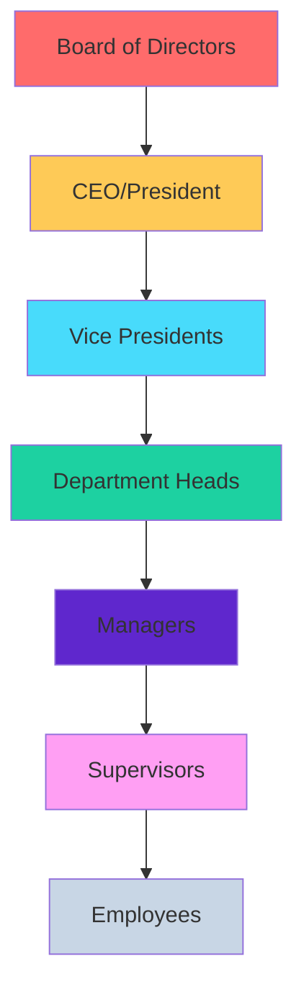

### Key Takeaways
- ✅ Three levels: Top, Middle, and First-Line Management
- ✅ Each level has distinct authority, responsibilities, and focus
- ✅ Clear hierarchy enables effective coordination and control

### Cross-References
- Related to: Topic 1.6 (Organizational Hierarchy), Topic 1.5 (Management Skills)

---

## Topic 1.5: Management Skills

**📍 Syllabus Reference:** Unit 1 → Topic 1.5
**📄 Sources:** Complete PME (1).pdf (Pages 35-45)

### Overview

Effective managers possess a combination of technical, human, and conceptual skills essential for managerial success:

- **Technical Skills:** Knowledge and proficiency in specific techniques and procedures. Example: An engineer using CAD software for design.
- **Human Skills:** Ability to work with, understand, and motivate people. Example: A manager resolving team conflicts.
- **Conceptual Skills:** Capacity to think abstractly and analyze complex situations. Example: A CEO developing long-term strategy.

**Skills by Management Level:**
- **Technical Skills:** Essential for lower-level managers and technical specialists. Includes engineering skills, computer programming, and financial analysis.
- **Human Skills:** Crucial for all levels of management, particularly middle managers. Includes communication, empathy, conflict resolution, and teamwork.
- **Conceptual Skills:** Essential for top-level managers dealing with uncertainty and strategic decision-making. Includes critical thinking, problem-solving, and strategic planning.

**Development of Management Skills:**
- **Training and Development:** Formal education, workshops, seminars, and on-the-job training programs.
- **Experience:** Learning through practical experience, exposure to diverse situations, and mentorship.
- **Continuous Learning:** Staying updated with industry trends, emerging technologies, and best practices.

### Key Definitions

> **Technical Skills:** The ability to use specific techniques and procedures related to a particular field or industry.
> *— : Complete PME (1).pdf, Page 36*

> **Human Skills:** The ability to work with, understand, and motivate individuals and groups.
> *— : Complete PME (1).pdf, Page 37*

> **Conceptual Skills:** The capacity to think abstractly, analyze complex situations, and formulate innovative solutions.
> *— : Complete PME (1).pdf, Page 38*

### Skills by Management Level

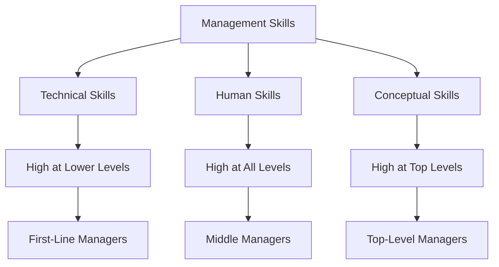

### Comparison of Skills

| Skill Type     | Description                      | Importance Level by Management Level   |
| -------------- | -------------------------------- | -------------------------------------- |
| **Technical**  | Knowledge of specific techniques | Highest for First-Line, Lowest for Top |
| **Human**      | Working with people              | Important at all levels                |
| **Conceptual** | Thinking and planning            | Highest for Top, Lowest for First-Line |

### Key Takeaways
- ✅ Three essential management skills: Technical, Human, and Conceptual
- ✅ Skill requirements vary by management level
- ✅ Skills develop through training, experience, and continuous learning

### Cross-References
- Related to: Topic 1.4 (Levels of Management), Topic 1.6 (Organizational Hierarchy)

---

## Topic 1.6: Organizational Hierarchy

**📍 Syllabus Reference:** Unit 1 → Topic 1.6
**📄 Sources:** Complete PME (1).pdf (Pages 45-55)

### Overview

Organizational hierarchy refers to the structure of authority and responsibility within an organization, depicting the chain of command and communication channels.

**Elements of Organizational Hierarchy:**

- **Unity of Command:** Ensures each employee reports to only one supervisor, avoiding confusion and conflicting directives. Example: Each team member has one manager.
- **Scalar Principle:** States that authority and responsibility flow in a hierarchical order from top to bottom. Example: CEO to managers to employees.
- **Span of Control:** Refers to the number of subordinates directly supervised by a manager. Example: A manager overseeing 5-10 employees.
- **Hierarchy of Authority:** Ensures clear lines of authority and communication for efficient decision-making and coordination. Example: Organizational chart.

**Types of Organizational Structures:**

- **Functional Structure:** Organized based on specialized functions (marketing, finance, HR). Example: Companies with separate departments.
- **Divisional Structure:** Organized around product lines, geographic regions, or customer segments. Example: Coca-Cola regional divisions.
- **Matrix Structure:** Combining functional and divisional structures. Example: Employees reporting to both function and project managers.

**Importance of Organizational Hierarchy:**

- Clarity in roles and responsibilities
- Coordination and communication
- Accountability
- Scalability

### Key Definitions

> **Organizational Hierarchy:** The structure of authority and responsibility within an organization depicting the chain of command.
> *— : Complete PME (1).pdf, Page 46*

> **Unity of Command:** The management principle that each employee reports to only one supervisor.
> *— : Complete PME (1).pdf, Page 46*

> **Span of Control:** The number of subordinates directly supervised by a manager.
> *— : Complete PME (1).pdf, Page 47*

### Organizational Structures

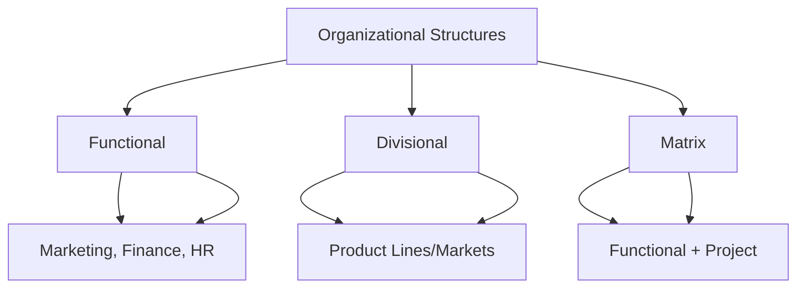

### Key Takeaways
- ✅ Organizational hierarchy defines authority and responsibility structure
- ✅ Key elements: Unity of Command, Scalar Principle, Span of Control
- ✅ Different structures serve different organizational needs

### Cross-References
- Related to: Topic 1.4 (Levels of Management), Topic 1.5 (Management Skills)

---

## Topic 1.7: Social and Ethical Responsibilities of Management

**📍 Syllabus Reference:** Unit 1 → Topic 1.7
**📄 Sources:** Complete PME (1).pdf (Pages 55-75)

### Overview

Social and ethical responsibilities of management refer to the obligation of businesses to consider the welfare of society and adhere to ethical principles in their decision-making and operations.

**Why These Responsibilities Matter:**
- **Stakeholder Satisfaction:** Meeting needs of all stakeholders
- **Reputation and Brand Image:** Building positive brand perception
- **Risk Management:** Reducing legal and reputational risks
- **Long-term Sustainability:** Ensuring business longevity

**Arguments FOR Social Responsibilities:**
- **Ethical Imperative:** Businesses have a moral obligation beyond profit maximization. Example: Not using child labor.
- **Public Expectations:** Society expects responsible behavior. Example: Consumers demanding ethical products.
- **Long-term Profitability:** Social responsibility enhances brand loyalty. Example: Loyal customer base.
- **Employee Engagement:** Attracts and retains talent. Example: People prefer ethical employers.
- **Competitive Advantage:** Differentiation through social responsibility. Example: Green certifications.

**Arguments AGAINST Social Responsibilities:**
- **Profit Maximization:** Primary responsibility is to maximize profits for shareholders. Example: Focusing solely on returns.
- **Costs and Resource Allocation:** May divert resources from core activities. Example: CSR costs reducing R&D budget.
- **Competitive Disadvantage:** Against less scrupulous competitors who don't spend on CSR. Example: Higher costs than competitors.
- **Lack of Accountability:** May lack clear metrics for social impact. Example: Difficult to measure outcomes.
- **Role of Government:** Social issues should be addressed by government. Example: Leaving welfare to policy.

**Ethical Responsibilities of Management:**
- **Fair Treatment:** Ensuring fairness in employment practices
- **Transparency:** Maintaining transparency in business operations
- **Integrity:** Upholding ethical standards
- **Environmental Stewardship:** Minimizing environmental impact
- **Community Engagement:** Contributing to community welfare

### Key Definitions

> **Corporate Social Responsibility (CSR):** The obligation of businesses to contribute to the welfare of society beyond profit maximization.
> *— : Complete PME (1).pdf, Page 56*

> **Managerial Ethics:** The moral principles, values, and standards of conduct that guide managerial decision-making.
> *— : Complete PME (1).pdf, Page 57*

### Arguments For and Against Social Responsibility

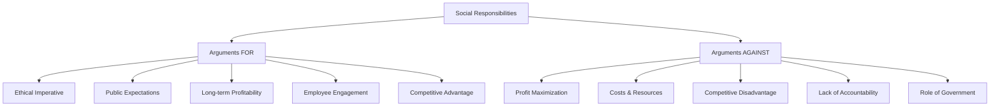

### Key Takeaways
- ✅ Businesses have social responsibilities beyond profit maximization
- ✅ Ethical conduct guides managerial decision-making
- ✅ CSR programs demonstrate commitment to societal welfare

### Cross-References
- Related to: Topic 1.8 (Social Stakeholders), Topic 1.9 (Measuring Social Responsiveness)

---

## Topic 1.8: Social Stakeholders

**📍 Syllabus Reference:** Unit 1 → Topic 1.8
**📄 Sources:** Complete PME (1).pdf (Pages 75-85)

### Overview

Social stakeholders are individuals or groups who are affected by or have an interest in the actions, decisions, and performance of an organization. They play a significant role in shaping the social, environmental, and ethical impact of businesses.

**Types of Social Stakeholders:**

- **Employees:** Who contribute to organizational success and seek fair compensation, safe working conditions, and career development. Example: Workers demanding better wages.
- **Customers:** Who purchase goods/services and seek quality, fair pricing, and ethical practices. Example: Customers preferring ethical brands.
- **Communities:** Who host organizational operations and seek economic development and sustainability. Example: Local communities opposing pollution.
- **Suppliers and Partners:** Who provide essential resources and seek fair business practices. Example: Suppliers requiring timely payments.
- **Investors and Shareholders:** Who provide financial capital and seek profitability and transparency. Example: Investors demanding financial reports.
- **Government and Regulatory Bodies:** Who enact and enforce laws and seek compliance. Example: Tax authorities requiring filings.
- **NGOs:** Who advocate for social causes and seek collaboration. Example: Environmental groups pressing for sustainability.
- **Media and Public Opinion:** Who shape public perception and seek accuracy and accountability. Example: News outlets reporting on company practices.

**Importance of Social Stakeholders:**

- **Accountability:** They hold organizations accountable for actions
- **Legitimacy:** Addressing stakeholder concerns enhances legitimacy
- **Risk Management:** Proactive engagement mitigates reputation risks
- **Innovation:** Stakeholder feedback fosters innovation
- **Long-term Sustainability:** Positive relationships contribute to sustainability

### Key Definitions

> **Social Stakeholders:** Individuals or groups affected by or interested in an organization's actions and performance.
> *— : Complete PME (1).pdf, Page 76*

> **Stakeholder Engagement:** Consulting with stakeholders to identify key issues and priorities.
> *— : Complete PME (1).pdf, Page 77*

### Types of Social Stakeholders

| Stakeholder     | Role                    | Key Interests                          |
| --------------- | ----------------------- | -------------------------------------- |
| **Employees**   | Contribute to success   | Fair compensation, safety, development |
| **Customers**   | Purchase goods/services | Quality, pricing, ethics               |
| **Communities** | Host operations         | Development, sustainability            |
| **Suppliers**   | Provide resources       | Fair practices, partnerships           |
| **Investors**   | Provide capital         | Profitability, transparency            |
| **Government**  | Enforce regulations     | Compliance, taxes                      |
| **NGOs**        | Advocate causes         | Collaboration, accountability          |
| **Media**       | Shape perception        | Accuracy, ethics                       |

### Key Takeaways
- ✅ Multiple stakeholder groups influence organizational decisions
- ✅ Engaging stakeholders is essential for organizational success
- ✅ Different stakeholders have different interests and expectations

### Cross-References
- Related to: Topic 1.7 (Social Responsibilities), Topic 1.9 (Measuring Social Responsiveness)

---

## Topic 1.9: Measuring Social Responsiveness and Managerial Ethics

**📍 Syllabus Reference:** Unit 1 → Topic 1.9
**📄 Sources:** Complete PME (1).pdf (Pages 85-100)

### Overview

Social responsiveness refers to an organization's ability to recognize and address social issues, concerns, and expectations in a timely and effective manner. Measuring social responsiveness involves evaluating the organization's efforts and impact in responding to societal needs.

**Key metrics and indicators include:**

- **Community Impact:** Community engagement initiatives and development contributions. Example: Building schools in underserved areas.
- **Environmental Sustainability:** Carbon footprint and resource conservation. Example: Reducing carbon emissions by 30%.
- **Employee Welfare:** Satisfaction and health and safety. Example: Implementing wellness programs.
- **Supplier Relations:** Diversity and code of conduct. Example: Ensuring fair labor practices in supply chain.
- **Ethical Business Practices:** Violations and ethics training. Example: Conducting anti-corruption training.
- **CSR Performance:** Reports and social impact assessment. Example: Publishing annual CSR reports.
- **Stakeholder Feedback:** Surveys and complaint resolution. Example: Regular stakeholder satisfaction surveys.

**Tools and approaches include:**

- **Social Audit:** Comprehensive assessment of social, environmental, and ethical performance.
- **Triple Bottom Line (TBL) Reporting:** Evaluating economic, environmental, and social criteria.
- **Key Performance Indicators (KPIs):** Aligned with social responsiveness goals.
- **Benchmarking:** Comparing with industry peers.

**Managerial Ethics** refers to the moral principles, values, and standards of conduct that guide managerial decision-making and behavior:

- **Integrity:** Acting honestly and truthfully
- **Respect for Others:** Treating with dignity and empathy
- **Transparency and Accountability:** Providing accurate information
- **Fairness and Justice:** Ensuring equitable treatment
- **Professional Competence:** Maintaining knowledge and skills

**The ethical decision-making framework:**
1. Identifying the ethical issue
2. Gathering information
3. Evaluating alternatives
4. Making a decision
5. Implementing and monitoring

### Key Definitions

> **Social Responsiveness:** An organization's ability to recognize and address social issues in a timely and effective manner.
> *— : Complete PME (1).pdf, Page 86*

> **Social Audit:** A comprehensive assessment of an organization's social, environmental, and ethical performance.
> *— : Complete PME (1).pdf, Page 87*

> **Triple Bottom Line (TBL):** A reporting framework evaluating organizational performance based on economic, environmental, and social criteria.
> *— : Complete PME (1).pdf, Page 87*

### Measurement Tools

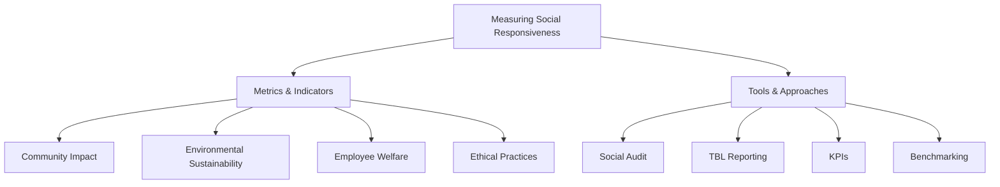

### Key Takeaways
- ✅ Social responsiveness can be measured through various metrics and tools
- ✅ Managerial ethics guides decision-making behavior
- ✅ Ethical frameworks help address complex dilemmas

### Cross-References
- Related to: Topic 1.7 (Social Responsibilities), Topic 1.8 (Social Stakeholders)

---

## Topic 1.10: Omnipotent and Symbolic View

**📍 Syllabus Reference:** Unit 1 → Topic 1.10
**📄 Sources:** Complete PME (1).pdf (Pages 100-115)

### Overview

**The Omnipotent View** posits that managers have significant control and authority over the success or failure of their organizations. According to this perspective, managers are seen as highly influential and capable of shaping organizational outcomes through their decisions and actions.

**Key Aspects of Omnipotent View:**

- **Managers as Key Decision-Makers:** Perceived as primary decision-makers with authority to determine strategies, allocate resources, and set goals. Example: CEO making strategic decisions.
- **Direct Impact on Organizational Performance:** Believed to have direct and substantial impact on performance and profitability. Example: Manager's decisions directly affecting quarterly results.
- **Accountability for Results:** Held accountable for outcomes of decisions and actions. Example: Manager fired for poor performance.
- **Centralized Authority and Control:** Authority centralized within managerial hierarchy. Example: Top-down decision making.
- **Leadership as a Driving Force:** Effective leadership seen as critical to success. Example: Transformational leader turning around company.

**Criticisms of Omnipotent View:**

- **External Factors and Constraints:** Overlooks influence of market conditions, regulatory environment, and economic forces. Example: Economic recession affecting all companies.
- **Complexity of Organizational Dynamics:** Organizations are complex systems with multiple stakeholders. Example: Multiple departments influencing outcomes.
- **Limited Scope of Managerial Influence:** Managers may have limited control over technological advancements and global trends. Example: Digital disruption beyond manager's control.
- **Shared Decision-Making:** Decision-making involves multiple stakeholders. Example: Board approvals required.

**The Symbolic View** emphasizes the symbolic and ritualistic aspects of managerial behavior, highlighting the importance of organizational culture, symbols, and ceremonies in shaping perceptions and interpretations of managerial effectiveness.

**Key Aspects of Symbolic View:**

- **Focus on Symbolism and Rituals:** Symbolic gestures convey organizational values. Example: CEO wearing casual clothes to show openness.
- **Management as Symbolic Figureheads:** Managers represent organizational identity. Example: CEO as company ambassador.
- **Meaning-Making and Interpretation:** Actions subject to interpretation. Example: Town hall meeting signals transparency.
- **Creation of Organizational Identity:** Managers sustain cohesive identity. Example: Founder defining company values.
- **Influence on Organizational Climate:** Symbolic practices shape climate. Example: Celebrating team successes.

**Criticisms of Symbolic View:**

- **Limited Impact on Performance:** Symbolic gestures may have limited impact on outcomes. Example: PR stunts not improving profits.
- **Superficiality and Symbol Manipulation:** May promote superficiality rather than substantive efforts. Example: Focus on image over substance.
- **Neglect of Structural and Strategic Factors:** May neglect important factors influencing effectiveness. Example: Ignoring strategic planning.
- **Perpetuation of Status Quo:** May reinforce existing power dynamics. Example: Maintaining hierarchical structures.

### Key Definitions

> **Omnipotent View:** The perspective that managers have significant control over organizational success or failure.
> *— : Complete PME (1).pdf, Page 101*

> **Symbolic View:** The perspective that managers act as symbolic figureheads with limited direct influence on outcomes.
> *— : Complete PME (1).pdf, Page 102*

### Comparison: Omnipotent vs Symbolic View

| Aspect              | Omnipotent View                                 | Symbolic View                                   |
| ------------------- | ----------------------------------------------- | ----------------------------------------------- |
| **Definition**      | Managers have significant control over outcomes | Managers have limited influence, act as symbols |
| **Focus**           | Control over organizational performance         | Symbolic representation                         |
| **Managerial Role** | Directly responsible for success/failure        | More symbolic, less direct impact               |
| **Decision Making** | Managers make critical decisions                | Decisions may have symbolic significance        |
| **Leadership**      | Emphasis on strong leadership                   | Emphasis on perception and image                |

### Key Takeaways
- ✅ Omnipotent view emphasizes managerial control and authority
- ✅ Symbolic view highlights ceremonial and cultural aspects
- ✅ Both perspectives offer different insights into management

### Cross-References
- Related to: Topic 1.11 (Organizational Culture), Topic 1.6 (Organizational Hierarchy)

---

## Topic 1.11: Characteristics and Importance of Organizational Culture

**📍 Syllabus Reference:** Unit 1 → Topic 1.11
**📄 Sources:** Complete PME (1).pdf (Pages 115-130)

### Overview

Organizational culture is characterized by shared values, beliefs, and norms that guide behavior and decision-making within the organization.

**Characteristics of Organizational Culture:**
- **Values and Beliefs:** Shared values guide behavior. Example: Company's commitment to integrity.
- **Norms and Practices:** Define acceptable behavior. Example: Dress code policies.
- **Symbols and Artifacts:** Manifested through logos, rituals. Example: Company logo and annual events.
- **Communication Patterns:** Reflect culture. Example: Open-door policy.
- **Leadership Style:** Shapes culture. Example: Democratic leadership approach.
- **Employee Behavior:** Influences attitudes. Example: Team collaboration norms.
- **Adaptability and Change:** Influences ability to adapt. Example: Embracing new technologies.
- **Alignment with Strategy:** Should support objectives. Example: Culture supporting growth strategy.

**Importance of Organizational Culture:**
- **Guidance for Behavior:** Provides framework for consistent behavior
- **Employee Engagement and Morale:** Fosters satisfaction and retention
- **Attracting and Retaining Talent:** Distinctive culture as competitive advantage
- **Performance and Productivity:** Shapes attitudes and motivation
- **Innovation and Creativity:** Encourages experimentation
- **Customer Satisfaction:** Prioritizes customer needs
- **Organizational Resilience:** Fosters adaptability during crisis
- **Brand Image and Reputation:** Influences external perception
- **Ethical Behavior:** Promotes integrity
- **Long-term Success and Sustainability:** Foundation for growth

### Key Definitions

> **Organizational Culture:** The shared values, beliefs, and norms that guide behavior within an organization.
> *— : Complete PME (1).pdf, Page 116*

> **Organizational Artifacts:** Visible elements such as logos, slogans, and physical workspace that manifest culture.
> *— : Complete PME (1).pdf, Page 117*

### Characteristics of Organizational Culture

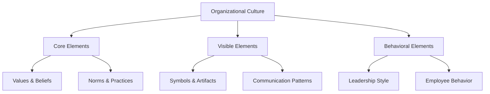

### Key Takeaways
- ✅ Organizational culture shapes behavior and decision-making
- ✅ Strong culture enhances performance and employee engagement
- ✅ Culture must align with strategic objectives

### Cross-References
- Related to: Topic 1.10 (Omnipotent and Symbolic View), Topic 1.12 (Business Environments)

---

## Topic 1.12: Relevance of Political, Legal, Economic and Cultural Environments to Global Business

**📍 Syllabus Reference:** Unit 1 → Topic 1.12
**📄 Sources:** Complete PME (1).pdf (Pages 130-145)

### Overview

The relevance of political, legal, economic, and cultural environments to global business is profound, as these factors significantly impact operations, strategies, and outcomes for businesses operating internationally.

**Political Environment:**
- **Government Stability and Policies:** Political instability creates uncertainties. Example: Changes in government affecting business regulations.
- **Regulatory Framework:** Laws related to trade, investment, taxation. Example: Import-export regulations.
- **Trade Relations and Tariffs:** Affects cost of doing business. Example: Trade wars increasing product costs.
- **Political Risk:** Expropriation, nationalization, terrorism. Example: Operating in politically unstable regions.

**Legal Environment:**
- **Legal Systems and Regulations:** Governing contracts, intellectual property. Example: Contract law variations across countries.
- **Compliance and Risk Management:** Robust compliance programs. Example: GDPR compliance for EU operations.
- **Intellectual Property Protection:** Patents, trademarks, copyrights. Example: Protecting software patents internationally.

**Economic Environment:**
- **Macroeconomic Factors:** GDP growth, inflation, interest rates. Example: Interest rate changes affecting investment decisions.
- **Market Conditions:** Affects demand and pricing. Example: Economic downturn reducing consumer spending.
- **Trade and Investment Opportunities:** Globalization opens opportunities. Example: Free trade agreements enabling market access.

**Cultural Environment:**
- **Social Norms and Values:** Shapes consumer preferences. Example: Color preferences in marketing.
- **Workplace Culture:** Affects dynamics and communication. Example: Hierarchical vs. flat organizational structures.
- **Business Ethics and Practices:** Varies across countries. Example: Gift-giving customs in business relationships.

### Key Definitions

> **Political Environment:** The political factors including government stability, policies, and regulations affecting business.
> *— : Complete PME (1).pdf, Page 131*

> **Legal Environment:** The legal systems, laws, and regulations governing business activities.
> *— : Complete PME (1).pdf, Page 132*

> **Economic Environment:** The macroeconomic factors and market conditions affecting business.
> *— : Complete PME (1).pdf, Page 133*

> **Cultural Environment:** The social norms, values, and ethical standards affecting business practices.
> *— : Complete PME (1).pdf, Page 134*

### Business Environments

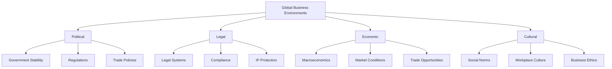

### Key Takeaways
- ✅ Multiple environmental factors affect global business
- ✅ Understanding environments is essential for international operations
- ✅ Businesses must adapt strategies to different contexts

### Cross-References
- Related to: Topic 1.13 (International Structures), Topic 1.11 (Organizational Culture)

---

## Topic 1.13: Structures and Techniques Organizations Use as They Go International

**📍 Syllabus Reference:** Unit 1 → Topic 1.13
**📄 Sources:** Complete PME (1).pdf (Pages 145-160)

### Overview

As organizations expand internationally, they employ various structures and techniques to effectively manage operations, navigate cross-border complexities, and capitalize on global opportunities.

**Organizational Structures for International Expansion:**

- **Global Division Structure:** Dedicated division for international operations. Example: Separate international business unit.
- **International Matrix Structure:** Combining functional and geographic structures. Example: Dual reporting to function and region.
- **Transnational Structure:** Integrating global operations with local responsiveness. Example: Balancing global efficiency with local adaptation.
- **Franchise Model:** Expanding through local franchisees. Example: McDonald's franchise model.
- **Joint Ventures and Strategic Alliances:** Partnering with local companies. Example: Toyota partnering with local firms.

**Techniques and Strategies:**

- **Market Research and Analysis:** Understanding local dynamics. Example: Researching consumer preferences in new markets.
- **Localization:** Adapting products and services. Example: McDonald's offering local cuisine.
- **Standardization:** Achieving economies of scale. Example: iPhone sold globally with minimal changes.
- **Supply Chain Management:** Optimizing logistics. Example: Global sourcing of components.
- **Cross-Cultural Training:** Enhancing cultural awareness. Example: Training employees on cultural differences.
- **Risk Management:** Addressing geopolitical risks. Example: Diversifying suppliers across countries.
- **Technology Adoption:** Leveraging digital tools. Example: Using cloud-based systems for global coordination.
- **Government Relations:** Navigating regulatory complexities. Example: Hiring local regulatory experts.
- **Ethical and CSR Initiatives:** Demonstrating sustainability commitment. Example: Environmental sustainability programs.
- **Continuous Learning and Adaptation:** Staying agile. Example: Regularly updating strategies based on feedback.

### Key Definitions

> **Global Division Structure:** An organizational structure with a dedicated division for managing international operations.
> *— : Complete PME (1).pdf, Page 146*

> **Transnational Structure:** An organizational structure integrating global operations while allowing for local responsiveness.
> *— : Complete PME (1).pdf, Page 147*

> **Franchise Model:** A business expansion method where local franchisees operate under the organization's brand.
> *— : Complete PME (1).pdf, Page 147*

### International Expansion Structures

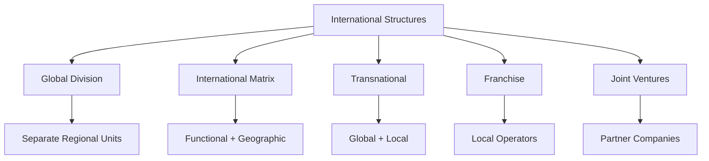

### Key Takeaways
- ✅ Multiple structural options for international expansion
- ✅ Adaptation and localization are crucial for success
- ✅ Cross-cultural understanding enables effective global operations

### Cross-References
- Related to: Topic 1.12 (Business Environments), Topic 1.6 (Organizational Hierarchy)

---

# Unit 2: Planning and Directing

## Topic 2.1: Nature and Purpose of Planning

**📍 Syllabus Reference:** Unit 2 → Topic 2.1
**📄 Sources:** Complete PME (1).pdf (Pages 161-175)

### Overview

Planning is the process of setting goals, objectives, and strategies to achieve desired outcomes. It is a fundamental function of management involving analyzing the current situation, anticipating future trends, and developing action plans.

The nature of planning includes being future-oriented (involves setting goals for future achievement), systematic process (follows analysis, decision-making, and action), integrative function (integrates various organizational functions), and dynamic and flexible (requires adaptation to changing circumstances).

The purpose of planning includes goal setting (provides clear direction), resource allocation (facilitates effective utilization), minimize uncertainty (anticipates future uncertainties), coordination and integration (promotes coordination across departments), and decision-making (provides framework for evaluation).

### Key Definitions

> **Planning:** The process of setting goals, objectives, and strategies to achieve desired outcomes.
> *— : Complete PME (1).pdf, Page 162*

> **Strategic Planning:** Long-term planning that defines mission, vision, and strategic objectives.
> *— : Complete PME (1).pdf, Page 163*

> **Tactical Planning:** Intermediate-term planning that translates strategic goals into specific action plans.
> *— : Complete PME (1).pdf, Page 163*

### Types of Planning

| Type            | Timeframe  | Focus                 | Examples                  |
| --------------- | ---------- | --------------------- | ------------------------- |
| **Strategic**   | 3-5+ years | Long-term goals       | Mission, vision, strategy |
| **Tactical**    | 1-3 years  | Implementation        | Departmental plans        |
| **Operational** | Short-term | Day-to-day activities | Budgets, schedules        |
| **Contingency** | As needed  | Emergency response    | Backup plans              |

### Key Takeaways
- ✅ Planning is future-oriented and systematic
- ✅ Multiple types serve different purposes
- ✅ Effective planning reduces uncertainty and enables coordination

### Cross-References
- Related to: Topic 2.2 (Steps in Planning), Topic 2.3 (Setting Objectives)

---

## Topic 2.2: Steps Involved in Planning

**📍 Syllabus Reference:** Unit 2 → Topic 2.2
**📄 Sources:** Complete PME (1).pdf (Pages 175-190)

### Overview

The planning process involves several sequential steps that ensure comprehensive and effective planning:

- **Setting Objectives:** Identifying and clarifying organizational goals, ensuring they are SMART (Specific, Measurable, Achievable, Relevant, Time-bound). Example: A company sets a goal to increase sales by 20% in the next fiscal year.

- **Environmental Analysis:** Assessing internal and external environment to identify strengths, weaknesses, opportunities, and threats (SWOT analysis). Example: Analyzing market trends and competitor actions before launching a new product.

- **Developing Strategies:** Formulating strategies and action plans considering available resources and market opportunities. Example: Creating a marketing strategy based on budget and target audience.

- **Implementation:** Executing plans by allocating resources, assigning responsibilities, and monitoring progress. Example: Rolling out a new project plan across departments.

- **Evaluation and Adjustment:** Monitoring and evaluating implementation, measuring performance, and making adjustments. Example: Reviewing quarterly results and modifying strategies.

**Challenges in planning:**
- Uncertainty and complexity in the business environment
- Resistance to change from employees
- Resource constraints (budget, personnel, time)
- Inadequate information or data

### Key Definitions

> **SWOT Analysis:** A strategic planning tool for analyzing Strengths, Weaknesses, Opportunities, and Threats.
> *— : Complete PME (1).pdf, Page 178*

> **SMART Goals:** Objectives that are Specific, Measurable, Achievable, Relevant, and Time-bound.
> *— : Complete PME (1).pdf, Page 177*

### Planning Process

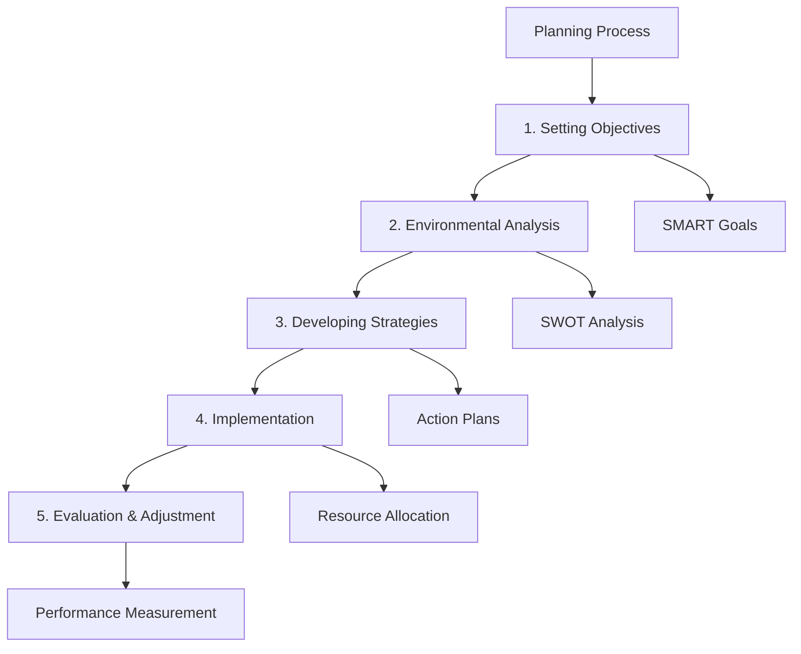

### Key Takeaways
- ✅ Planning follows a systematic process
- ✅ Environmental analysis is crucial for effective planning
- ✅ Continuous evaluation enables improvement

### Cross-References
- Related to: Topic 2.1 (Nature of Planning), Topic 2.3 (Setting Objectives)

---

## Topic 2.3: Objectives and Setting Objectives

**📍 Syllabus Reference:** Unit 2 → Topic 2.3
**📄 Sources:** Complete PME (1).pdf (Pages 190-205)

### Overview

Setting objectives involves defining specific, measurable, achievable, relevant, and time-bound (SMART) goals that provide direction and purpose for organizational activities. The purpose includes serving as benchmarks for performance evaluation, decision-making, and organizational alignment.

Steps in setting objectives include 
- clarifying organizational mission and vision, 
- identifying key result areas (KRAs), 
- defining specific objectives, 
- ensuring measurability and achievability, 
- relevance to organizational goals, 
- setting time frames,
- communicating objectives.

### Key Definitions

> **Objectives:** Specific, measurable goals that provide direction and purpose for organizational activities.
> *— : Complete PME (1).pdf, Page 191*

> **Key Result Areas (KRAs):** Strategic priorities that drive organizational success.
> *— : Complete PME (1).pdf, Page 192*

### Steps in Setting Objectives

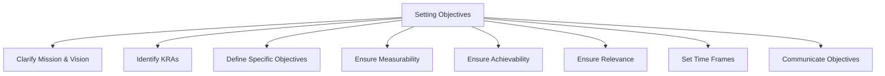

### Key Takeaways
- ✅ Objectives must be SMART
- ✅ Clear objectives align organizational efforts
- ✅ Communication ensures understanding and buy-in

### Cross-References
- Related to: Topic 2.2 (Planning Process), Topic 2.4 (MBO)

---

## Topic 2.4: Process of Managing by Objectives (MBO)

### Overview

Managing by Objectives (MBO) is a systematic approach to management involving setting specific objectives, cascading them throughout the organization, and using them as a basis for planning, performance evaluation, and decision-making.

The MBO process includes establishing organizational objectives (senior management defines overarching objectives based on mission and vision), cascading objectives downward (objectives cascaded through hierarchy), setting departmental and individual objectives (aligned with higher-level goals), developing action plans (outlining strategies and resources required), monitoring progress (regular tracking with feedback), evaluating performance (periodic evaluations against objectives), taking corrective action (addressing performance gaps), and rewarding achievement (recognizing and rewarding success).

### Key Definitions

> **MBO (Managing by Objectives):** A systematic approach involving cascading objectives throughout the organization.
> *— : Complete PME (1).pdf, Page 206*

> **Cascading Objectives:** The process of translating organizational objectives into departmental and individual goals.
> *— : Complete PME (1).pdf, Page 207*

### MBO Process

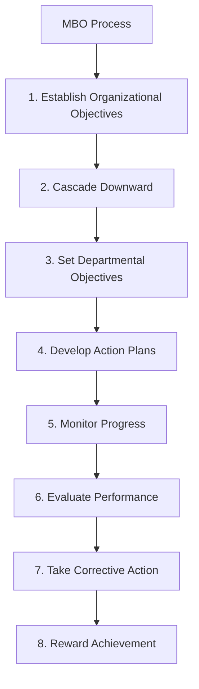

### Key Takeaways
- ✅ MBO aligns objectives across organizational levels
- ✅ Regular monitoring enables timely adjustments
- ✅ Performance evaluation drives continuous improvement

### Cross-References
- Related to: Topic 2.3 (Setting Objectives), Topic 2.5 (Strategies)

---

## Topic 2.5: Strategies

**📍 Syllabus Reference:** Unit 2 → Topic 2.5
**📄 Sources:** Complete PME (1).pdf (Pages 220-235)

### Overview

Strategies refer to broad approaches or courses of action designed to achieve long-term organizational goals and objectives.

**Characteristics of Strategies:**
- **Long-term Orientation:** Focus on future goals and outcomes
- **Comprehensive Scope:** Cover multiple aspects of the organization
- **Flexibility and Adaptability:** Can be adjusted as needed
- **Alignment with Goals:** Support organizational objectives

**Types of Strategies:**
- **Corporate Strategy:** Defines overall scope and direction, including diversification and mergers. Example: Disney expanding from entertainment to theme parks.
- **Business Strategy:** Achieves competitive advantage through differentiation, cost leadership, or focus. Example: Walmart's cost leadership strategy.
- **Functional Strategy:** Guides functional areas like marketing and finance. Example: Marketing strategy for product launch.
- **Competitive Strategy:** Positions organization within industry. Example: Apple differentiation strategy.

### Key Definitions

> **Strategy:** A broad approach or course of action designed to achieve long-term organizational goals.
> *— : Complete PME (1).pdf, Page 221*

> **Corporate Strategy:** The overall scope and direction of the organization.
> *— : Complete PME (1).pdf, Page 222*

> **Competitive Strategy:** A strategy for achieving competitive advantage in the market.
> *— : Complete PME (1).pdf, Page 222*

### Types of Strategies

| Type                     | Description                                         | Example                                          |
| ------------------------ | --------------------------------------------------- | ------------------------------------------------ |
| **Corporate Strategy**   | The overall scope and direction of the organization | A company deciding to diversify into new markets |
| **Business Strategy**    | Strategy for achieving competitive advantage        | A retailer offering exclusive products           |
| **Functional Strategy**  | Supports business unit objectives                   | Marketing strategy for product launch            |
| **Competitive Strategy** | Strategy for market positioning                     | Cost leadership or differentiation               |

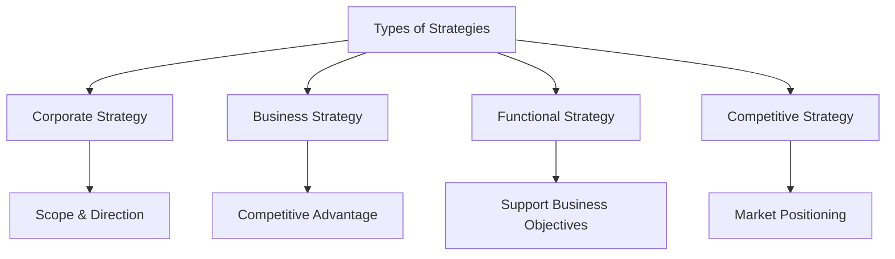

### Key Takeaways
- ✅ Strategies provide long-term direction
- ✅ Different strategy levels serve different purposes
- ✅ Strategy must be flexible and adaptable

### Cross-References
- Related to: Topic 2.6 (Policies), Topic 2.10 (Decision-Making)

---

## Topic 2.6: Policies and Planning Premises

**📍 Syllabus Reference:** Unit 2 → Topic 2.6
**📄 Sources:** Complete PME (1).pdf (Pages 235-255)

### Overview

Policies are guidelines or principles that govern decision-making and action within an organization, providing a framework for consistent and standardized behavior.

**Characteristics of Policies:**
- **Directive Nature:** Provides guidance for decision-making
- **Broad Applicability:** Applies to multiple situations
- **Flexibility:** Can be adapted to specific circumstances
- **Enforceability:** Must be followed by employees

**Types of Policies:**
- **Operational Policies:** Govern day-to-day activities. Example: Customer service guidelines.
- **HR Policies:** Outline recruitment, compensation, and conduct. Example: Leave policy.
- **Information Security Policies:** Protect sensitive data. Example: Password policy.
- **Quality Assurance Policies:** Define quality standards. Example: Product inspection criteria.

**Planning Premises** are assumptions, forecasts, and expectations about future conditions and events that serve as the basis for planning decisions:

- **Economic Premises:** Forecasts of economic growth, inflation. Example: Expecting 5% GDP growth.
- **Market Premises:** Assumptions about market demand. Example: Predicting increased consumer spending.
- **Technological Premises:** Forecasts of technological advancements. Example: Expecting AI adoption.
- **Social and Cultural Premises:** Expectations about demographic shifts. Example: Aging population trends.

### Key Definitions

> **Policies:** Guidelines or principles that govern decision-making within an organization.
> *— : Complete PME (1).pdf, Page 236*

> **Planning Premises:** Assumptions and forecasts about future conditions serving as basis for planning.
> *— : Complete PME (1).pdf, Page 237*

### Types of Policies and Premises

| Type                           | Description                                  | Example                          |
| ------------------------------ | -------------------------------------------- | -------------------------------- |
| **Operational Policies**       | Guidelines for day-to-day activities         | Customer service standards       |
| **HR Policies**                | Rules for recruitment, compensation, conduct | Leave and attendance policy      |
| **Information Security**       | Protects sensitive data and systems          | Password complexity requirements |
| **Quality Assurance**          | Defines quality standards for products       | ISO certification standards      |
| **Economic Premises**          | Forecasts of economic conditions             | GDP growth rate projections      |
| **Market Premises**            | Assumptions about market demand              | Consumer spending trends         |
| **Technological Premises**     | Forecasts of tech advancements               | AI adoption rates                |
| **Social & Cultural Premises** | Expectations about demographic shifts        | Aging population trends          |

### Key Takeaways
- ✅ Policies provide consistent decision-making frameworks
- ✅ Planning premises are assumptions about future conditions
- ✅ Both are essential for effective planning

### Cross-References
- Related to: Topic 2.5 (Strategies), Topic 2.2 (Planning Process)

---

## Topic 2.7: Competitor Intelligence

**📍 Syllabus Reference:** Unit 2 → Topic 2.7
**📄 Sources:** Complete PME (1).pdf (Pages 255-275)

### Overview

Competitor intelligence refers to the systematic process of gathering, analyzing, and interpreting information about competitors' strategies, capabilities, strengths, weaknesses, and actions to gain insights and make informed decisions.

**Why Competitor Intelligence is Important:**
- **Strategic Planning:** Provides inputs for anticipating threats and opportunities. Example: Identifying emerging competitors.
- **Market Positioning:** Understanding competitive positioning in the market. Example: Mapping market share.
- **Risk Management:** Anticipating risks and challenges. Example: Preparing for price wars.
- **Innovation and Adaptation:** Informs innovation strategies. Example: Learning from competitor products.
- **Market Entry and Expansion:** Evaluates opportunities for new markets. Example: Assessing competition in new regions.
- **Marketing and Sales:** Informs marketing campaigns. Example: Creating differentiated messaging.
- **Investment and Resource Allocation:** Assists in optimization. Example: Deciding where to invest.

**Process of Competitor Intelligence:**
1. Identifying competitors (direct and indirect)
2. Gathering information (from multiple sources)
3. Analyzing strategies (understanding approaches)
4. Assessing competitive positioning (market share analysis)
5. Monitoring activities (ongoing surveillance)
6. Benchmarking performance (comparing metrics)
7. Generating insights (actionable recommendations)

**Tools and Techniques:**
- Market research and surveys
- Competitor analysis tools
- Industry reports
- Networking and social listening
- Competitor interviews
- SWOT analysis

### Key Definitions

> **Competitor Intelligence:** The systematic process of gathering and analyzing information about competitors.
> *— : Complete PME (1).pdf, Page 256*

> **Competitive Analysis:** The process of evaluating competitors' strategies and positions.
> *— : Complete PME (1).pdf, Page 257*

### Competitor Intelligence Process

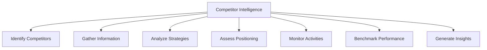

### Key Takeaways
- ✅ Competitor intelligence enables informed decision-making
- ✅ Systematic processes ensure comprehensive analysis
- ✅ Multiple tools enhance intelligence gathering

### Cross-References
- Related to: Topic 2.8 (Benchmarking), Topic 2.10 (Decision-Making)

---

## Topic 2.8: Benchmarking

**📍 Syllabus Reference:** Unit 2 → Topic 2.8
**📄 Sources:** Complete PME (1).pdf (Pages 275-290)

### Overview

Benchmarking is a systematic process of comparing an organization's performance, processes, practices, or products against those of industry leaders or competitors to identify best practices, areas for improvement, and opportunities for innovation.

**Why Benchmarking is Important:**
- **Performance Improvement:** Identifying best practices from leaders. Example: Adopting Amazon's customer service practices.
- **Quality Enhancement:** Identifying gaps in quality compared to competitors. Example: Improving product defect rates.
- **Cost Reduction:** Identifying efficiency opportunities. Example: Reducing manufacturing costs.
- **Innovation and Creativity:** Exposing new ideas from different industries. Example: Applying hospitality practices to healthcare.
- **Customer Satisfaction:** Enhancing service delivery. Example: Improving delivery times.
- **Strategic Planning:** Understanding competitive position. Example: Identifying market gaps.

**Types of Benchmarking:**
- **Internal Benchmarking:** Comparing within organization. Example: Comparing branches.
- **Competitive Benchmarking:** Comparing against competitors. Example: Comparing with direct rivals.
- **Functional Benchmarking:** Comparing with different industries. Example: Learning from airline check-in processes.
- **Strategic Benchmarking:** Comparing overall strategies. Example: Studying market entry strategies.

### Key Definitions

> **Benchmarking:** Comparing organizational performance against industry leaders to identify best practices.
> *— : Complete PME (1).pdf, Page 276*

> **Best Practices:** Superior methods and processes that lead to excellent performance.
> *— : Complete PME (1).pdf, Page 277*

### Types of Benchmarking

| Type            | Description                          | Example                                              |
| --------------- | ------------------------------------ | ---------------------------------------------------- |
| **Internal**    | Comparing within organization        | Comparing performance across different branches      |
| **Competitive** | Comparing against direct competitors | Analyzing competitor pricing strategies              |
| **Functional**  | Comparing with different industries  | Applying airline check-in practices to hotels        |
| **Strategic**   | Comparing overall strategies         | Studying market entry approaches of industry leaders |

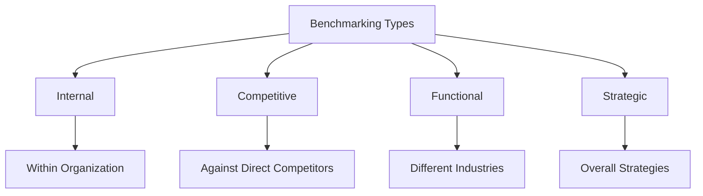

### Key Takeaways
- ✅ Benchmarking identifies improvement opportunities
- ✅ Different types serve different purposes
- ✅ Learning from others accelerates improvement

### Cross-References
- Related to: Topic 2.7 (Competitor Intelligence), Topic 2.9 (Forecasting)

---

## Topic 2.9: Forecasting

**📍 Syllabus Reference:** Unit 2 → Topic 2.9
**📄 Sources:** Complete PME (1).pdf (Pages 290-310)

### Overview

Forecasting is the process of predicting future trends, events, or outcomes based on historical data, statistical analysis, and judgmental inputs to support decision-making and planning.

**Why Forecasting is Important:**
- **Decision Support:** Providing information for decisions. Example: Forecasting demand to decide production levels.
- **Resource Planning:** Planning allocation of resources. Example: Staffing based on projected workload.
- **Risk Management:** Preparing for future risks. Example: Building inventory buffers for seasonal demand.
- **Performance Evaluation:** Comparing actual vs. forecasted. Example: Monthly sales vs. targets.
- **Strategic Planning:** Anticipating market changes. Example: Entering new markets based on growth forecasts.
- **Financial Management:** Developing budgets and projections. Example: Creating annual budgets.

**Forecasting Methods:**
- **Time Series Analysis:** Analyzing historical patterns to predict future values. Example: Using past sales data to predict next quarter sales.
- **Regression Analysis:** Identifying relationships between variables. Example: Understanding how advertising affects sales.
- **Qualitative Methods:** Expert judgment and Delphi method. Example: Experts predicting industry trends.
- **Market Research:** Gathering customer and market insights. Example: Surveys about new product demand.

### Key Definitions

> **Forecasting:** Predicting future trends based on historical data and analysis.
> *— : Complete PME (1).pdf, Page 291*

> **Time Series Analysis:** Forecasting method using historical data patterns.
> *— : Complete PME (1).pdf, Page 292*

> **Delphi Method:** A qualitative forecasting technique using expert consensus.
> *— : Complete PME (1).pdf, Page 293*

### Forecasting Methods

| Method                   | Description                                            | Example                                               |
| ------------------------ | ------------------------------------------------------ | ----------------------------------------------------- |
| **Time Series Analysis** | Analyzing historical patterns to predict future values | Using past 5 years sales data to predict next quarter |
| **Regression Analysis**  | Identifying relationships between variables            | Understanding how price affects demand                |
| **Qualitative Methods**  | Expert judgment and Delphi technique                   | Industry experts predicting technology trends         |
| **Market Research**      | Gathering customer and market insights                 | Surveying customers about new product features        |

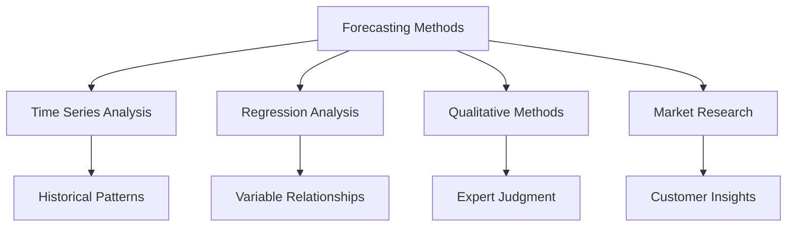

### Key Takeaways
- ✅ Forecasting enables proactive decision-making
- ✅ Multiple methods suit different situations
- ✅ Accuracy improves with quality data and analysis

### Cross-References
- Related to: Topic 2.2 (Planning Process), Topic 2.10 (Decision-Making)

---

## Topic 2.10: Decision-Making

**📍 Syllabus Reference:** Unit 2 → Topic 2.10
**📄 Sources:** Complete PME (1).pdf (Pages 310-340)

### Overview

Decision-making is the process of selecting a course of action from among multiple alternatives to achieve specific goals or objectives, based on analysis, evaluation, and judgment.

**Why Decision-Making is Important:**
- **Achieving Goals and Objectives:** Making informed choices to reach organizational goals
- **Problem Solving:** Addressing challenges and finding effective solutions
- **Resource Allocation:** Deciding how to distribute limited resources
- **Risk Management:** Identifying and mitigating potential risks
- **Innovation and Adaptation:** Finding new ways to improve operations
- **Organizational Learning:** Improving decision-making through experience

**Steps in Decision-Making:**
1. Gathering information
2. Identifying alternatives
3. Evaluating alternatives
4. Making a decision
5. Implementing the decision
6. Monitoring and evaluating
7. Feedback and adjustment

**Decision-Making Techniques:**
- **Rational Decision-Making:** Systematic, logical approach
- **Intuitive Decision-Making:** Relying on gut feeling and experience
- **Group Decision-Making:** Involving multiple stakeholders
- **Decision Trees:** Visual representation of scenarios
- **Cost-Benefit Analysis:** Assessing costs and benefits
- **SWOT Analysis:** Evaluating internal and external factors

### Key Definitions

> **Decision-Making:** The process of selecting a course of action from among alternatives.
> *— : Complete PME (1).pdf, Page 311*

> **Rational Decision-Making:** A systematic approach based on analysis and evaluation.
> *— : Complete PME (1).pdf, Page 312*

> **Cost-Benefit Analysis:** Evaluating alternatives based on their costs and benefits.
> *— : Complete PME (1).pdf, Page 313*

### Decision-Making Process

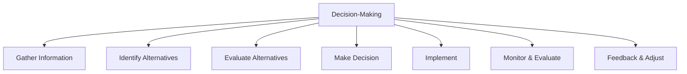

### Decision-Making Techniques

| Technique          | How It Works                                                                                                    | Example                                                                                      |
| ------------------ | --------------------------------------------------------------------------------------------------------------- | -------------------------------------------------------------------------------------------- |
| **Rational**       | Systematic analysis using logical steps: define problem, gather data, evaluate alternatives, select best option | A company analyzing market research data to decide whether to launch a new product           |
| **Intuitive**      | Gut feeling or instinct-based decision making relying on past experience and subconscious patterns              | An experienced manager sensing a project is going to fail despite positive reports           |
| **Group**          | Multiple stakeholders collaborate to leverage diverse perspectives and expertise                                | A cross-functional team deciding on a new software implementation                            |
| **Decision Trees** | Visual model showing decision points, possible outcomes, and probabilities for each branch                      | A company evaluating whether to expand operations using a tree with success/failure branches |
| **Cost-Benefit**   | Compare monetary costs against expected benefits to determine financial viability                               | An organization evaluating whether to invest in new equipment                                |
| **SWOT**           | Analyze Strengths, Weaknesses, Opportunities, Threats to understand internal and external factors               | A business planning market entry uses SWOT to assess competitiveness                         |

### Key Takeaways
- ✅ Decision-making is central to management functions
- ✅ Systematic processes improve decision quality
- ✅ Multiple techniques suit different contexts

### Cross-References
- Related to: Topic 2.5 (Strategies), Topic 2.9 (Forecasting)

---

## Topic 2.11: Directing in Management

**📍 Syllabus Reference:** Unit 2 → Topic 2.11
**📄 Sources:** Complete PME (1).pdf (Pages 341-365)

### Overview

Directing is the process of guiding, supervising, motivating, and leading employees to achieve organizational goals effectively and efficiently. It involves issuing instructions, providing guidance, delegating authority, and overseeing the execution of tasks to ensure alignment with organizational objectives.

**Importance of Directing:**
- **Leadership and Motivation:** Providing leadership and motivation to employees. Example: A manager recognizing employee achievements to boost morale.
- **Coordination and Integration:** Facilitating coordination across departments. Example: Ensuring sales and production teams work together.
- **Goal Achievement:** Ensuring efforts are directed towards goals. Example: Aligning daily tasks with quarterly targets.
- **Conflict Resolution:** Resolving conflicts and maintaining harmony. Example: Mediating disagreements between team members.
- **Decision-Making:** Providing guidance for effective decision-making. Example: Coaching employees on how to approach decisions.

**Elements of Directing:**
- **Issuing Instructions:** Providing clear and specific instructions. Example: Writing detailed project briefs.
- **Delegating Authority:** Assigning decision-making authority. Example: Empowering team leads to make budget decisions.
- **Supervising Performance:** Monitoring and evaluating performance. Example: Conducting weekly one-on-one reviews.
- **Motivating Employees:** Inspiring and motivating through recognition. Example: Implementing an employee of the month program.
- **Communicating Effectively:** Establishing open communication channels. Example: Holding regular town hall meetings.

### Key Definitions

> **Directing:** The process of guiding, supervising, motivating, and leading employees to achieve organizational goals.
> *— : Complete PME (1).pdf, Page 342*

> **Supervision:** The function of overseeing and monitoring employee performance.
> *— : Complete PME (1).pdf, Page 343*

### Scope of Directing

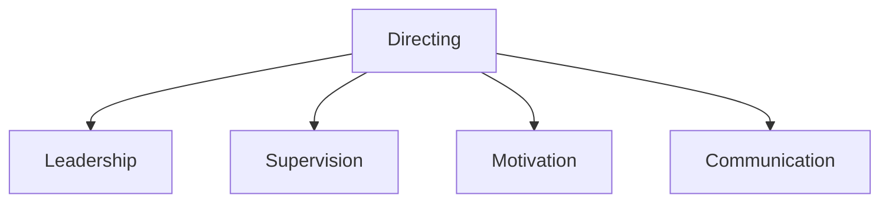

### Human Factors in Management

**📍 Syllabus Reference:** Unit 2 → Topic 2.11 → Human Factors
**📄 Sources:** Complete PME (1).pdf (Pages 341-365)

#### Overview

Human factors (ergonomics) studies human-system interaction. In management, it focuses on how human capabilities influence organizational performance.

#### Key Areas

- Work Design and Job Analysis
- Training and Skill Development
- Workplace Layout and Design
- Communication and Collaboration
- Human-Computer Interaction
- Stress Management

#### Importance

| Area                      | Benefit                                                            |
| ------------------------- | ------------------------------------------------------------------ |
| **Performance**           | Optimizes work processes and enhances productivity                 |
| **Safety**                | Prevents accidents and promotes safe work environment              |
| **Satisfaction**          | Improves employee engagement and retention                         |
| **Error Reduction**       | Designs systems aligned with human capabilities to reduce mistakes |
| **Decision-Making**       | Optimizes outcomes through effective collaboration                 |
| **Customer Satisfaction** | Ensures products meet user needs and expectations                  |

#### Key Definitions

> **Human Factors:** Scientific discipline of human-system interaction.
> *— : Complete PME (1).pdf, Page 342*

> **Ergonomics:** Designing work environments to fit workers.
> *— : Complete PME (1).pdf, Page 343*

---

### Creativity and Innovation in Management

**📍 Syllabus Reference:** Unit 2 → Topic 2.11 → Creativity and Innovation
**📄 Sources:** Complete PME (1).pdf (Pages 365-390)

#### Overview

Creativity generates new ideas; innovation implements them. Both are essential for competitive advantage and growth.

#### Importance

- Competitive Advantage
- Problem Solving
- Value Creation
- Efficiency
- Employee Engagement
- Adaptability

#### Strategies

1. **Promote Culture of Creativity:** Establish environment that values experimentation, tolerates failure, rewards innovation
2. **Encourage Diverse Perspectives:** Foster diversity and inclusivity to bring different ideas
3. **Provide Resources and Support:** Allocate time, tools, and incentives for innovation projects
4. **Facilitate Collaboration:** Create platforms for cross-functional idea sharing
5. **Empower Employees:** Provide autonomy and decision-making authority
6. **Promote Learning:** Invest in creative thinking and problem-solving skills development
7. **Embrace Risk-taking:** Encourage calculated risk-taking and exploration of new ideas

#### Implementation Process

```mermaid
flowchart TD
    A[Identify] --> B[Generate]
    B --> C[Evaluate]
    C --> D[Prototype]
    D --> E[Implement]
    E --> F[Monitor]
```

#### Key Definitions

> **Creativity:** Ability to generate new ideas.
> *— : Complete PME (1).pdf, Page 366*

> **Innovation:** Implementing new ideas to create value.
> *— : Complete PME (1).pdf, Page 367*

---

### Harmonizing Objectives in Management

**📍 Syllabus Reference:** Unit 2 → Topic 2.11 → Harmonizing Objectives
**📄 Sources:** Complete PME (1).pdf (Pages 390-415)

#### Overview

Aligning goals, interests, and priorities of stakeholders for coherent pursuit of objectives.

#### Importance

| Aspect              | Benefit             |
| ------------------- | ------------------- |
| Alignment           | Common goals        |
| Conflict Resolution | Mitigates conflicts |
| Resource Allocation | Strategic           |
| Collaboration       | Teamwork            |
| Decision-Making     | Streamlined         |
| Performance         | Improved            |

#### Strategies

- **Clear Communication:** Transparently communicate organizational goals and expectations
- **Shared Vision:** Develop unified vision and core values uniting all stakeholders
- **Stakeholder Engagement:** Involve stakeholders in objective-setting process
- **Negotiation:** Facilitate compromise to reconcile conflicting objectives
- **Performance Metrics:** Define KPIs aligned with organizational objectives
- **Cross-Functional Teams:** Establish teams from different departments for collaboration
- **Continuous Monitoring:** Implement feedback mechanisms to track progress

#### Key Definitions

> **Harmonizing Objectives:** Aligning stakeholder goals.
> *— : Complete PME (1).pdf, Page 391*

---

### Leadership and Types of Leadership

**📍 Syllabus Reference:** Unit 2 → Topic 2.11 → Leadership
**📄 Sources:** Complete PME (1).pdf (Pages 415-440)

#### Overview

Influencing, motivating, and directing individuals toward organizational goals.

#### Types

| Type                 | Characteristics                                                         |
| -------------------- | ----------------------------------------------------------------------- |
| **Autocratic**       | Makes decisions individually with minimal input; full control over team |
| **Democratic**       | Involves team in decision-making while maintaining final authority      |
| **Laissez-faire**    | Grants complete autonomy; minimal interference in team decisions        |
| **Transformational** | Inspires followers to exceed expectations through compelling vision     |

#### Key Definitions

> **Leadership:** Influencing and directing toward goals.
> *— : Complete PME (1).pdf, Page 416*

---

### Early Leadership Theories: Trait Theories

**📍 Syllabus Reference:** Unit 2 → Topic 2.11 → Trait Theories
**📄 Sources:** Complete PME (1).pdf (Pages 440-470)

#### Overview

Effective leaders possess inherent qualities.

#### Key Concepts

- **Trait-based Approach:** Emphasizes significance of individual traits in determining leadership effectiveness
- **Leadership Traits:** Intelligence, confidence, decisiveness, integrity, charisma, sociability
- **Trait Assessment:** Uses surveys, interviews, and psychological tests

#### Contributors

| Contributor    | Contribution               |
| -------------- | -------------------------- |
| Thomas Carlyle | Great Man Theory           |
| Ralph Stogdill | Intelligence, adaptability |
| Warren Bennis  | Integrity, vision          |

#### Criticisms

- **Lack of Universality:** Not all individuals with leadership traits become effective leaders
- **Trait Ambiguity:** Difficulty defining and measuring traits like "charisma" objectively
- **Overemphasis on Traits:** Neglects importance of situational factors and skills

#### Key Definitions

> **Trait Theories:** Inherent qualities predispose to leadership.
> *— : Complete PME (1).pdf, Page 441*

---

### Behavioral Theories of Leadership

**📍 Syllabus Reference:** Unit 2 → Topic 2.11 → Behavioral Theories
**📄 Sources:** Complete PME (1).pdf (Pages 470-500)

#### Overview

Focus on observable behaviors rather than traits.

#### Key Theories

| Theory                     | Focus                                                                      |
| -------------------------- | -------------------------------------------------------------------------- |
| **Ohio State**             | Consideration (relationships) and initiating structure (task organization) |
| **University of Michigan** | Employee-oriented (relationships) vs production-oriented (tasks)           |
| **Managerial Grid**        | Concern for people vs concern for production                               |

#### Managerial Grid

```mermaid
flowchart TD
    A[Grid] --> B[1,1-Impoverished]
    A --> C[1,9-Country Club]
    A --> D[9,1-Perish]
    A --> E[5,5-Middle]
    A --> F[9,9-Team]
```

| Style        | People   | Production |
| ------------ | -------- | ---------- |
| Impoverished | Low      | Low        |
| Country Club | High     | Low        |
| Produce      | Low      | High       |
| Middle       | Moderate | Moderate   |
| Team         | High     | High       |

#### Key Definitions

> **Behavioral Theories:** Focus on observable behaviors.


> **Managerial Grid:** People vs production concern.


---

### Contingency Theories of Leadership

**📍 Syllabus Reference:** Unit 2 → Topic 2.11 → Contingency Theories
**📄 Sources:** Complete PME (1).pdf (Pages 500-530)

#### Overview

Effectiveness depends on leader-situation interaction.

#### Key Theories

| Theory               | Key Points                                                                                                                |
| -------------------- | ------------------------------------------------------------------------------------------------------------------------- |
| **Fiedler's Model**  | Leadership effectiveness depends on situational favorableness (leader-member relations, task structure, positional power) |
| **Hersey-Blanchard** | Effective leadership depends on follower maturity level; four styles: directing, coaching, supporting, delegating         |
| **Path-Goal**        | Leaders clarify path to goals, remove obstacles, provide support                                                          |

#### Criticisms

- **Complexity:** Difficult to apply in practice; requires assessing multiple situational factors
- **Limited Predictive Power:** Does not always accurately predict effective leadership style
- **Neglect of Individual Differences:** Focuses primarily on situational factors over individual traits

#### Key Definitions

> **Contingency Theories:** Effectiveness depends on situation.
> *— : Complete PME (1).pdf, Page 501*

---

### Path-Goal Theory

**📍 Syllabus Reference:** Unit 2 → Topic 2.11 → Path-Goal Theory
**📄 Sources:** Complete PME (1).pdf (Pages 530-560)

#### Overview

Leaders clarify path to goals, remove obstacles, provide support.

#### Components

| Style                    | Description                                                                            |
| ------------------------ | -------------------------------------------------------------------------------------- |
| **Directive**            | Provides clear instructions, guidance, and structure; tells followers what is expected |
| **Supportive**           | Shows concern for follower well-being; friendly and approachable                       |
| **Participative**        | Involves followers in decisions; seeks suggestions and input                           |
| **Achievement-Oriented** | Sets challenging goals; expects high performance; emphasizes excellence                |

#### Key Definitions

> **Path-Goal Theory:** Leaders enhance motivation by clarifying paths.
> *— : Complete PME (1).pdf, Page 531*

---

### Contemporary Views of Leadership

**📍 Syllabus Reference:** Unit 2 → Topic 2.11 → Contemporary Leadership
**📄 Sources:** Complete PME (1).pdf (Pages 560-590)

#### Types

| Type                 | Focus                                                                    |
| -------------------- | ------------------------------------------------------------------------ |
| **Transformational** | Inspires followers to exceed expectations through vision and empowerment |
| **Servant**          | Prioritizes needs and well-being of others; leads by serving             |
| **Authentic**        | Self-aware, genuine, transparent; aligned actions with values            |
| **Distributed**      | Leadership shared across organization levels; shared decision-making     |
| **Adaptive**         | Flexible, resilient; embraces change and encourages innovation           |
| **Inclusive**        | Values diversity; creates belonging; leverages different perspectives    |
| **Agile**            | Quick decision-making; responds rapidly to market changes                |
| **Ethical**          | Integrity, fairness, responsibility in all decisions                     |

#### Key Definitions

> **Transformational Leadership:** Inspiring through vision.
> *— : Complete PME (1).pdf, Page 561*

---

### Cross-Cultural Leadership

**📍 Syllabus Reference:** Unit 2 → Topic 2.11 → Cross-Cultural Leadership
**📄 Sources:** Complete PME (1).pdf (Pages 590-620)

#### Overview

Managing diverse teams across cultural contexts.

#### Understanding Differences

- **Cultural Awareness:** Understanding values, beliefs, norms, and communication styles of different cultures
- **Cultural Intelligence (CQ):** Ability to adapt to different cultural contexts; includes cognitive, motivational, and behavioral components

#### Practices

| Practice                | Description                                                             |
| ----------------------- | ----------------------------------------------------------------------- |
| **Adaptability**        | Modifying leadership style to suit cultural preferences of team members |
| **Communication**       | Being clear and sensitive to cultural nuances in communication          |
| **Empathy**             | Demonstrating respect for cultural values and perspectives              |
| **Conflict Resolution** | Managing and resolving conflicts arising from cultural differences      |

#### Benefits

- **Enhanced Innovation:** Diverse perspectives lead to more creative solutions
- **Improved Performance:** Inclusive environment boosts productivity
- **Global Expansion:** Understanding cultures enables international growth
- **Cultural Integration:** Creates unity across cultural boundaries

#### Key Definitions

> **Cross-Cultural Leadership:** Managing diverse teams.
> *— : Complete PME (1).pdf, Page 591*

---

### Leadership Training

**📍 Syllabus Reference:** Unit 2 → Topic 2.11 → Leadership Training
**📄 Sources:** Complete PME (1).pdf (Pages 620-650)

#### Importance

- **Skill Development:** Builds communication, decision-making, and conflict resolution abilities
- **Self-Awareness:** Helps identify personal strengths, weaknesses, and leadership style
- **Team Building:** Fosters collaboration, trust, and effective teamwork
- **Change Management:** Enables navigating uncertainty and leading organizational change
- **Performance:** Drives innovation and achievement of organizational objectives

#### Components

| Component                 | Description                                                                          |
| ------------------------- | ------------------------------------------------------------------------------------ |
| **Development Programs**  | Structured curriculum covering self-awareness, communication, emotional intelligence |
| **Workshops**             | Short-term focused training on specific leadership skills                            |
| **Coaching**              | One-on-one personalized guidance from experienced leaders                            |
| **Experiential Learning** | Hands-on practice through simulations, role-playing, and real projects               |
| **Feedback**              | 360-degree feedback from peers, subordinates, and supervisors                        |

#### Key Definitions

> **Leadership Training:** Developing leadership skills.
> *— : Complete PME (1).pdf, Page 621*

---

### Substitutes of Leadership

**📍 Syllabus Reference:** Unit 2 → Topic 2.11 → Substitutes of Leadership
**📄 Sources:** Complete PME (1).pdf (Pages 650-680)

#### Examples

| Substitute                   | Description                                                                                     |
| ---------------------------- | ----------------------------------------------------------------------------------------------- |
| **Technology**               | Automation and AI providing instructions, feedback, and performance metrics without supervision |
| **Structure**                | Flat organizations and self-managed teams enabling autonomous decisions                         |
| **Job Design**               | Well-designed jobs with clear roles, responsibilities reducing supervision need                 |
| **Culture**                  | Strong organizational values and norms guiding behavior                                         |
| **Employee Characteristics** | Experienced, skilled employees capable of self-management                                       |

#### Implications

```mermaid
flowchart TD
    A[Practice] --> B[Empowerment]
    A --> C[Culture]
    A --> D[Improvement]
    A --> E[Training]
    A --> F[Feedback]
```

#### Key Definitions

> **Substitutes of Leadership:** Factors reducing leadership need.

---

## Topic 2.12: Summary of Management Functions

**📍 Syllabus Reference:** Unit 2 → Topic 2.12
**📄 Sources:** Complete PME (1).pdf (Pages 680-700)

### Overview

The management functions of planning, organizing, directing, and controlling form an integrated system essential for organizational success. Planning provides the foundation by setting objectives and determining actions. Organizing arranges resources to accomplish objectives. Directing guides and motivates employees toward goal achievement. Controlling monitors performance and implements corrective actions.

These functions are interdependent and cyclical, with each function supporting and influencing the others. Effective managers must perform all four functions to achieve organizational success.

### Key Takeaways
- ✅ Management involves planning, organizing, directing, and controlling
- ✅ Directing is essential for translating plans into action
- ✅ Leadership theories provide frameworks for effective direction
- ✅ Human factors and innovation are critical for modern management

### Cross-References
- Related to: Topic 1.1 (Management Overview), Topic 2.1 (Planning)


