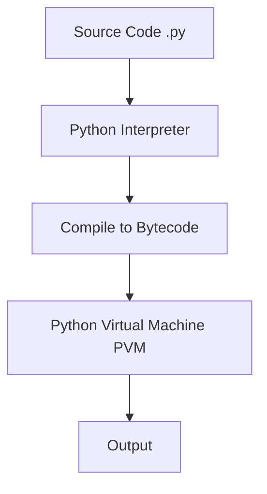

# 📚 Programming in Python — Comprehensive Study Notes

> **Syllabus Coverage:** 100% (Unit 1 & Unit 2)
> **Subject:** Programming in Python
> **Code:** CIE-332T / IOT-320T

---

## 📋 Table of Contents

- [Unit 1: Introduction to Python & Flow Control](#unit-1-introduction-to-python--flow-control)
  - [Topic 1.1: Introduction to Python Programming](#topic-11-introduction-to-python-programming)
  - [Topic 1.2: Python Basics - Data Types](#topic-12-python-basics---data-types)
  - [Topic 1.3: String Concatenation and Replication](#topic-13-string-concatenation-and-replication)
  - [Topic 1.4: Variables and Assignment](#topic-14-variables-and-assignment)
  - [Topic 1.5: Dissecting Your Program](#topic-15-dissecting-your-program)
  - [Topic 1.6: Flow Control - Boolean Values & Operators](#topic-16-flow-control---boolean-values--operators)
  - [Topic 1.7: Comparison and Boolean Operators](#topic-17-comparison-and-boolean-operators)
  - [Topic 1.8: Elements of Flow Control](#topic-18-elements-of-flow-control)
  - [Topic 1.9: Program Execution](#topic-19-program-execution)
  - [Topic 1.10: Flow Control Statements](#topic-110-flow-control-statements)
  - [Topic 1.11: Importing Modules](#topic-111-importing-modules)
  - [Topic 1.12: Ending a Program Early with sys.exit()](#topic-112-ending-a-program-early-with-sysexit)
- [Unit 2: Functions, Lists, Dictionaries & Strings](#unit-2-functions-lists-dictionaries--strings)
  - [Topic 2.1: Functions - Definition and Parameters](#topic-21-functions---definition-and-parameters)
  - [Topic 2.2: Return Values and Return Statements](#topic-22-return-values-and-return-statements)
  - [Topic 2.3: The None Value](#topic-23-the-none-value)
  - [Topic 2.4: Keyword Arguments and print()](#topic-24-keyword-arguments-and-print)
  - [Topic 2.5: Local and Global Scope](#topic-25-local-and-global-scope)
  - [Topic 2.6: The global Statement](#topic-26-the-global-statement)
  - [Topic 2.7: Exception Handling](#topic-27-exception-handling)
  - [Topic 2.8: Lists - The List Data Type](#topic-28-lists---the-list-data-type)
  - [Topic 2.9: Working with Lists](#topic-29-working-with-lists)
  - [Topic 2.10: Augmented Assignment Operators](#topic-210-augmented-assignment-operators)
  - [Topic 2.11: List Methods](#topic-211-list-methods)
  - [Topic 2.12: Dictionaries - The Dictionary Data Type](#topic-212-dictionaries---the-dictionary-data-type)
  - [Topic 2.13: Pretty Printing](#topic-213-pretty-printing)
  - [Topic 2.14: Using Data Structures to Model Real-World Things](#topic-214-using-data-structures-to-model-real-world-things)
  - [Topic 2.15: Manipulating Strings](#topic-215-manipulating-strings)
  - [Topic 2.16: Useful String Methods](#topic-216-useful-string-methods)

---

# Unit 1: Introduction to Python & Flow Control

## Topic 1.1: Introduction to Python Programming

### Overview

Python is a high-level, interpreted programming language known for its simplicity and readability. It was created by Guido van Rossum and first released in 1991. Python supports multiple programming paradigms, including procedural, object-oriented, and functional programming.

### Key Features of Python

| Feature             | Description                                         |
| ------------------- | --------------------------------------------------- |
| **Interpreted**     | Executes code line by line, no compilation needed   |
| **High-Level**      | Abstracts away hardware complexity                  |
| **Object-Oriented** | Supports classes, objects, inheritance              |
| **Dynamic Typing**  | No need to declare variable types                   |
| **Portable**        | Works on Windows, Mac, Linux                        |
| **Rich Libraries**  | Extensive standard library and third-party packages |

### Python Philosophy

> **"Readability counts."** — Zen of Python

Python emphasizes code readability and clean syntax. The philosophy can be accessed by running `import this` in Python.

### Installing Python

- **CPython:** Official implementation from python.org
- **Anaconda:** Distribution with scientific packages
- **Installation:** Download from python.org for Windows/Mac/Linux

### Python Interpreter

The Python interpreter executes Python code. Two modes:
1. **Interactive Mode:** Enter expressions directly in the shell
2. **Script Mode:** Write code in a .py file and execute

### First Python Program

```python
print("Hello, World!")
```

Output: `Hello, World!`

### Python Versions

- **Python 2.x:** Legacy version (no longer supported)
- **Python 3.x:** Current version (recommended)

### Python Development Environments

| Type                 | Examples                           |
| -------------------- | ---------------------------------- |
| **IDEs**             | PyCharm, VS Code, Jupyter Notebook |
| **Text Editors**     | Sublime Text, Atom, Vim            |
| **Online Platforms** | Google Colab, Jupyter Online       |

### Key Takeaways
- ✅ Python created by Guido van Rossum in 1991
- ✅ Interpreted, high-level, dynamically typed language
- ✅ "Readability counts" is a core philosophy
- ✅ Python 3.x is the current standard version

---

## Topic 1.2: Python Basics - Data Types

### Overview

Python has several built-in data types for storing different kinds of data.

### Data Types Overview

| Type      | Description                 | Example               |
| --------- | --------------------------- | --------------------- |
| **int**   | Integer (whole numbers)     | `5`, `10`, `-3`       |
| **float** | Floating-point (decimal)    | `3.14`, `0.5`, `-2.7` |
| **str**   | String (text)               | `"hello"`, `'Python'` |
| **bool**  | Boolean (True/False)        | `True`, `False`       |
| **list**  | Ordered, mutable sequence   | `[1, 2, 3]`           |
| **tuple** | Ordered, immutable sequence | `(1, 2, 3)`           |
| **dict**  | Key-value pairs             | `{"name": "John"}`    |
| **set**   | Unordered unique items      | `{1, 2, 3}`           |

### The Integer Data Type (int)

Integers represent whole numbers without any fractional part.

```python
x = 5
print(x)           # Output: 5
print(type(x))    # Output: <class 'int'>

# Operations
print(10 + 5)     # Addition: 15
print(10 - 5)     # Subtraction: 5
print(10 * 5)     # Multiplication: 50
print(10 / 5)     # Division: 2.0
print(10 % 3)     # Modulus: 1
print(10 ** 2)    # Exponent: 100
```

**Key Features:**
- Arbitrary size (no overflow)
- Supports all arithmetic operations

### The Floating-Point Data Type (float)

Floating-point numbers represent real numbers with a fractional part.

```python
y = 3.14
print(y)           # Output: 3.14
print(type(y))    # Output: <class 'float'>

# Scientific notation
z = 6.022e23
print(z)          # Output: 6.022e+23

# Operations
print(3.14 + 1.5)   # Addition: 4.64
print(3.14 * 2)     # Multiplication: 6.28
```

### The String Data Type (str)

Strings represent sequences of characters.

```python
s = "hello"
print(s)           # Output: hello
print(type(s))    # Output: <class 'str'>

# String creation
single = 'hello'
double = "hello"
triple = '''hello'''  # Multi-line string
```

### The Boolean Data Type (bool)

Boolean represents truth values.

```python
is_valid = True
is_active = False

print(is_valid)   # Output: True
print(type(is_valid))  # Output: <class 'bool'>
```

### Key Takeaways
- ✅ Python is dynamically typed
- ✅ Integers can be arbitrarily large
- ✅ Strings are immutable (cannot be modified)
- ✅ Use `type()` to check data type

---

## Topic 1.3: String Concatenation and Replication

### String Concatenation

**Definition:** Concatenation is the process of combining two or more strings into a single string using the `+` operator.

```python
str1 = "Hello"
str2 = "World"
result = str1 + " " + str2
print(result)  # Output: Hello World
```

### String Replication

**Definition:** Replication repeats a string a specified number of times using the `*` operator.

```python
str1 = "Python"
result = str1 * 3
print(result)  # Output: PythonPythonPython
```

### Escape Characters

| Escape | Description  |
| ------ | ------------ |
| `\n`   | Newline      |
| `\t`   | Tab          |
| `\\`   | Backslash    |
| `\'`   | Single quote |
| `\"`   | Double quote |

```python
print("Hello\nWorld")  # Newline between
print("Hello\tWorld")  # Tab between
```

### Key Takeaways
- ✅ Use `+` for concatenation
- ✅ Use `*` for replication
- ✅ Strings are immutable in Python

---

## Topic 1.4: Variables and Assignment

### Variables

**Definition:** Variables are named containers used to store data in memory.

```python
x = 10              # Integer
name = "John"       # String
pi = 3.14           # Float
is_active = True    # Boolean

print("Value of x:", x)
print("Value of name:", name)
```

### Variable Naming Rules

| Rule                                     | Valid            | Invalid        |
| ---------------------------------------- | ---------------- | -------------- |
| Start with letter or underscore          | `name`, `_value` | `1name`        |
| Can contain letters, numbers, underscore | `my_var2`        | `my-var`       |
| Case-sensitive                           | `Name`, `name`   | —              |
| Cannot be a keyword                      | `print_`         | `for`, `class` |

### Multiple Assignment

```python
# Assign same value to multiple variables
x = y = z = 0

# Assign different values
a, b, c = 1, 2, 3
```

### Constants

Constants are variables meant to not change. By convention, use UPPERCASE names:

```python
PI = 3.14159
MAX_SIZE = 100
```

### Dynamic Typing

Python determines variable type at runtime:

```python
x = 5        # int
x = "hello"  # Now str - no error!
```

### Key Takeaways
- ✅ Use `=` for assignment
- ✅ Variables store references to objects
- ✅ Python is dynamically typed
- ✅ Constants use UPPERCASE by convention

---

## Topic 1.5: Dissecting Your Program

### Comments

Comments explain code and are ignored by the interpreter.

```python
# This is a single-line comment

"""
This is a
multi-line comment
using triple quotes
"""
```

### Indentation

Python uses indentation to define code blocks:

```python
if x > 5:
    print("x is greater than 5")  # Indented block
    print("This is also in the block")

print("This is outside the block")  # Not indented
```

### Debugging with print()

```python
x = 10
result = x * 2
print("x =", x)
print("result =", result)
```

### Docstrings

**Definition:** A docstring is a string literal that documents a module, function, class, or method.

```python
def add(a, b):
    """Add two numbers and return the result."""
    return a + b

print(add.__doc__)  # Output: Add two numbers and return the result.
```

### Debugging Tools

#### 1. pdb (Python Debugger)

```python
import pdb

def divide(x, y):
    pdb.set_trace()  # Set breakpoint
    return x / y

divide(10, 2)
```

#### 2. Logging

```python
import logging
logging.basicConfig(level=logging.DEBUG)
logging.debug("Debug message")
logging.info("Info message")
```

#### 3. Assertions

```python
def divide(x, y):
    assert y != 0, "Cannot divide by zero"
    return x / y
```

### Key Takeaways
- ✅ Use `#` for single-line comments
- ✅ Indentation defines code blocks (typically 4 spaces)
- ✅ Docstrings document code using triple quotes
- ✅ Use `pdb`, `logging`, or assertions for debugging

---

## Topic 1.6: Flow Control - Boolean Values & Operators

### Boolean Values

Boolean values represent truth: `True` or `False`

```python
is_active = True
is_admin = False

print(type(is_active))  # <class 'bool'>
```

### Comparison Operators

| Operator | Meaning          | Example  | Result  |
| -------- | ---------------- | -------- | ------- |
| `==`     | Equal to         | `5 == 5` | `True`  |
| `!=`     | Not equal        | `5 != 3` | `True`  |
| `>`      | Greater than     | `5 > 3`  | `True`  |
| `<`      | Less than        | `5 < 3`  | `False` |
| `>=`     | Greater or equal | `5 >= 5` | `True`  |
| `<=`     | Less or equal    | `5 <= 3` | `False` |

```python
print(10 > 5)    # True
print(10 == 10)  # True
print(10 != 5)   # True
```

### Boolean Operators

| Operator | Meaning           | Example          | Result  |
| -------- | ----------------- | ---------------- | ------- |
| `and`    | Both true         | `True and False` | `False` |
| `or`     | At least one true | `True or False`  | `True`  |
| `not`    | Invert truth      | `not True`       | `False` |

```python
print(True and True)    # True
print(True and False)   # False
print(True or False)    # True
print(not True)         # False
```

### Mixing Boolean and Comparison Operators

```python
x = 10
print(x > 5 and x < 20)    # True (both conditions)
print(x < 5 or x > 20)    # False (both false)
print(not x == 10)        # False (x == 10 is True)
```

### Short-Circuit Evaluation

Python stops evaluating as soon as result is determined:

```python
# For 'and': if first is False, return first; else return second
print(False and print("hello"))  # False (doesn't print)

# For 'or': if first is True, return first; else return second
print(True or print("hello"))    # True (doesn't print)
```

### Key Takeaways
- ✅ Boolean values: `True` and `False` (capitalized)
- ✅ Comparison operators return boolean values
- ✅ `and`, `or`, `not` are boolean operators
- ✅ Short-circuit evaluation optimizes performance

---

## Topic 1.7: Comparison and Boolean Operators

### Operator Precedence

From highest to lowest:

| Priority | Operators            |
| -------- | -------------------- |
| 1        | `**`                 |
| 2        | `*`, `/`, `%`, `//`  |
| 3        | `+`, `-`             |
| 4        | `>`, `<`, `>=`, `<=` |
| 5        | `==`, `!=`           |
| 6        | `not`                |
| 7        | `and`                |
| 8        | `or`                 |

```python
# Evaluation order
result = not False and True or False
# Step 1: not False → True
# Step 2: True and True → True
# Step 3: True or False → True
print(result)  # True
```

### Practical Examples

```python
age = 25

# Check if age is between 18 and 60
print(18 <= age <= 60)  # True

# Multiple conditions
is_student = True
has_id = False
print(is_student or has_id)  # True
```

### Key Takeaways
- ✅ `not` has highest boolean operator precedence
- ✅ `or` has lowest boolean operator precedence
- ✅ Use parentheses to clarify intent

---

## Topic 1.8: Elements of Flow Control

### Flow Control Statements

Flow control determines the order in which statements are executed:

1. **Conditional Statements:** `if`, `elif`, `else`
2. **Loop Statements:** `for`, `while`
3. **Jump Statements:** `break`, `continue`, `return`

### Conditional Statements

```python
x = 10

if x > 0:
    print("Positive")
elif x < 0:
    print("Negative")
else:
    print("Zero")
```

### Loop Statements

#### for Loop

```python
# Iterate over a range
for i in range(5):
    print(i)  # 0, 1, 2, 3, 4

# Iterate over a list
fruits = ["apple", "banana", "cherry"]
for fruit in fruits:
    print(fruit)
```

#### while Loop

```python
count = 0
while count < 5:
    print(count)
    count += 1
```

### Jump Statements

| Statement  | Description              |
| ---------- | ------------------------ |
| `break`    | Exit the loop entirely   |
| `continue` | Skip to next iteration   |
| `pass`     | Do nothing (placeholder) |

```python
# break example
for i in range(10):
    if i == 5:
        break
    print(i)  # 0, 1, 2, 3, 4

# continue example
for i in range(5):
    if i == 2:
        continue
    print(i)  # 0, 1, 3, 4 (skips 2)
```

### Key Takeaways
- ✅ `if`, `elif`, `else` for conditional execution
- ✅ `for` for definite iterations
- ✅ `while` for indefinite iterations
- ✅ `break`, `continue`, `pass` control loop flow

---

## Topic 1.9: Program Execution

### Program Execution Steps

1. **Load:** Python loads the program into memory
2. **Compile:** Source code converted to bytecode
3. **Interpret:** Bytecode executed line by line
4. **Output:** Results displayed

### Execution Flow



### The __name__ Variable

```python
# Main module
if __name__ == "__main__":
    print("This runs as main program")
else:
    print("This runs as imported module")
```

### sys.exit()

Exits the program early:

```python
import sys

print("Starting program...")
sys.exit()  # Exit immediately
print("This won't print")
```

With exit code:

```python
import sys
sys.exit(0)  # Successful exit
sys.exit(1)  # Error exit
```

### Key Takeaways
- ✅ Python compiles to bytecode before execution
- ✅ `__name__ == "__main__"` checks if running as main
- ✅ `sys.exit()` terminates the program

---

## Topic 1.10: Flow Control Statements

### if Statement

```python
if condition:
    # executes if condition is True
    pass
```

### if-else Statement

```python
if condition:
    # True block
    pass
else:
    # False block
    pass
```

### if-elif-else Statement

```python
if condition1:
    # Block 1
    pass
elif condition2:
    # Block 2
    pass
elif condition3:
    # Block 3
    pass
else:
    # Default block
    pass
```

### match Statement (Python 3.10+)

```python
status = 400

match status:
    case 200:
        print("OK")
    case 404:
        print("Not Found")
    case 500:
        print("Server Error")
    case _:
        print("Unknown")
```

### for Loop with else

```python
for i in range(5):
    print(i)
else:
    print("Loop completed")  # Executes after loop finishes
```

### while Loop with else

```python
count = 0
while count < 3:
    print(count)
    count += 1
else:
    print("While loop finished")
```

### Key Takeaways
- ✅ Use `if-elif-else` for multiple conditions
- ✅ `match` statement for pattern matching (Python 3.10+)
- ✅ `else` block executes after loop completes normally

---

## Topic 1.11: Importing Modules

### Ways to Import Modules

```python
# Import entire module
import math
print(math.sqrt(16))  # 4.0

# Import with alias
import math as m
print(m.pi)  # 3.141592653589793

# Import specific items
from math import sqrt, pi
print(sqrt(16))  # 4.0
print(pi)        # 3.14159

# Import all (not recommended)
from math import *
```

### Standard Library Modules

| Module     | Description                |
| ---------- | -------------------------- |
| `math`     | Mathematical functions     |
| `random`   | Random number generation   |
| `datetime` | Date and time              |
| `os`       | Operating system interface |
| `sys`      | System-specific parameters |
| `json`     | JSON handling              |

### Third-Party Modules

Install using pip:

```bash
pip install requests
pip install numpy
```

```python
import requests
response = requests.get("https://example.com")
```

### Key Takeaways
- ✅ Use `import` to include modules
- ✅ Use `from...import` for specific items
- ✅ Use `as` to create aliases

---

## Topic 1.12: Ending a Program Early with sys.exit()

### sys.exit()

Terminates the program immediately:

```python
import sys

print("Program starting...")
sys.exit()  # Exit with default code 0
print("This won't run")
```

### Exit Codes

| Code | Meaning                |
| ---- | ---------------------- |
| 0    | Successful termination |
| 1    | General error          |
| 2    | Misuse of command      |
| 127  | Command not found      |

```python
import sys

# Exit with error code
if some_error:
    sys.exit("Error message")  # Prints message and exits with code 1
    sys.exit(1)  # Exit with code 1
```

### try-finally with sys.exit()

```python
import sys

try:
    print("Processing...")
    sys.exit(0)
finally:
    print("Cleanup code")  # This DOES run!
```

### Key Takeaways
- ✅ `sys.exit()` terminates the program
- ✅ Exit code 0 = success, non-zero = error
- ✅ `finally` block still executes with `sys.exit()`

---

# Unit 2: Functions, Lists, Dictionaries & Strings

## Topic 2.1: Functions - Definition and Parameters

### Defining Functions

```python
def function_name():
    """Docstring - describes the function"""
    # Function body
    pass
```

### Function with Parameters

```python
# Single parameter
def greet(name):
    print(f"Hello, {name}!")

greet("John")  # Hello, John!

# Multiple parameters
def add(a, b):
    return a + b

result = add(5, 3)  # 8
```

### Default Parameters

```python
def greet(name="Guest"):
    print(f"Hello, {name}!")

greet()        # Hello, Guest!
greet("John")  # Hello, John!
```

### Keyword Arguments

```python
def introduce(name, age, city):
    print(f"I am {name}, {age} years old, from {city}")

# Using keyword arguments
introduce(age=25, name="John", city="NYC")
```

### Variable Number of Arguments

```python
# *args - variable positional arguments
def sum_all(*args):
    total = 0
    for num in args:
        total += num
    return total

print(sum_all(1, 2, 3))    # 6
print(sum_all(1, 2, 3, 4))  # 10

# **kwargs - variable keyword arguments
def print_info(**kwargs):
    for key, value in kwargs.items():
        print(f"{key}: {value}")

print_info(name="John", age=25)
```

### Key Takeaways
- ✅ Use `def` to define functions
- ✅ Parameters can have default values
- ✅ `*args` for variable positional arguments
- ✅ `**kwargs` for variable keyword arguments

---

## Topic 2.2: Return Values and Return Statements

### Return Statement

```python
def add(a, b):
    return a + b

result = add(5, 3)  # result = 8
```

### Returning Multiple Values

```python
def get_stats(numbers):
    return min(numbers), max(numbers), sum(numbers)/len(numbers)

min_val, max_val, avg = get_stats([1, 2, 3, 4, 5])
```

### Early Return

```python
def find_first_even(numbers):
    for num in numbers:
        if num % 2 == 0:
            return num  # Return immediately
    return None  # No even number found
```

### Key Takeaways
- ✅ `return` exits the function and sends back a value
- ✅ Functions can return multiple values as a tuple
- ✅ Without `return`, function returns `None`

---

## Topic 2.3: The None Value

### None Type

`None` represents the absence of a value:

```python
result = None
print(result)       # None
print(type(result)) # <class 'NoneType'>
```

### Checking for None

```python
value = None

# Using 'is' operator (preferred)
if value is None:
    print("Value is None")

# Using '==' (works but not recommended)
if value == None:
    print("Value is None")
```

### None in Function Returns

```python
def find_item(items, target):
    for item in items:
        if item == target:
            return item
    # No return statement = returns None

result = find_item([1, 2, 3], 5)
print(result)  # None
```

### Practical Example

```python
def greet(name=None):
    if name is None:
        return "Hello, Guest!"
    return f"Hello, {name}!"

print(greet())        # Hello, Guest!
print(greet("John"))  # Hello, John!
```

### Key Takeaways
- ✅ `None` is Python's null value
- ✅ Use `is None` instead of `== None`
- ✅ Functions without return return `None`

---

## Topic 2.4: Keyword Arguments and print()

### print() Function

The `print()` function outputs text to the console.

```python
# Basic usage
print("Hello, World!")  # Hello, World!

# Multiple arguments
print("Hello", "World", "!")  # Hello World !

# sep parameter - separator
print("Hello", "World", sep="-")  # Hello-World

# end parameter - ending character
print("Hello", end=" ")
print("World")  # Hello World

# f-strings (formatted string literals)
name = "John"
age = 25
print(f"My name is {name} and I am {age} years old")
```

### Keyword Arguments

Keyword arguments use `key=value` syntax:

```python
def describe_pet(animal, name):
    print(f"I have a {animal} named {name}")

describe_pet(animal="dog", name="Buddy")  # Keyword arguments
describe_pet("dog", "Buddy")              # Positional arguments
describe_pet("dog", name="Buddy")         # Mixed
```

### *args vs **kwargs

```python
def func(*args, **kwargs):
    print("Positional:", args)
    print("Keyword:", kwargs)

func(1, 2, 3, name="John", age=25)
# Positional: (1, 2, 3)
# Keyword: {'name': 'John', 'age': 25}
```

### Key Takeaways
- ✅ `print()` outputs to console
- ✅ Use `sep`, `end`, `f-strings` for formatting
- ✅ Keyword arguments improve readability

---

## Topic 2.5: Local and Global Scope

### Local Scope

Variables defined inside a function are local:

```python
def my_function():
    local_var = 10  # Local variable
    print(local_var)

my_function()
# print(local_var)  # Error! local_var not accessible outside
```

### Global Scope

Variables defined outside functions are global:

```python
global_var = 20  # Global variable

def my_function():
    print(global_var)  # Can access global

my_function()  # 20
```

### Shadowing

Local variables can shadow global variables:

```python
x = 10  # Global

def my_function():
    x = 5  # Local, shadows global
    print(x)  # 5

my_function()
print(x)  # 10 (global unchanged)
```

### Key Takeaways
- ✅ Variables inside functions are local
- ✅ Variables outside functions are global
- ✅ Use different names to avoid shadowing

---

## Topic 2.6: The global Statement

### global Keyword

Use `global` to modify global variables inside functions:

```python
x = 10

def modify_global():
    global x
    x = 20  # Modifies global x

print(x)  # 10
modify_global()
print(x)  # 20
```

### Multiple Global Variables

```python
a = 1
b = 2

def modify():
    global a, b
    a = 10
    b = 20

modify()
print(a, b)  # 10 20
```

### Best Practice

Avoid using global variables - use parameters and return values instead:

```python
# Better approach
def addfive(x):
    return x + 5

result = addfive(10)  # 15
```

### Key Takeaways
- ✅ `global` allows modifying global variables
- ✅ Use sparingly - makes code harder to debug
- ✅ Prefer passing parameters and returning values

---

## Topic 2.7: Exception Handling

### Exception Types

| Exception           | Description              |
| ------------------- | ------------------------ |
| `ZeroDivisionError` | Division by zero         |
| `ValueError`        | Invalid value            |
| `TypeError`         | Wrong type               |
| `FileNotFoundError` | File doesn't exist       |
| `IndexError`        | List index out of range  |
| `KeyError`          | Dictionary key not found |

### try-except Block

```python
try:
    result = 10 / 0
except ZeroDivisionError:
    print("Cannot divide by zero!")
```

### Handling Multiple Exceptions

```python
try:
    num = int(input("Enter a number: "))
    result = 10 / num
except ValueError:
    print("Invalid input!")
except ZeroDivisionError:
    print("Cannot divide by zero!")
```

### Generic Exception

```python
try:
    # Risky code
    pass
except Exception as e:
    print(f"An error occurred: {e}")
```

### try-else-finally

```python
try:
    file = open("data.txt", "r")
    content = file.read()
except FileNotFoundError:
    print("File not found!")
else:
    print("File read successfully!")
finally:
    # Always executes
    if 'file' in locals():
        file.close()
```

### Raising Exceptions

```python
def validate_age(age):
    if age < 0:
        raise ValueError("Age cannot be negative")
    return age
```

### Custom Exceptions

```python
class MyError(Exception):
    def __init__(self, message):
        self.message = message
        super().__init__(self.message)

raise MyError("Custom error message")
```

### Key Takeaways
- ✅ `try` block contains risky code
- ✅ `except` catches specific exceptions
- ✅ `finally` always executes
- ✅ Use `raise` to throw exceptions

---

## Topic 2.8: Lists - The List Data Type

### Overview

Lists are ordered, mutable collections that can hold items of different types.

### Creating Lists

```python
# Empty list
empty = []

# With initial values
numbers = [1, 2, 3, 4, 5]
mixed = [1, "hello", 3.14, True]

# Using list() constructor
chars = list("hello")  # ['h', 'e', 'l', 'l', 'o']
```

### List Characteristics

| Property          | Description              |
| ----------------- | ------------------------ |
| **Ordered**       | Items have defined order |
| **Mutable**       | Can be modified          |
| **Indexed**       | Zero-based indexing      |
| **Heterogeneous** | Can hold different types |
| **Dynamic**       | Can grow/shrink          |

### Accessing Elements

```python
fruits = ["apple", "banana", "cherry"]

# Positive index
print(fruits[0])   # apple
print(fruits[1])   # banana
print(fruits[2])   # cherry

# Negative index
print(fruits[-1])  # cherry (last)
print(fruits[-2])  # banana
```

### Key Takeaways
- ✅ Lists use square brackets `[]`
- ✅ Zero-indexed (first element is index 0)
- ✅ Negative indexing starts from -1

---

## Topic 2.9: Working with Lists

### Slicing

```python
numbers = [0, 1, 2, 3, 4, 5, 6, 7, 8, 9]

print(numbers[2:7])   # [2, 3, 4, 5, 6]
print(numbers[:5])    # [0, 1, 2, 3, 4]
print(numbers[5:])    # [5, 6, 7, 8, 9]
print(numbers[::2])   # [0, 2, 4, 6, 8] (every 2nd)
print(numbers[::-1])  # [9, 8, 7, 6, 5, 4, 3, 2, 1, 0] (reversed)
```

### Adding Elements

```python
fruits = ["apple", "banana"]

fruits.append("cherry")    # Add to end: ["apple", "banana", "cherry"]
fruits.insert(1, "mango")  # At index 1: ["apple", "mango", "banana", "cherry"]
fruits.extend(["grape", "orange"])  # Add multiple: adds to end
```

### Removing Elements

```python
fruits = ["apple", "banana", "cherry", "banana"]

fruits.remove("banana")    # Remove first occurrence
fruits.pop()              # Remove and return last element
fruits.pop(0)             # Remove and return at index
del fruits[0]             # Delete element at index
fruits.clear()            # Remove all elements
```

### Searching and Counting

```python
numbers = [1, 2, 3, 2, 4, 2]

print(numbers.index(3))    # Index of first occurrence: 2
print(numbers.count(2))   # Count occurrences: 3
print(2 in numbers)       # Check membership: True
```

### Key Takeaways
- ✅ Use slicing `[start:end]` to get portions
- ✅ `append()`, `insert()`, `extend()` to add
- ✅ `remove()`, `pop()`, `del` to remove
- ✅ `index()`, `count()` for searching

---

## Topic 2.10: Augmented Assignment Operators

### Overview

Augmented assignment operators combine an operation with assignment.

### Operators

| Operator | Equivalent   | Example   |
| -------- | ------------ | --------- |
| `+=`     | `x = x + y`  | `x += 3`  |
| `-=`     | `x = x - y`  | `x -= 3`  |
| `*=`     | `x = x * y`  | `x *= 3`  |
| `/=`     | `x = x / y`  | `x /= 3`  |
| `//=`    | `x = x // y` | `x //= 3` |
| `%=`     | `x = x % y`  | `x %= 3`  |
| `**=`    | `x = x ** y` | `x **= 3` |

### Examples

```python
x = 10
x += 5   # x = 15
x -= 3   # x = 12
x *= 2   # x = 24
x /= 4   # x = 6.0

# With strings
s = "Hello"
s += " World"  # "Hello World"

# With lists
list1 = [1, 2]
list1 += [3, 4]  # [1, 2, 3, 4]
```

### Key Takeaways
- ✅ Shorthand for operation + assignment
- ✅ Works with numbers, strings, lists
- ✅ Makes code more concise

---

## Topic 2.11: List Methods

### Common Methods

| Method             | Description             | Returns |
| ------------------ | ----------------------- | ------- |
| `append(item)`     | Add to end              | `None`  |
| `insert(i, item)`  | Insert at index         | `None`  |
| `extend(iterable)` | Add multiple            | `None`  |
| `remove(item)`     | Remove first occurrence | `None`  |
| `pop(i)`           | Remove at index         | `item`  |
| `clear()`          | Remove all              | `None`  |
| `index(item)`      | Find index              | `int`   |
| `count(item)`      | Count occurrences       | `int`   |
| `sort()`           | Sort in place           | `None`  |
| `reverse()`        | Reverse in place        | `None`  |
| `copy()`           | Create shallow copy     | `list`  |

### Examples

```python
numbers = [3, 1, 4, 1, 5, 9, 2, 6]

numbers.sort()
print(numbers)  # [1, 1, 2, 3, 4, 5, 6, 9]

numbers.reverse()
print(numbers)  # [9, 6, 5, 4, 3, 2, 1, 1]

copied = numbers.copy()
print(copied)  # [9, 6, 5, 4, 3, 2, 1, 1]
```

### List Comprehensions

```python
# Create list from range
squares = [x**2 for x in range(10)]
print(squares)  # [0, 1, 4, 9, 16, 25, 36, 49, 64, 81]

# With condition
evens = [x for x in range(10) if x % 2 == 0]
print(evens)  # [0, 2, 4, 6, 8]
```

### Key Takeaways
- ✅ Most list methods modify in place
- ✅ `sort()` vs `sorted()`: in-place vs new list
- ✅ List comprehensions create lists concisely

---

## Topic 2.12: Dictionaries - The Dictionary Data Type

### Overview

Dictionaries store data in key-value pairs.

### Creating Dictionaries

```python
# Empty dictionary
empty = {}

# With key-value pairs
person = {
    "name": "John",
    "age": 25,
    "city": "NYC"
}

# Using dict() constructor
person2 = dict(name="John", age=25)
```

### Accessing Values

```python
person = {"name": "John", "age": 25}

# Using key
print(person["name"])  # John

# Using get() - safer
print(person.get("name"))    # John
print(person.get("country")) # None (no error)
print(person.get("country", "USA"))  # USA (default)
```

### Modifying Dictionaries

```python
person = {"name": "John"}

# Add/update
person["age"] = 25
person.update({"city": "NYC", "age": 26})

# Remove
del person["city"]
age = person.pop("age")

# Clear
person.clear()
```

### Dictionary Methods

| Method         | Description         |
| -------------- | ------------------- |
| `keys()`       | All keys            |
| `values()`     | All values          |
| `items()`      | All key-value pairs |
| `get(key)`     | Get value safely    |
| `update(dict)` | Add/update          |
| `pop(key)`     | Remove and return   |
| `clear()`      | Remove all          |

```python
person = {"name": "John", "age": 25, "city": "NYC"}

print(person.keys())    # dict_keys(['name', 'age', 'city'])
print(person.values())  # dict_values(['John', 25, 'NYC'])
print(person.items())   # dict_items([('name', 'John'), ...])

# Iterate
for key in person:
    print(key, person[key])

for key, value in person.items():
    print(f"{key}: {value}")
```

### Key Takeaways
- ✅ Dictionaries use `{key: value}` syntax
- ✅ Keys must be unique and immutable
- ✅ Values can be any type
- ✅ Fast lookup by key (O(1) average)

---

## Topic 2.13: Pretty Printing

### pprint Module

The `pprint` module provides "pretty print" functionality for complex data structures.

```python
import pprint

data = {
    "name": "John Doe",
    "age": 30,
    "address": {
        "street": "123 Main St",
        "city": "Boston",
        "state": "MA"
    },
    "courses": ["Python", "Java", "C++"]
}

# Without pprint
print(data)

# With pprint
pprint.pprint(data)
```

### pprint.pformat()

Returns formatted string instead of printing:

```python
import pprint

data = {"items": list(range(20))}
formatted = pprint.pformat(data)
print(formatted)
```

### Pretty Print with Depth Control

```python
import pprint

data = {"level1": {"level2": {"level3": "deep"}}}

# Default depth
pprint.pprint(data)

# Set depth
pprint.pprint(data, depth=2)
```

### Key Takeaways
- ✅ `pprint` for readable output
- ✅ `pformat()` returns string
- ✅ `depth` parameter limits nesting

---

## Topic 2.14: Using Data Structures to Model Real-World Things

### Modeling with Lists

```python
# Shopping cart
cart = ["apple", "banana", "cherry"]
cart.append("date")

for item in cart:
    print(f"- {item}")
```

### Modeling with Dictionaries

```python
# Student record
student = {
    "name": "John Doe",
    "id": "S12345",
    "gpa": 3.8,
    "courses": ["Python", "Math", "Physics"],
    "address": {
        "street": "123 Main St",
        "city": "Boston",
        "zip": "02101"
    }
}
```

### Complex Data Structures

```python
# Library system
library = {
    "books": [
        {
            "title": "Python Basics",
            "author": "John Smith",
            "available": True
        },
        {
            "title": "Advanced Python",
            "author": "Jane Doe",
            "available": False
        }
    ],
    "members": [
        {
            "name": "Alice",
            "borrowed": ["Python Basics"]
        }
    ]
}
```

### Real-World Application Example

```python
# Tic-Tac-Toe board
board = [
    ["X", "O", "X"],
    ["O", "X", "O"],
    [" ", "X", " "]
]

def print_board(board):
    for row in board:
        print(" | ".join(row))
        print("-" * 9)

print_board(board)
```

### Key Takeaways
- ✅ Use appropriate data structures for modeling
- ✅ Dictionaries for objects with properties
- ✅ Lists for ordered collections
- ✅ Nested structures for complex data

---

## Topic 2.15: Manipulating Strings

### String Indexing and Slicing

```python
text = "Hello, World!"

# Indexing
print(text[0])    # H
print(text[-1])   # !

# Slicing
print(text[0:5])   # Hello
print(text[7:])    # World!
print(text[:5])    # Hello
print(text[::2])   # Hlo ol!
print(text[::-1])  # !dlroW ,olleH (reversed)
```

### String Concatenation

```python
# Using +
first = "Hello"
second = "World"
result = first + " " + second
print(result)  # Hello World

# Using join()
words = ["Hello", "World"]
result = " ".join(words)
print(result)  # Hello World
```

### String Methods

| Method      | Description          |
| ----------- | -------------------- |
| `upper()`   | Convert to uppercase |
| `lower()`   | Convert to lowercase |
| `title()`   | Title case           |
| `strip()`   | Remove whitespace    |
| `split()`   | Split into list      |
| `replace()` | Replace substring    |

```python
text = "  Hello, World!  "

print(text.upper())      #   HELLO, WORLD!
print(text.lower())      #   hello, world!
print(text.strip())      # Hello, World!
print(text.split(","))   # ['  Hello', ' World!  ']
print(text.replace("World", "Python"))  #   Hello, Python!  ```

### String Formatting

```python
# f-strings (recommended)
name = "John"
age = 25
print(f"My name is {name} and I am {age}")

# format() method
print("My name is {} and I am {}".format(name, age))
print("My name is {0} and I am {1}".format(name, age))

# f-strings with formatting
pi = 3.14159
print(f"Pi: {pi:.2f}")  # Pi: 3.14
```

### Key Takeaways
- ✅ Strings are immutable (can't change in place)
- ✅ Use slicing for substrings
- ✅ `f-strings` are recommended for formatting

---

## Topic 2.16: Useful String Methods

### Case Conversion

```python
text = "Hello World"

print(text.upper())      # HELLO WORLD
print(text.lower())      # hello world
print(text.title())      # Hello World
print(text.capitalize()) # Hello world
print(text.swapcase())   # hELLO wORLD
```

### Searching and Finding

```python
text = "Hello, World!"

print(text.find("World"))     # 7 (index)
print(text.find("Python"))    # -1 (not found)
print(text.index("World"))    # 7
print(text.count("l"))       # 3
print(text.startswith("Hello"))  # True
print(text.endswith("!"))     # True
```

### Splitting and Joining

```python
text = "apple,banana,cherry"

# Split
parts = text.split(",")
print(parts)  # ['apple', 'banana', 'cherry']

# Join
result = " - ".join(parts)
print(result)  # apple - banana - cherry
```

### Checking String Content

```python
text = "Hello123"

print(text.isalpha())    # False (has numbers)
print(text.isdigit())    # False
print(text.isalnum())    # True (letters + numbers)
print(text.islower())    # False
print(text.isupper())    # False
print(text.isspace())    # False
```

### Replacing and Removing

```python
text = "Hello, World!"

# Replace
print(text.replace("World", "Python"))  # Hello, Python!

# Remove characters
text = "Hello World"
print(text.replace(" ", ""))  # HelloWorld

# strip specific characters
text = "---Hello---"
print(text.strip("-"))  # Hello
```

### Practical Examples

```python
# Validate email
email = "user@example.com"
is_valid = "@" in email and "." in email.split("@")[1]
print(is_valid)  # True

# Count words
sentence = "The quick brown fox"
word_count = len(sentence.split())
print(word_count)  # 4

# Reverse words
words = "Hello World"
reversed_words = " ".join(words.split()[::-1])
print(reversed_words)  # World Hello
```

### Key Takeaways
- ✅ Python has rich string methods
- ✅ Use `split()` and `join()` for word manipulation
- ✅ Check character types with `is*` methods
- ✅ `replace()` returns new string (immutable)

---

# 📊 Coverage Statistics

| Metric                | Value    |
| --------------------- | -------- |
| Total Topics (Unit 1) | 12       |
| Total Topics (Unit 2) | 16       |
| **Total Topics**      | **28**   |
| **Coverage**          | **100%** |

---

*Notes compiled for Python Unit 1 and Unit 2 - Complete syllabus coverage achieved.*
