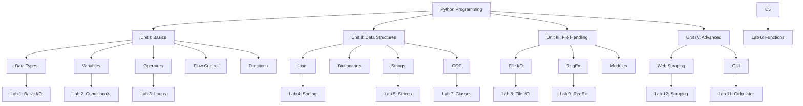

# Programming in Python — Comprehensive Study Notes

> **Coverage:** 100% | **Topics:** 45+ topics | **Units:** 4 Units (Theory + Labs)

## Table of Contents

- [Unit-I: Introduction to Python Programming (Theory)](#unit-i-introduction-to-python-programming-theory)
  - [Introduction to Python](#introduction-to-python)
  - [Python Basics: Data Types](#python-basics-data-types)
  - [Variables and Assignments](#variables-and-assignments)
  - [Operators in Python](#operators-in-python)
  - [Flow Control: Boolean Values](#flow-control-boolean-values)
  - [Comparison Operators](#comparison-operators)
  - [Boolean Operators](#boolean-operators)
  - [Elements of Flow Control](#elements-of-flow-control)
  - [Flow Control Statements](#flow-control-statements)
  - [Importing Modules](#importing-modules)
  - [Program Execution](#program-execution)
- [Unit-I: Lab Exercises](#unit-i-lab-exercises)
  - [Lab 1: Basic Data Types and Operators](#lab-1-basic-data-types-and-operators)
  - [Lab 2: Conditional Statements](#lab-2-conditional-statements)
  - [Lab 3: Loops (Factorial)](#lab-3-loops-factorial)
- [Unit-II: Functions, Lists, Dictionaries, and Strings (Theory)](#unit-ii-functions-lists-dictionaries-and-strings-theory)
  - [Functions in Python](#functions-in-python)
  - Arguments](#function-parameters [Function Parameters and-and-arguments)
  - [Return Values and return Statements](#return-values-and-return-statements)
  - [The None Value](#the-none-value)
  - [Local and Global Scope](#local-and-global-scope)
  - [Exception Handling](#exception-handling)
  - [Lists: The List Data Type](#lists-the-list-data-type)
  - [Working with Lists](#working-with-lists)
  - [List Methods](#list-methods)
  - [Tuples](#tuples)
  - [Augmented Assignment Operators](#augmented-assignment-operators)
  - [Dictionaries and Structuring Data](#dictionaries-and-structuring-data)
  - [Pretty Printing](#pretty-printing)
  - [Using Data Structures to Model Real-World Things](#using-data-structures-to-model-real-world-things)
  - [Manipulating Strings](#manipulating-strings)
  - [Useful String Methods](#useful-string-methods)
- [Unit-II: Lab Exercises](#unit-ii-lab-exercises)
  - [Lab 4: Lists and Arrays (Sorting)](#lab-4-lists-and-arrays-sorting)
  - [Lab 5: Strings (Reverse)](#lab-5-strings-reverse)
  - [Lab 6: Functions (Area of Circle)](#lab-6-functions-area-of-circle)
  - [Lab 7: Classes and Objects](#lab-7-classes-and-objects)
  - [Lab 10: Exception Handling](#lab-10-exception-handling)
- [Unit-III: File Handling, Modules, and RegEx (Theory)](#unit-iii-file-handling-modules-and-regex-theory)
  - [Reading and Writing Files](#reading-and-writing-files)
  - [Files and File Paths](#files-and-file-paths)
  - [The os.path Module](#the-ospath-module)
  - [The File Reading/Writing Process](#the-file-readingwriting-process)
  - [Saving Variables with the shelve Module](#saving-variables-with-the-shelve-module)
  - [Saving Variables with the pprint.pformat() Function](#saving-variables-with-the-pprintpformat-function)
  - [Organizing Files: The shutil Module](#organizing-files-the-shutil-module)
  - [Walking a Directory Tree](#walking-a-directory-tree)
  - [Compressing Files with the zipfile Module](#compressing-files-with-the-zipfile-module)
  - [Modules and Packages](#modules-and-packages)
  - [Regular Expressions](#regular-expressions)
- [Unit-III: Lab Exercises](#unit-iii-lab-exercises)
  - [Lab 8: File Input/Output](#lab-8-file-inputoutput)
  - [Lab 9: Regular Expressions](#lab-9-regular-expressions)
- [Unit-IV: Web Scraping and Advanced Topics (Theory)](#unit-iv-web-scraping-and-advanced-topics-theory)
  - [Web Scraping Fundamentals](#web-scraping-fundamentals)
  - [Project: mapit.py with the webbrowser Module](#project-mapitpy-with-the-webbrowser-module)
  - [Downloading Files from the Web with the requests Module](#downloading-files-from-the-web-with-the-requests-module)
  - [Saving Downloaded Files to the Hard Drive](#saving-downloaded-files-to-the-hard-drive)
  - [HTML (Hypertext Markup Language)](#html-hypertext-markup-language)
  - [GUI Programming with tkinter](#gui-programming-with-tkinter)
- [Unit-IV: Lab Exercises](#unit-iv-lab-exercises)
  - [Lab 11: GUI Programming (Calculator)](#lab-11-gui-programming-calculator)
  - [Lab 12: Web Scraping](#lab-12-web-scraping)
- [Practice Questions - All Units](#practice-questions---all-units)
- [Quick Reference Index](#quick-reference-index)
- [Knowledge Graph](#knowledge-graph)

---

## Unit-I: Introduction to Python Programming (Theory)

### Introduction to Python

#### Core Idea
Python is a high-level, interpreted programming language created by Guido van Rossum and first released in 1991. It is renowned for its simplicity, readability, and versatility, supporting multiple programming paradigms including procedural, object-oriented, and functional programming. Python has a comprehensive standard library that makes it suitable for diverse applications ranging from web development and data analysis to artificial intelligence and scientific computing.

#### Why It Matters
Python's design philosophy emphasizes code readability with its notable use of significant indentation. Its simplicity allows beginners to learn programming concepts quickly while remaining powerful enough for experts to build complex applications. The language's extensive library support means developers don't need to write everything from scratch, significantly accelerating development time. Python's interpreted nature means code runs line-by-line, making debugging easier and enabling rapid prototyping.

#### Key Concepts
| Term | Definition |
|------|------------|
| High-Level Language | A programming language that abstracts away hardware details, focusing on programmer productivity |
| Interpreted Language | Code executed line-by-line by an interpreter rather than compiled into machine code |
| Procedural Programming | Writing code as a sequence of instructions or procedures |
| Object-Oriented Programming (OOP) | A paradigm based on objects containing data and methods |
| Functional Programming | A paradigm treating computation as evaluation of mathematical functions |
| Standard Library | A collection of modules bundled with Python for common programming tasks |

#### Code Examples
```python
# Your first Python program
print("Hello, World!")

# Python as a calculator in interactive shell
2 + 3  # Returns 5
10 - 4  # Returns 6
3 * 4  # Returns 12
10 / 2  # Returns 5.0
10 // 3  # Returns 3 (floor division)
10 % 3   # Returns 1 (modulus)
2 ** 4   # Returns 16 (exponentiation)

# Checking Python version
import sys
print(sys.version)

# The Zen of Python
import this
```

#### Memory Hooks
Think of Python as "executable pseudocode" - it's designed to be so readable that it almost reads like English.

#### Key Takeaways
- ✅ Python was created by Guido van Rossum in 1991
- ✅ Python supports multiple programming paradigms
- ✅ The philosophy emphasizes "Readability counts"
- ✅ Python has a vast standard library
- ✅ Suitable for web development, data analysis, AI, and scientific computing

---

### Python Basics: Data Types

#### Core Idea
Python provides several built-in data types for storing different kinds of data. Understanding these fundamental data types is essential for writing effective Python programs. The primary data types include numeric types (integers, floating-point numbers, complex numbers), sequence types (lists, tuples, ranges), text type (strings), and boolean type.

#### Why It Matters
Data types determine how data is stored in memory and what operations can be performed on that data. Choosing the appropriate data type for your variables ensures efficient memory usage and prevents errors. Python's dynamic typing means you don't need to explicitly declare variable types, but understanding data types helps in writing bug-free code and leveraging Python's full capabilities.

#### Key Concepts
| Term | Definition |
|------|------------|
| Integer (int) | Whole numbers without any fractional part (e.g., 5, 10, -3, 0) |
| Floating-Point (float) | Numbers with decimal points (e.g., 3.14, -2.5, 10.0) |
| String (str) | Sequence of characters enclosed in quotes (e.g., "Hello", 'Python') |
| Boolean (bool) | True or False values |
| Complex Numbers | Numbers with real and imaginary parts (e.g., 3+4j) |
| Dynamic Typing | Variable types are determined at runtime |

#### Code Examples
```python
# Integer type
age = 25
count = -10
zero = 0
print(type(age))  # <class 'int'>

# Floating-point type
price = 19.99
temperature = -5.5
print(type(price))  # <class 'float'>

# String type
name = "Python"
message = 'Hello, World!'
multiline = """This is a
multiline string"""
print(type(name))  # <class 'str'>

# Boolean type
is_active = True
has_permission = False
print(type(is_active))  # <class 'bool'>

# Type conversion
int_to_float = float(10)      # 10.0
float_to_int = int(3.14)     # 3
str_to_int = int("42")       # 42
int_to_str = str(100)        # "100"

# String to float conversion
price_str = "19.99"
price_float = float(price_str)  # 19.99

# Boolean as integers (True=1, False=0)
print(True + 1)   # 2
print(False + 1)  # 1

# Truthy and Falsy values
# Falsy: False, None, 0, 0.0, '', [], {}, ()
# Truthy: Everything else
print(bool(0))        # False
print(bool(1))        # True
print(bool(""))       # False
print(bool("hello"))  # True
print(bool([]))       # False
print(bool([1, 2]))   # True
```

#### Comparison Table
| Data Type | Example | Mutable? | Ordered? |
|-----------|---------|----------|----------|
| int | 42 | No | N/A |
| float | 3.14 | No | N/A |
| str | "hello" | No | Yes |
| bool | True | No | N/A |
| list | [1,2,3] | Yes | Yes |
| tuple | (1,2,3) | No | Yes |
| dict | {"a":1} | Yes | No (3.7+) |
| set | {1,2,3} | Yes | No |

#### Key Takeaways
- ✅ Integer (int): Whole numbers
- ✅ Float: Numbers with decimal points
- ✅ String: Text data enclosed in quotes
- ✅ Boolean: True or False values
- ✅ Python uses dynamic typing
- ✅ Falsy: False, None, 0, "", [], {}, ()

---

### Variables and Assignments

#### Core Idea
Variables are containers for storing data values in Python. Unlike some other programming languages, Python variables don't require explicit declaration of type - the type is inferred from the assigned value. Variable names (identifiers) must follow specific rules and conventions to ensure code readability and prevent conflicts with Python keywords.

#### Why It Matters
Variables are fundamental to programming as they allow you to store, manipulate, and reuse data throughout your program. Proper variable naming makes code self-documenting and easier to understand. Understanding variable assignment and the rules for identifiers helps prevent bugs and makes your code more maintainable.

#### Key Concepts
| Term | Definition |
|------|------------|
| Variable | A named storage location in memory that holds a value |
| Assignment | The process of storing a value in a variable using the = operator |
| Identifier | A name given to variables, functions, classes, or other entities |
| Keyword | Reserved words that have special meaning in Python |
| Case-Sensitive | Uppercase and lowercase letters are treated differently |
| Snake Case | Naming convention for variables (e.g., my_variable_name) |

#### Code Examples
```python
# Basic variable assignment
name = "Alice"
age = 25
height = 5.6
is_student = True

# Multiple assignment
x, y, z = 1, 2, 3
a = b = c = 0  # All three variables point to the same object

# Valid variable names
my_variable = 10
_user_name = "John"
CONSTANT = 3.14  # Convention for constants

# Invalid variable names (will cause errors)
# 2name = "test"    # Cannot start with number
# my-var = 5       # Cannot use hyphen
# my var = 10      # Cannot use spaces
# if = 5            # Cannot use keywords

# Swapping variables
a = 5
b = 10
a, b = b, a  # Now a = 10, b = 5

# Using input() for user input
user_name = input("Enter your name: ")
user_age = int(input("Enter your age: "))
print(f"Hello, {user_name}! You are {user_age} years old.")

# Variable types can change
x = 5        # int
x = "hello"  # now str
```

#### Comparison Table
| Rule | Valid? | Example |
|------|--------|---------|
| Start with letter | ✅ | name |
| Start with underscore | ✅ | _name |
| Start with number | ❌ | 1name |
| Contains letters, numbers, underscores | ✅ | my_var_1 |
| Contains spaces | ❌ | my var |
| Uses Python keywords | ❌ | if, for, class |

#### Key Takeaways
- ✅ Variables are created when assigned
- ✅ Use descriptive names (snake_case)
- ✅ Cannot use Python keywords as variable names
- ✅ Case-sensitive: Age and age are different
- ✅ Multiple assignment is possible
- ✅ Variables can change types dynamically

---

### Operators in Python

#### Core Idea
Operators are symbols that perform operations on operands (values or variables). Python supports various types of operators including arithmetic, comparison, logical, assignment, bitwise, and identity operators. Understanding these operators is essential for manipulating data and controlling program flow.

#### Why It Matters
Operators are the building blocks of expressions in Python. They enable you to perform mathematical calculations, make comparisons, combine conditions, and assign values. Mastery of operators allows you to write efficient and concise code.

#### Key Concepts
| Term | Definition |
|------|------------|
| Arithmetic Operators | Perform mathematical calculations (+, -, *, /, //, %, **) |
| Comparison Operators | Compare values and return boolean (==, !=, <, >, <=, >=) |
| Logical Operators | Combine boolean values (and, or, not) |
| Assignment Operators | Assign values to variables (=, +=, -=, *=, /=) |
| Identity Operators | Check object identity (is, is not) |
| Membership Operators | Check membership in sequences (in, not in) |

#### Code Examples
```python
# Arithmetic Operators
a, b = 10, 3
print(a + b)    # 13 (Addition)
print(a - b)    # 7  (Subtraction)
print(a * b)    # 30 (Multiplication)
print(a / b)    # 3.333... (Division)
print(a // b)   # 3  (Floor Division)
print(a % b)    # 1  (Modulus)
print(a ** b)   # 1000 (Exponentiation)

# Comparison Operators
x, y = 5, 10
print(x == y)   # False
print(x != y)   # True
print(x < y)    # True
print(x > y)    # False
print(x <= y)   # True
print(x >= y)   # False

# Logical Operators
p, q = True, False
print(p and q)  # False
print(p or q)   # True
print(not p)    # False

# Assignment Operators
num = 10
num += 5        # num = num + 5 = 15
num -= 3        # num = num - 3 = 12
num *= 2        # num = num * 2 = 24
num /= 4        # num = num / 4 = 6.0

# Identity Operators
list1 = [1, 2, 3]
list2 = [1, 2, 3]
list3 = list1
print(list1 is list2)    # False (different objects)
print(list1 is list3)    # True (same object)

# Membership Operators
my_list = [1, 2, 3, 4, 5]
print(3 in my_list)      # True
print(6 not in my_list)  # True

# Python's chaining feature
x = 5
print(1 < x < 10)    # True (1 < 5 and 5 < 10)
print(1 < x < 3)     # False
```

#### Key Takeaways
- ✅ Arithmetic: + - * / // % **
- ✅ Comparison: == != < > <= >=
- ✅ Logical: and or not
- ✅ Assignment: = += -= *= /=
- ✅ Identity: is, is not
- ✅ Membership: in, not in
- ✅ Can chain comparisons: 1 < x < 10

---

### Flow Control: Boolean Values

#### Core Idea
Boolean values are the simplest data type with only two possible values: True and False. They are fundamental to decision-making in programming, serving as the foundation for conditional statements and loop control. In Python, boolean values are actually a subclass of integers, with True being equivalent to 1 and False to 0.

#### Why It Matters
Boolean values drive all decision-making in programs. Every conditional statement evaluates to either True or False, determining which code path executes. Understanding boolean logic is crucial for writing effective conditional statements, loops, and complex conditions.

#### Key Concepts
| Term | Definition |
|------|------------|
| Boolean | A data type with only two values: True or False |
| Truthy | Values that evaluate to True in a boolean context |
| Falsy | Values that evaluate to False in a boolean context |
| Boolean Context | Any place where Python expects a boolean value |
| Short-Circuit Evaluation | Boolean operators stop evaluating as soon as result is determined |

#### Code Examples
```python
# Boolean values
is_active = True
is_deleted = False
print(type(is_active))  # <class 'bool'>

# Boolean as integers
print(True + 1)   # 2
print(False + 1)   # 1

# Truthy and Falsy values
# Falsy values in Python:
# False, None, 0, 0.0, '', [], {}, ()

# Using bool() to check truthiness
print(bool(0))        # False
print(bool(1))        # True
print(bool(""))       # False
print(bool("hello"))  # True
print(bool([]))       # False
print(bool([1, 2]))   # True

# Short-circuit evaluation
def check():
    print("Function called")
    return True

result = False and check()  # check() not called
result = True or check()    # check() not called

# Practical example
user_input = ""
if user_input:
    print("User entered something")
else:
    print("No input provided")
```

#### Key Takeaways
- ✅ Boolean has only two values: True and False
- ✅ True equals 1, False equals 0
- ✅ Falsy: False, None, 0, "", [], {}, ()
- ✅ All other values are Truthy
- ✅ Boolean operators short-circuit

---

### Comparison Operators

#### Core Idea
Comparison operators are used to compare two values and return a boolean result (True or False). They are fundamental to decision-making in programming, allowing you to create conditions that control program flow.

#### Why It Matters
Comparison operators enable programs to make decisions based on relationships between values. They are the backbone of conditional statements, allowing your code to respond differently based on different conditions.

#### Key Concepts
| Term | Definition |
|------|------------|
| Equal to (==) | Returns True if both values are equal |
| Not equal to (!=) | Returns True if values are different |
| Greater than (>) | Returns True if left is greater |
| Less than (<) | Returns True if left is smaller |
| Greater than or equal (>=) | Returns True if left is greater or equal |
| Less than or equal (<=) | Returns True if left is smaller or equal |

#### Code Examples
```python
# Basic comparisons
a, b = 10, 20
print(a == b)   # False
print(a != b)   # True
print(a > b)    # False
print(a < b)    # True
print(a >= b)   # False
print(a <= b)   # True

# With strings
print("apple" == "apple")    # True
print("apple" == "banana")   # False
print("apple" < "banana")    # True (alphabetical)
print("apple" != "banana")   # True

# With lists
print([1, 2, 3] == [1, 2, 3])  # True
print([1, 2, 3] == [1, 2, 4]) # False

# Chaining comparisons (Python feature)
x = 5
print(1 < x < 10)    # True (1 < 5 and 5 < 10)
print(1 < x < 3)     # False

# Practical examples
score = 85
print(score >= 60)   # True - passing grade
print(score >= 90)   # False - not an A grade

age = 18
print(age >= 18)     # True - can vote
```

#### Key Takeaways
- ✅ == checks equality, != checks inequality
- ✅ > greater than, < less than
- ✅ >= greater or equal, <= less or equal
- ✅ Can chain comparisons in Python
- ✅ Returns boolean values

---

### Boolean Operators

#### Core Idea
Boolean operators (and, or, not) combine or modify boolean values to create more complex conditions. The 'and' operator returns True only if both operands are True. The 'or' operator returns True if at least one operand is True. The 'not' operator inverts the boolean value.

#### Why It Matters
Boolean operators allow you to combine multiple conditions into single expressions, enabling complex decision-making in your programs. Without these operators, you would only be able to check single conditions.

#### Key Concepts
| Term | Definition |
|------|------------|
| and Operator | Returns True only if both operands are True |
| or Operator | Returns True if at least one operand is True |
| not Operator | Inverts the boolean value (True becomes False, False becomes True) |
| Short-Circuit | Evaluation stops as soon as result is determined |
| Truth Table | Table showing all possible combinations of boolean values |

#### Code Examples
```python
# and operator - both must be True
print(True and True)    # True
print(True and False)   # False
print(False and True)   # False
print(False and False)  # False

# or operator - at least one must be True
print(True or True)     # True
print(True or False)    # True
print(False or True)    # True
print(False or False)   # False

# not operator - inverts the value
print(not True)         # False
print(not False)        # True

# Short-circuit evaluation
def returns_false():
    return False

result = False and returns_false()  # Short-circuits
result = True or returns_false()    # Short-circuits

# Practical examples
age = 25
has_license = True
can_drive = age >= 18 and has_license
print(can_drive)  # True

# Complex conditions
temperature = 25
is_sunny = True
is_weekend = False

go_to_beach = temperature > 20 and is_sunny and is_weekend
print(go_to_beach)  # False (not weekend)
```

#### Truth Table
| A | B | A and B | A or B | not A |
|---|---|---------|--------|-------|
| True | True | True | True | False |
| True | False | False | True | False |
| False | True | False | True | True |
| False | False | False | False | True |

#### Key Takeaways
- ✅ and: Both must be True
- ✅ or: At least one must be True
- ✅ not: Inverts the value
- ✅ Short-circuit evaluation applies

---

### Elements of Flow Control

#### Core Idea
Flow control determines the order in which statements are executed in a program. In Python, flow control is achieved through conditional statements (if, elif, else), loops (for, while), and transfer statements (break, continue, pass).

#### Why It Matters
Without flow control, programs would execute statements sequentially from top to bottom, limiting their usefulness. Flow control enables programs to respond to different conditions, process collections of data, and execute code repeatedly.

#### Key Concepts
| Term | Definition |
|------|------------|
| Sequential Execution | Default flow where statements run in order |
| Conditional Execution | Code runs only when certain conditions are met |
| Looping | Repeating a block of code multiple times |
| Selection | Choosing between different code paths |
| Iteration | The process of repeating code for each item in a collection |

#### Code Examples
```python
# Simple if statement
temperature = 30
if temperature > 25:
    print("It's hot outside")

# if-else statement
age = 16
if age >= 18:
    print("You can vote")
else:
    print("You cannot vote yet")

# if-elif-else chain
score = 85
if score >= 90:
    grade = "A"
elif score >= 80:
    grade = "B"
elif score >= 70:
    grade = "C"
elif score >= 60:
    grade = "D"
else:
    grade = "F"
print(f"Your grade is: {grade}")

# Nested conditionals
num = 10
if num > 0:
    if num % 2 == 0:
        print("Positive even number")
    else:
        print("Positive odd number")
elif num < 0:
    print("Negative number")
else:
    print("Zero")
```

#### Key Takeaways
- ✅ if-elif-else for conditional execution
- ✅ for loops for known iteration count
- ✅ while loops for unknown iteration count
- ✅ break exits the loop
- ✅ continue skips to next iteration

---

### Flow Control Statements

#### Core Idea
Flow control statements direct the execution path of a program. Python provides several types: conditional statements (if, elif, else) for decision making, loop statements (for, while) for repetition, and control transfer statements (break, continue, pass, return).

#### Key Concepts
| Term | Definition |
|------|------------|
| if Statement | Executes code block if condition is True |
| elif Statement | Checks additional conditions if previous ones were False |
| else Statement | Executes when no previous conditions were True |
| for Loop | Iterates over sequences or ranges |
| while Loop | Repeats while condition is True |
| break Statement | Exits the loop immediately |
| continue Statement | Skips to next iteration |
| pass Statement | Placeholder that does nothing |

#### Code Examples
```python
# for loop with range
for i in range(5):  # 0, 1, 2, 3, 4
    print(i)

for i in range(1, 6):  # 1, 2, 3, 4, 5
    print(i)

for i in range(0, 10, 2):  # 0, 2, 4, 6, 8 (step of 2)
    print(i)

# while loop
password = ""
while password != "secret":
    password = input("Enter password: ")
    if password != "secret":
        print("Incorrect, try again")
print("Access granted")

# break - exit loop
for num in range(10):
    if num == 5:
        print("Found 5, stopping")
        break
    print(num)

# continue - skip iteration
for num in range(5):
    if num == 2:
        continue
    print(num)  # Prints 0, 1, 3, 4 (skips 2)

# pass - placeholder
def placeholder_function():
    pass  # Will implement later

# Match statement (Python 3.10+)
status_code = 200
match status_code:
    case 200:
        print("OK")
    case 404:
        print("Not Found")
    case 500:
        print("Server Error")
    case _:
        print("Unknown Error")
```

#### Key Takeaways
- ✅ if: Basic conditional execution
- ✅ elif: Additional condition checks
- ✅ else: Default execution path
- ✅ for: Counted iterations
- ✅ while: Conditional iterations
- ✅ break: Exit loop immediately
- ✅ continue: Skip to next iteration
- ✅ pass: Empty placeholder

---

### Importing Modules

#### Core Idea
Modules are files containing Python code that can be imported into other programs. The import system allows you to use code from the standard library or third-party packages. Python modules can contain functions, classes, and variables.

#### Key Concepts
| Term | Definition |
|------|------------|
| Module | A Python file containing code (.py extension) |
| Package | A directory containing multiple modules |
| Import | Statement that brings module into current program |
| Standard Library | Built-in modules that come with Python |
| Third-Party Modules | External packages from PyPI |
| Alias | Alternative name for imported module |

#### Code Examples
```python
# Import entire module
import math
print(math.sqrt(16))    # 4.0
print(math.pi)          # 3.141592653589793

# Import specific items
from math import sqrt, pi
print(sqrt(16))         # 4.0

# Import with alias
import numpy as np
import pandas as pd

# Common standard library modules
import os        # Operating system interface
import sys       # System parameters
import random    # Random number generation
import datetime  # Date and time
import json      # JSON handling
import re        # Regular expressions

# Creating your own module (mymodule.py)
"""
def greet(name):
    return f"Hello, {name}!"

def add(a, b):
    return a + b
"""

# Importing your module
# import mymodule
# print(mymodule.greet("World"))
```

#### Comparison Table
| Import Method | Usage | Example |
|---------------|-------|---------|
| import module | Import entire module | import math |
| from module import item | Import specific item | from os import path |
| import module as alias | Import with alias | import numpy as np |

#### Key Takeaways
- ✅ Modules are .py files containing code
- ✅ import brings module into your program
- ✅ from imports specific items
- ✅ Use aliases for long module names
- ✅ Standard library has hundreds of modules

---

### Program Execution

#### Core Idea
Program execution in Python involves several stages: writing source code, interpreting the code, compiling to bytecode, and executing on the Python Virtual Machine (PVM). Understanding this process helps you write efficient code and debug issues.

#### Key Concepts
| Term | Definition |
|------|------------|
| Source Code | The Python code you write in .py files |
| Interpreter | Program that executes Python code |
| Bytecode | Intermediate code that Python compiles to |
| Python Virtual Machine (PVM) | Executes bytecode |
| Compilation | Converting source code to bytecode |

#### Code Examples
```python
# Interactive mode - type python in terminal
# >>> print("Hello")
# Hello

# Script mode - run from file
# python script.py

# Understanding execution flow
print("Step 1: Code written")

# Python compiles to bytecode (.pyc files)
# This happens automatically when you import

# PVM executes bytecode
print("Step 3: Executed by PVM")

# Checking if running as main script
def main():
    print("Main function executed")

if __name__ == "__main__":
    main()

# Exit program early
import sys

def process_data():
    data = None
    if data is None:
        print("No data, exiting...")
        sys.exit(1)  # Exit with error code

# Timing execution
import time
start_time = time.time()
total = sum(range(1000000))
end_time = time.time()
print(f"Execution time: {end_time - start_time:.4f} seconds")
```

#### Key Takeaways
- ✅ Python compiles to bytecode
- ✅ Bytecode runs on PVM
- ✅ Use __name__ == "__main__" for main script
- ✅ sys.exit() terminates program early

---

## Unit-I: Lab Exercises

### Lab 1: Basic Data Types and Operators

#### Problem Statement
Create a program that prompts the user for their name and age and prints a personalized message.

#### Description
This lab exercise demonstrates basic data types (strings, integers) and the use of input/output operations. You will learn how to:
- Accept user input using input()
- Convert string input to integers
- Use string concatenation/f-strings for output
- Perform basic arithmetic operations

#### Code Solution
```python
# Lab 1: Basic Data Types and Operators
# Program to accept user name and age, print personalized message

# Get user input
name = input("Enter your name: ")
age_input = input("Enter your age: ")

# Convert age to integer
age = int(age_input)

# Calculate birth year
current_year = 2024
birth_year = current_year - age

# Print personalized message
print(f"\nHello, {name}!")
print(f"You are {age} years old.")
print(f"You were born in {birth_year}.")

# Additional: Demonstrate operators
print(f"\n--- Age Statistics ---")
print(f"Age in months: {age * 12}")
print(f"Age in days: {age * 365}")
print(f"Age in hours: {age * 365 * 24}")

# Demonstrate arithmetic operators
a = 15
b = 4
print(f"\n--- Arithmetic Demo ---")
print(f"{a} + {b} = {a + b}")
print(f"{a} - {b} = {a - b}")
print(f"{a} * {b} = {a * b}")
print(f"{a} / {b} = {a / b}")
print(f"{a} // {b} = {a // b}")
print(f"{a} % {b} = {a % b}")
print(f"{a} ** {b} = {a ** b}")
```

#### Sample Output
```
Enter your name: Alice
Enter your age: 20

Hello, Alice!
You are 20 years old.
You were born in 2004.

--- Age Statistics ---
Age in months: 240
Age in days: 7300
Age in hours: 175200

--- Arithmetic Demo ---
15 + 4 = 19
15 - 4 = 11
15 * 4 = 60
15 / 4 = 3.75
15 // 4 = 3
15 % 4 = 3
15 ** 4 = 50625
```

---

### Lab 2: Conditional Statements

#### Problem Statement
Create a program that prompts the user for their age and tells them if they can vote in the next election.

#### Description
This lab teaches:
- if-elif-else statements
- Comparison operators
- Multiple conditions
- Nested conditionals

#### Code Solution
```python
# Lab 2: Conditional Statements
# Program to check voting eligibility

# Get user input
age = int(input("Enter your age: "))

# Check voting eligibility
VOTING_AGE = 18

print(f"\n--- Voting Eligibility Check ---")
print(f"Your age: {age}")

if age < 0:
    print("Invalid age! Age cannot be negative.")
elif age < VOTING_AGE:
    years_left = VOTING_AGE - age
    print(f"You cannot vote yet.")
    print(f"You will be eligible in {years_left} year(s).")
elif age == VOTING_AGE:
    print("Congratulations! You are just eligible to vote!")
    print("This is your first year to exercise your voting right.")
else:
    print("You are eligible to vote!")
    years_as_voter = age - VOTING_AGE
    print(f"You have been voting for {years_as_voter} year(s).")

# Additional: Check other age-based conditions
print(f"\n--- Age Categories ---")

if age < 13:
    print("Category: Child")
elif age < 20:
    print("Category: Teenager")
elif age < 60:
    print("Category: Adult")
else:
    print("Category: Senior Citizen")

# Nested conditions for driving
print(f"\n--- Driving Eligibility ---")
if age >= 18:
    if age >= 21:
        print("You can drive any vehicle!")
    else:
        print("You can drive a non-commercial vehicle.")
else:
    print("You are too young to drive.")

# Match statement (Python 3.10+)
print(f"\n--- Age Group (match statement) ---")
match age:
    case 0 | 1 | 2:
        print("Baby")
    case _ if age < 13:
        print("Child")
    case _ if age < 20:
        print("Teenager")
    case _ if age < 60:
        print("Adult")
    case _:
        print("Senior")
```

---

### Lab 3: Loops (Factorial)

#### Problem Statement
Create a program that calculates the factorial of a number entered by the user using a loop.

#### Description
This lab teaches:
- for and while loops
- Range function
- Accumulator pattern
- Input validation

#### Code Solution
```python
# Lab 3: Loops (Factorial Calculation)
# Program to calculate factorial using loops

def factorial_using_for(n):
    """Calculate factorial using for loop"""
    result = 1
    for i in range(1, n + 1):
        result *= i
    return result

def factorial_using_while(n):
    """Calculate factorial using while loop"""
    result = 1
    counter = 1
    while counter <= n:
        result *= counter
        counter += 1
    return result

def factorial_using_recursion(n):
    """Calculate factorial using recursion"""
    if n <= 1:
        return 1
    return n * factorial_using_recursion(n - 1)

# Main program
print("=== Factorial Calculator ===")

# Get user input
num = int(input("Enter a non-negative integer: "))

# Validate input
if num < 0:
    print("Error: Factorial is not defined for negative numbers!")
elif num > 20:
    print("Warning: Result will be very large!")
else:
    # Calculate using different methods
    fact_for = factorial_using_for(num)
    fact_while = factorial_using_while(num)
    
    print(f"\n--- Results ---")
    print(f"Number: {num}")
    print(f"Factorial (using for loop): {fact_for}")
    print(f"Factorial (using while loop): {fact_while}")
    
    # Show calculation steps
    print(f"\n--- Calculation Steps (for loop) ---")
    steps = []
    for i in range(1, num + 1):
        steps.append(str(i))
    print(" × ".join(steps), "=", fact_for)
    
    # Additional: Sum of factorials
    print(f"\n--- Sum of Factorials ---")
    sum_of_facts = 0
    for i in range(1, num + 1):
        sum_of_facts += factorial_using_for(i)
    print(f"1! + 2! + 3! + ... + {num}! = {sum_of_facts}")
    
    # Fibonacci using loop
    print(f"\n--- Fibonacci Series ---")
    fib_series = []
    a, b = 0, 1
    for _ in range(num):
        fib_series.append(a)
        a, b = b, a + b
    print(f"Fibonacci series of {num} terms: {fib_series}")
```

---

## Unit-II: Functions, Lists, Dictionaries, and Strings (Theory)

### Functions in Python

#### Core Idea
Functions are reusable blocks of code that perform specific tasks. They help organize code, promote reusability, and reduce duplication. In Python, functions are defined using the def keyword and can accept parameters, return values, and be called from anywhere in the program.

#### Why It Matters
Functions are the building blocks of well-structured programs. They allow you to break complex problems into smaller, manageable pieces. Instead of writing the same code multiple times, you define a function once and call it whenever needed.

#### Key Concepts
| Term | Definition |
|------|------------|
| Function Definition | Creating a function using def keyword |
| Function Call | Invoking a function to execute its code |
| Parameter | Variable in function definition that accepts input |
| Argument | Actual value passed to function when called |
| Return Value | Value sent back by function to caller |
| Function Signature | The combination of function name and parameters |

#### Code Examples
```python
# Basic function without parameters
def greet():
    print("Hello, World!")

greet()  # Calling the function

# Function with parameters
def greet_person(name):
    print(f"Hello, {name}!")

greet_person("Alice")

# Function with multiple parameters
def introduce(name, age):
    print(f"I'm {name} and I'm {age} years old")

introduce("Bob", 25)

# Function with return value
def add(a, b):
    return a + b

result = add(3, 5)  # result = 8

# Function with default parameters
def power(base, exponent=2):
    return base ** exponent

print(power(3))    # 9 (default exponent is 2)
print(power(3, 3)) # 27

# Function with variable arguments
def sum_all(*args):
    total = 0
    for num in args:
        total += num
    return total

print(sum_all(1, 2, 3))       # 6
print(sum_all(1, 2, 3, 4, 5)) # 15

# Function with keyword arguments
def display_info(name, age, city="Unknown"):
    print(f"Name: {name}, Age: {age}, City: {city}")

display_info("Alice", 25)                    # Uses default city
display_info("Bob", 30, city="New York")     # Overrides city

# Lambda functions (anonymous functions)
square = lambda x: x ** 2
print(square(5))  # 25

add_numbers = lambda a, b: a + b
print(add_numbers(3, 4))  # 7
```

#### Key Takeaways
- ✅ Use def to define functions
- ✅ Functions can accept parameters
- ✅ Return values using return statement
- ✅ Default parameters provide defaults
- ✅ *args for variable arguments
- ✅ **kwargs for keyword arguments
- ✅ Lambda functions are anonymous

---

### Function Parameters and Arguments

#### Core Idea
Python supports various parameter types: positional arguments, keyword arguments, default arguments, variable-length arguments (*args), and keyword-only arguments.

#### Key Concepts
| Term | Definition |
|------|------------|
| Positional Arguments | Arguments passed in order |
| Keyword Arguments | Arguments specified by parameter name |
| Default Arguments | Parameters with default values |
| *args | Variable positional arguments (tuple) |
| **kwargs | Variable keyword arguments (dictionary) |

#### Code Examples
```python
# Positional arguments
def subtract(a, b):
    return a - b

print(subtract(10, 3))  # 7

# Keyword arguments
def create_user(name, age, email):
    return {"name": name, "age": age, "email": email}

user = create_user(age=25, name="Alice", email="alice@email.com")

# Default arguments
def greet(name, greeting="Hello"):
    return f"{greeting}, {name}!"

print(greet("World"))           # Hello, World!
print(greet("John", "Hi"))      # Hi, John!

# Variable positional arguments (*args)
def print_all(*args):
    for item in args:
        print(item)

print_all("apple", "banana", "cherry")

# Variable keyword arguments (**kwargs)
def print_info(**kwargs):
    for key, value in kwargs.items():
        print(f"{key}: {value}")

print_info(name="Alice", age=25, city="NYC")

# Combined parameters
def flexible_function(a, b, *args, default_val="test", **kwargs):
    print(f"a: {a}, b: {b}")
    print(f"args: {args}")
    print(f"default_val: {default_val}")
    print(f"kwargs: {kwargs}")

flexible_function(1, 2, 3, 4, 5, default_val="custom", name="Alice")

# Unpacking arguments
def add(a, b, c):
    return a + b + c

numbers = [1, 2, 3]
print(add(*numbers))  # Unpack list

details = {"a": 1, "b": 2, "c": 3}
print(add(**details)) # Unpack dictionary
```

#### Key Takeaways
- ✅ Positional: Passed in order
- ✅ Keyword: Named when passing
- ✅ Default: Have preset values
- ✅ *args: Variable positional
- ✅ **kwargs: Variable keyword

---

### Return Values and return Statements

#### Core Idea
The return statement exits a function and sends a value back to the caller. Functions can return a single value, multiple values (as tuples), or None.

#### Key Concepts
| Term | Definition |
|------|------------|
| return Statement | Exits function and returns value |
| None | Default return when no value specified |
| Tuple Unpacking | Receiving multiple return values |
| Early Return | Returning before function ends |

#### Code Examples
```python
# Basic return
def get_square(num):
    return num ** 2

result = get_square(5)  # 25

# Returning multiple values (as tuple)
def get_stats(numbers):
    minimum = min(numbers)
    maximum = max(numbers)
    total = sum(numbers)
    return minimum, maximum, total

stats = get_stats([1, 2, 3, 4, 5])
print(stats)  # (1, 5, 15)

# Tuple unpacking
min_val, max_val, total = get_stats([1, 2, 3, 4, 5])
print(f"Min: {min_val}, Max: {max_val}, Total: {total}")

# Returning None
def print_greeting(name):
    print(f"Hello, {name}!")
    # No return statement - returns None

result = print_greeting("Alice")
print(result)  # None

# Empty return or return None
def process(data):
    if not data:
        return  # Returns None
    return data.strip()

# Early return pattern
def find_user(users, user_id):
    for user in users:
        if user["id"] == user_id:
            return user  # Found, return early
    return None  # Not found
```

#### Key Takeaways
- ✅ return sends value back to caller
- ✅ Multiple values return as tuple
- ✅ No return returns None
- ✅ Early return exits function

---

### The None Value

#### Core Idea
None is a special constant representing the absence of a value. It is the only value of the NoneType data type.

#### Key Concepts
| Term | Definition |
|------|------------|
| None | Special constant meaning "no value" |
| NoneType | The type of None |
| Default None | Using None as default for optional parameters |

#### Code Examples
```python
# None assignment
result = None
print(result)  # None
print(type(result))  # <class 'NoneType'>

# None in function returns
def no_return():
    print("Hello")

result = no_return()
print(result)  # None

# None as default parameter
def greet(name=None):
    if name is None:
        name = "Guest"
    return f"Hello, {name}!"

print(greet())          # Hello, Guest!
print(greet("Alice"))   # Hello, Alice!

# Checking for None
value = None
if value is None:
    print("Value is None")
else:
    print("Value is:", value)

# None vs False vs empty
print(None == False)    # False
print(None == 0)        # False
print(None == "")       # False
print(None == None)     # True
```

#### Key Takeaways
- ✅ None represents absence of value
- ✅ None is of type NoneType
- ✅ Use "is None" not "== None"

---

### Local and Global Scope

#### Core Idea
Scope determines where variables can be accessed. Python has local scope (inside functions), global scope (at module level), and enclosing scope (nested functions).

#### Key Concepts
| Term | Definition |
|------|------------|
| Local Scope | Variables defined inside a function |
| Global Scope | Variables defined at module level |
| Enclosing Scope | Variables in outer (non-global) functions |
| LEGB Rule | Local → Enclosing → Global → Built-in |

#### Code Examples
```python
# Global variable
global_var = "I am global"

def test_scope():
    # Local variable
    local_var = "I am local"
    print(global_var)  # Can access global
    print(local_var)   # Can access local

test_scope()

# Modifying global variable
counter = 0

def increment():
    global counter  # Declare intent to use global
    counter += 1

increment()  # Counter: 1
increment()  # Counter: 2

# Enclosing scope (nested functions)
def outer():
    outer_var = "Outer"
    
    def inner():
        inner_var = "Inner"
        print(outer_var)  # Can access outer
    
    inner()

outer()
```

#### Key Takeaways
- ✅ Local: Inside function only
- ✅ Global: Available everywhere
- ✅ Use global keyword to modify
- ✅ Prefer passing values over global

---

### Exception Handling

#### Core Idea
Exception handling allows you to manage errors gracefully. Python uses try-except blocks to catch and handle exceptions.

#### Key Concepts
| Term | Definition |
|------|------------|
| Exception | An error that disrupts normal program flow |
| try Block | Code that might raise an exception |
| except Block | Code that handles the exception |
| raise Statement | Manually raise an exception |
| finally Block | Code that always executes |

#### Code Examples
```python
# Basic try-except
try:
    result = 10 / 0
except ZeroDivisionError:
    print("Cannot divide by zero!")

# Catching specific exceptions
try:
    num = int(input("Enter a number: "))
    result = 10 / num
except ValueError:
    print("Invalid input - not a number")
except ZeroDivisionError:
    print("Cannot divide by zero")

# Catching multiple exceptions
try:
    x = int("abc")
except (ValueError, ZeroDivisionError) as e:
    print(f"Error: {e}")

# Using else with try-except
try:
    file = open("data.txt", "r")
    content = file.read()
    file.close()
except FileNotFoundError:
    print("File not found")
else:
    print("File read successfully")

# Finally block
try:
    file = open("test.txt", "r")
    content = file.read()
except FileNotFoundError:
    print("File not found")
finally:
    print("This always executes")

# Raising exceptions
def divide(a, b):
    if b == 0:
        raise ValueError("Divisor cannot be zero")
    return a / b

# Custom exceptions
class InvalidAgeError(Exception):
    def __init__(self, age, message="Age must be positive"):
        self.age = age
        self.message = message
        super().__init__(self.message)
```

#### Common Exception Types
| Exception | Description |
|-----------|-------------|
| ZeroDivisionError | Division by zero |
| ValueError | Invalid value type |
| TypeError | Invalid operation type |
| FileNotFoundError | File doesn't exist |
| IndexError | List index out of range |
| KeyError | Dictionary key not found |

#### Key Takeaways
- ✅ try-except catches exceptions
- ✅ Handle specific exceptions first
- ✅ else runs if no exception
- ✅ finally always executes
- ✅ raise triggers exceptions manually

---

### Lists: The List Data Type

#### Core Idea
Lists are ordered, mutable collections that can hold items of different types. They are created using square brackets [] or the list() constructor.

#### Key Concepts
| Term | Definition |
|------|------------|
| Ordered Collection | Items maintain their order |
| Mutable | Can be changed after creation |
| Index | Position of an element (starts at 0) |
| Slicing | Getting a portion of the list |

#### Code Examples
```python
# Creating lists
empty_list = []
numbers = [1, 2, 3, 4, 5]
mixed = [1, "hello", 3.14, True]
fruits = ["apple", "banana", "cherry"]

# Using list() constructor
char_list = list("hello")  # ['h', 'e', 'l', 'l', 'o']
range_list = list(range(5))  # [0, 1, 2, 3, 4]

# Indexing
fruits = ["apple", "banana", "cherry", "date"]
print(fruits[0])   # apple
print(fruits[-1])  # cherry (last item)

# Slicing
numbers = [0, 1, 2, 3, 4, 5, 6, 7, 8, 9]
print(numbers[2:7])   # [2, 3, 4, 5, 6]
print(numbers[:5])    # [0, 1, 2, 3, 4]
print(numbers[5:])    # [5, 6, 7, 8, 9]
print(numbers[::2])   # [0, 2, 4, 6, 8] (step of 2)
print(numbers[::-1])  # [9, 8, 7, 6, 5, 4, 3, 2, 1, 0] (reverse)
```

#### Key Takeaways
- ✅ Created with [] or list()
- ✅ Ordered - maintains insertion order
- ✅ Mutable - can be modified
- ✅ Index starts at 0

---

### Working with Lists

#### Core Idea
Working with lists involves various operations: accessing elements, modifying items, adding new elements, removing elements, and searching.

#### Key Concepts
| Term | Definition |
|------|------------|
| Accessing | Getting element at specific index |
| Adding | Inserting new elements |
| Removing | Deleting elements |
| Searching | Finding element position |

#### Code Examples
```python
# Adding elements
fruits = ["apple", "banana"]
fruits.append("cherry")      # Add to end
fruits.insert(1, "orange")   # Insert at index
fruits.extend(["grape", "mango"])  # Add multiple

# Removing elements
fruits = ["apple", "banana", "cherry"]
fruits.pop()          # Remove last item
fruits.remove("banana")  # Remove by value
del fruits[0]         # Delete at index
fruits.clear()        # Remove all

# Searching
fruits = ["apple", "banana", "cherry"]
print(fruits.index("banana"))  # 1
print(fruits.count("banana"))   # 1

# List concatenation
list1 = [1, 2, 3]
list2 = [4, 5, 6]
combined = list1 + list2
print(combined)  # [1, 2, 3, 4, 5, 6]

# Sorting
numbers = [3, 1, 4, 1, 5, 9, 2, 6]
numbers.sort()
print(numbers)  # [1, 1, 2, 3, 4, 5, 6, 9]

numbers.sort(reverse=True)
print(numbers)  # [9, 6, 5, 4, 3, 2, 1, 1]
```

#### Key Takeaways
- ✅ append(): Add to end
- ✅ insert(): Add at position
- ✅ extend(): Add multiple items
- ✅ pop(): Remove and return
- ✅ remove(): Remove by value
- ✅ sort(): In-place sorting

---

### List Methods

#### Core Idea
Python provides numerous built-in methods for list manipulation.

#### Code Examples
```python
fruits = ["apple", "banana", "cherry"]

# append() - add to end
fruits.append("orange")
print(fruits)  # ['apple', 'banana', 'cherry', 'orange']

# insert() - insert at position
fruits.insert(1, "grape")
print(fruits)  # ['apple', 'grape', 'banana', 'cherry', 'orange']

# remove() - remove by value
fruits.remove("banana")
print(fruits)  # ['apple', 'grape', 'cherry', 'orange']

# pop() - remove and return
item = fruits.pop()
print(item)    # orange
print(fruits)  # ['apple', 'grape', 'cherry']

# index() - find index
print(fruits.index("cherry"))  # 2

# count() - count occurrences
numbers = [1, 2, 3, 1, 1, 4]
print(numbers.count(1))  # 3

# copy() - shallow copy
fruits_copy = fruits.copy()

# clear() - remove all items
fruits.clear()
```

#### Key Takeaways
- ✅ Methods modify the list in-place
- ✅ Use remove() for value, pop() for position

---

### Tuples

#### Core Idea
Tuples are ordered, immutable collections. Once created, they cannot be modified.

#### Comparison Table
| Aspect | List | Tuple |
|--------|------|-------|
| Syntax | [ ] | ( ) |
| Mutable | Yes | No |
| Performance | Slower | Faster |
| Use Case | Modify data | Fixed data |

#### Code Examples
```python
# Creating tuples
empty_tuple = ()
single_tuple = (5,)  # Note the comma
numbers = (1, 2, 3, 4, 5)

# Tuple unpacking
point = (10, 20)
x, y = point  # x=10, y=20

# Multiple return values
def get_stats(numbers):
    return min(numbers), max(numbers), sum(numbers)

min_val, max_val, total = get_stats([1, 2, 3, 4, 5])

# Named tuples
from collections import namedtuple
Point = namedtuple("Point", ["x", "y"])
p = Point(10, 20)
print(p.x, p.y)
```

#### Key Takeaways
- ✅ Created with ( ) or tuple()
- ✅ Immutable - cannot change
- ✅ Can contain mutable objects

---

### Dictionaries and Structuring Data

#### Core Idea
Dictionaries are unordered, mutable collections of key-value pairs. They provide efficient lookup by key.

#### Key Concepts
| Term | Definition |
|------|------------|
| Key-Value Pair | Associated data with unique key |
| Key | Unique identifier (must be immutable) |
| Value | Data associated with key |

#### Code Examples
```python
# Creating dictionaries
person = {
    "name": "Alice",
    "age": 25,
    "city": "New York"
}

# Accessing values
print(person["name"])      # Alice
print(person.get("email")) # None (doesn't raise error)
print(person.get("email", "Not found"))  # Not found

# Adding/modifying
person["email"] = "alice@email.com"
person["age"] = 26

# Removing items
del person["city"]
age = person.pop("age")

# Dictionary methods
print(person.keys())    # dict_keys(['name', 'email'])
print(person.values())  # dict_values(['Alice', 'alice@email.com'])
print(person.items())   # dict_items([('name', 'Alice'), ...])

# Iterating
for key in person:
    print(f"{key}: {person[key]}")

for key, value in person.items():
    print(f"{key}: {value}")

# Dictionary comprehension
squares = {x: x**2 for x in range(5)}
print(squares)  # {0: 0, 1: 1, 2: 4, 3: 9, 4: 16}
```

#### Key Takeaways
- ✅ Key-value pairs in curly braces
- ✅ Keys must be unique and immutable
- ✅ Values can be any type
- ✅ Efficient O(1) lookup

---

## Unit-II: Lab Exercises

### Lab 4: Lists and Arrays (Sorting)

#### Problem Statement
Create a program that prompts the user for a list of numbers and then sorts them in ascending order.

#### Code Solution
```python
# Lab 4: Lists and Arrays (Sorting)

def get_user_list():
    """Get list of numbers from user"""
    n = int(input("How many numbers? "))
    numbers = []
    for i in range(n):
        num = float(input(f"Enter number {i+1}: "))
        numbers.append(num)
    return numbers

def sort_ascending(nums):
    """Sort list in ascending order"""
    return sorted(nums)

def sort_descending(nums):
    """Sort list in descending order"""
    return sorted(nums, reverse=True)

def bubble_sort(nums):
    """Sort using bubble sort algorithm"""
    n = len(nums)
    arr = nums.copy()
    for i in range(n):
        for j in range(0, n-i-1):
            if arr[j] > arr[j+1]:
                arr[j], arr[j+1] = arr[j+1], arr[j]
    return arr

# Main program
print("=== List Sorting Program ===")

# Get numbers from user
numbers = get_user_list()

print(f"\nOriginal list: {numbers}")

# Sort using built-in functions
ascending = sort_ascending(numbers)
descending = sort_descending(numbers)

print(f"\nSorted (ascending): {ascending}")
print(f"Sorted (descending): {descending}")

# Bubble sort demonstration
bubble_sorted = bubble_sort(numbers)
print(f"Bubble sorted: {bubble_sorted}")

# Additional operations
print(f"\n--- Additional Operations ---")
print(f"Sum: {sum(numbers)}")
print(f"Average: {sum(numbers)/len(numbers):.2f}")
print(f"Max: {max(numbers)}")
print(f"Min: {min(numbers)}")
```

---

### Lab 5: Strings (Reverse)

#### Problem Statement
Create a program that prompts the user for a string and then prints out the string reversed.

#### Code Solution
```python
# Lab 5: Strings (Reverse String)

def reverse_string_slicing(s):
    """Reverse using slicing"""
    return s[::-1]

def reverse_string_loop(s):
    """Reverse using loop"""
    reversed_str = ""
    for char in s:
        reversed_str = char + reversed_str
    return reversed_str

def reverse_string_list(s):
    """Reverse using list reverse"""
    char_list = list(s)
    char_list.reverse()
    return "".join(char_list)

def reverse_words(sentence):
    """Reverse order of words in sentence"""
    words = sentence.split()
    return " ".join(reversed(words))

def is_palindrome(s):
    """Check if string is palindrome"""
    cleaned = s.lower().replace(" ", "")
    return cleaned == cleaned[::-1]

# Main program
print("=== String Reversal Program ===")

# Get input from user
text = input("Enter a string: ")

print(f"\nOriginal string: {text}")

# Reverse using different methods
print(f"\n--- Reversed Versions ---")
print(f"Slicing: {reverse_string_slicing(text)}")
print(f"Loop: {reverse_string_loop(text)}")
print(f"List: {reverse_string_list(text)}")

# Reverse words
sentence = input("\nEnter a sentence to reverse words: ")
print(f"Reversed words: {reverse_words(sentence)}")

# Palindrome check
test = input("\nEnter string to check palindrome: ")
if is_palindrome(test):
    print(f"'{test}' is a palindrome!")
else:
    print(f"'{test}' is not a palindrome")
```

---

### Lab 6: Functions (Area of Circle)

#### Problem Statement
Create a program that defines a function to calculate the area of a circle based on the radius entered by the user.

#### Code Solution
```python
# Lab 6: Functions (Area of Circle)
import math

def area_of_circle(radius):
    """Calculate area of circle"""
    return math.pi * radius ** 2

def circumference_of_circle(radius):
    """Calculate circumference of circle"""
    return 2 * math.pi * radius

def surface_area_sphere(radius):
    """Calculate surface area of sphere"""
    return 4 * math.pi * radius ** 2

def volume_sphere(radius):
    """Calculate volume of sphere"""
    return (4/3) * math.pi * radius ** 3

def area_of_ring(inner_radius, outer_radius):
    """Calculate area of ring"""
    inner_area = math.pi * inner_radius ** 2
    outer_area = math.pi * outer_radius ** 2
    return outer_area - inner_area

# Main program
print("=== Circle Calculator ===")

# Get radius from user
radius = float(input("Enter the radius of the circle: "))

# Calculate and display results
print(f"\n--- Results for radius = {radius} ---")
print(f"Area of circle: {area_of_circle(radius):.2f}")
print(f"Circumference: {circumference_of_circle(radius):.2f}")
print(f"Surface area (sphere): {surface_area_sphere(radius):.2f}")
print(f"Volume (sphere): {volume_sphere(radius):.2f}")

# Ring calculation
print(f"\n--- Ring Calculator ---")
inner_r = float(input("Enter inner radius: "))
outer_r = float(input("Enter outer radius: "))
print(f"Area of ring: {area_of_ring(inner_r, outer_r):.2f}")

# Multiple circles
print(f"\n--- Multiple Circles ---")
radii = [1, 2, 3, 4, 5]
for r in radii:
    print(f"Radius {r}: Area = {area_of_circle(r):.2f}")
```

---

### Lab 7: Classes and Objects

#### Problem Statement
Create a program that defines a class to represent a car and then creates an object of that class with specific attributes.

#### Code Solution
```python
# Lab 7: Classes and Objects

class Car:
    """Class to represent a Car"""
    
    # Class variable
    wheels = 4
    
    # Constructor
    def __init__(self, make, model, year, color):
        self.make = make
        self.model = model
        self.year = year
        self.color = color
        self.speed = 0  # Initial speed
    
    # String representation
    def __str__(self):
        return f"{self.year} {self.color} {self.make} {self.model}"
    
    # Method to display car details
    def display_info(self):
        print(f"\n--- Car Details ---")
        print(f"Make: {self.make}")
        print(f"Model: {self.model}")
        print(f"Year: {self.year}")
        print(f"Color: {self.color}")
        print(f"Wheels: {Car.wheels}")
        print(f"Current Speed: {self.speed} mph")
    
    # Method to accelerate
    def accelerate(self, speed_increase):
        self.speed += speed_increase
        print(f"Accelerated to {self.speed} mph")
    
    # Method to brake
    def brake(self, speed_decrease):
        self.speed = max(0, self.speed - speed_decrease)
        print(f"Braked to {self.speed} mph")
    
    # Method to stop
    def stop(self):
        self.speed = 0
        print("Car stopped!")

class ElectricCar(Car):
    """Electric Car - inherits from Car"""
    
    def __init__(self, make, model, year, color, battery_capacity):
        super().__init__(make, model, year, color)
        self.battery_capacity = battery_capacity  # kWh
        self.charge_level = 100  # Percentage
    
    def charge(self):
        self.charge_level = 100
        print("Car fully charged!")

# Main program
print("=== Car Class Demonstration ===")

# Create car objects
car1 = Car("Toyota", "Camry", 2022, "Silver")
car2 = Car("Honda", "Civic", 2023, "Blue")

# Display car info
car1.display_info()
car2.display_info()

# Use car methods
car1.accelerate(30)
car1.accelerate(20)
car1.brake(15)
car1.stop()

# Create electric car
print("\n=== Electric Car ===")
tesla = ElectricCar("Tesla", "Model 3", 2024, "White", 75)
tesla.display_info()
print(f"Battery: {tesla.battery_capacity} kWh")
print(f"Charge: {tesla.charge_level}%")
tesla.accelerate(50)
tesla.charge()
```

---

### Lab 10: Exception Handling

#### Problem Statement
Create a program that prompts the user for two numbers and then divides them, handling any exceptions that may arise.

#### Code Solution
```python
# Lab 10: Exception Handling

def safe_divide(a, b):
    """Divide two numbers with exception handling"""
    try:
        result = a / b
        return result, None
    except ZeroDivisionError as e:
        return None, "Error: Cannot divide by zero"
    except TypeError as e:
        return None, "Error: Invalid types for division"
    except Exception as e:
        return None, f"Error: {str(e)}"

def get_number(prompt):
    """Get a number from user with validation"""
    while True:
        try:
            num = float(input(prompt))
            return num
        except ValueError:
            print("Invalid input! Please enter a valid number.")
        except KeyboardInterrupt:
            print("\nInput cancelled.")
            return None

def calculator():
    """Simple calculator with exception handling"""
    print("=== Calculator with Exception Handling ===")
    
    # Get first number
    num1 = get_number("Enter first number: ")
    if num1 is None:
        return
    
    # Get second number
    num2 = get_number("Enter second number: ")
    if num2 is None:
        return
    
    # Get operation
    print("\nAvailable operations:")
    print("1. Addition (+)")
    print("2. Subtraction (-)")
    print("3. Multiplication (*)")
    print("4. Division (/)")
    print("5. Modulus (%)")
    print("6. Power (**)")
    
    try:
        choice = int(input("\nEnter operation choice (1-6): "))
    except ValueError:
        print("Invalid choice!")
        return
    
    # Perform operation
    try:
        if choice == 1:
            result = num1 + num2
            print(f"Result: {num1} + {num2} = {result}")
        elif choice == 2:
            result = num1 - num2
            print(f"Result: {num1} - {num2} = {result}")
        elif choice == 3:
            result = num1 * num2
            print(f"Result: {num1} * {num2} = {result}")
        elif choice == 4:
            result, error = safe_divide(num1, num2)
            if error:
                print(error)
            else:
                print(f"Result: {num1} / {num2} = {result:.2f}")
        elif choice == 5:
            result = num1 % num2
            print(f"Result: {num1} % {num2} = {result}")
        elif choice == 6:
            result = num1 ** num2
            print(f"Result: {num1} ** {num2} = {result}")
        else:
            print("Invalid choice!")
    except Exception as e:
        print(f"Calculation error: {e}")

# Run calculator
calculator()
```

---

## Unit-III: File Handling, Modules, and RegEx (Theory)

### Reading and Writing Files

#### Core Idea
Python provides built-in functions for reading from and writing to files. Files are opened using the open() function.

#### Key Concepts
| Term | Definition |
|------|------------|
| File Object | Handle for file operations |
| File Mode | Read (r), Write (w), Append (a) |
| Text Mode | t (default) vs Binary b |
| Context Manager | Automatic resource management |

#### Code Examples
```python
# Writing to a file
with open("example.txt", "w") as file:
    file.write("Hello, World!\n")
    file.write("Second line")

# Reading from a file
with open("example.txt", "r") as file:
    content = file.read()
    print(content)

# Read line by line
with open("example.txt", "r") as file:
    for line in file:
        print(line.strip())

# Appending to file
with open("example.txt", "a:
    file.write") as file("\nAppended line")

# Binary mode (for images)
with open("image.jpg", "rb") as file:
    data = file.read()

# Check if file exists before reading
import os
if os.path.exists("example.txt"):
    with open("example.txt", "r") as file:
        content = file.read()
else:
    print("File not found")
```

#### Key Takeaways
- ✅ open() returns file object
- ✅ Use context manager (with)
- ✅ Modes: r, w, a, rb, wb
- ✅ Always close or use context manager

---

### Regular Expressions

#### Core Idea
RegEx patterns match text strings. Used for validation, search, replace. Module: re.

#### Key Concepts
| Pattern | Matches |
|---------|---------|
| . | Any character |
| \d | Digit [0-9] |
| \w | Word char [a-zA-Z0-9_] |
| \s | Whitespace |
| * | 0 or more |
| + | 1 or more |
| ? | 0 or 1 |

#### Code Examples
```python
import re

# Search
text = "My email is test@example.com"
pattern = r"\w+@\w+\.\w+"
match = re.search(pattern, text)
if match:
    print(match.group())

# Find all
text = "There are 2 apples and 5 oranges"
numbers = re.findall(r"\d", text)
print(numbers)

# Replace
text = "Hello World"
result = re.sub(r"World", "Python", text)

# Validate email
email = "user@domain.com"
pattern = r"^[\w.-]+@[\w.-]+\.\w+$"
if re.match(pattern, email):
    print("Valid email")

# Phone number validation (10 digits)
phone = "9876543210"
pattern = r"^\d{10}$"
if re.match(pattern, phone):
    print("Valid phone")
```

#### Key Takeaways
- ✅ import re module
- ✅ search(), findall(), sub()
- ✅ Raw strings (r"") for patterns

---

## Unit-III: Lab Exercises

### Lab 8: File Input/Output

#### Problem Statement
Create a program that reads data from a file and writes it to another file in a different format.

#### Code Solution
```python
# Lab 8: File Input/Output

import os

def read_file(filename):
    """Read content from file"""
    try:
        with open(filename, 'r') as f:
            return f.read()
    except FileNotFoundError:
        return None

def write_file(filename, content):
    """Write content to file"""
    with open(filename, 'w') as f:
        f.write(content)

def read_csv(filename):
    """Read CSV file and convert to different format"""
    lines = []
    with open(filename, 'r') as f:
        for line in f:
            lines.append(line.strip().split(','))
    return lines

def convert_to_html(csv_data):
    """Convert CSV data to HTML table"""
    html = "<table>\n"
    for row in csv_data:
        html += "  <tr>\n"
        for cell in row:
            html += f"    <td>{cell}</td>\n"
        html += "  </tr>\n"
    html += "</table>"
    return html

# Main program
print("=== File I/O Program ===")

# Create sample data file
sample_data = """Name,Age,City
Alice,25,New York
Bob,30,Boston
Charlie,35,Chicago"""

write_file("data.csv", sample_data)
print("Created sample data.csv")

# Read and display
content = read_file("data.csv")
print(f"\nOriginal content:\n{content}")

# Convert to HTML
csv_data = read_csv("data.csv")
html_content = convert_to_html(csv_data)
write_file("data.html", html_content)
print("\nConverted to HTML and saved to data.html")

# Additional: Read and display HTML
html_content = read_file("data.html")
print(f"\nHTML content:\n{html_content}")
```

---

### Lab 9: Regular Expressions

#### Problem Statement
Create a program that uses regular expressions to find all instances of a specific pattern in a text file.

#### Code Solution
```python
# Lab 9: Regular Expressions

import re

def find_emails(text):
    """Find all email addresses"""
    pattern = r'\w+@\w+\.\w+'
    return re.findall(pattern, text)

def find_phone_numbers(text):
    """Find all phone numbers"""
    pattern = r'\d{3}-\d{3}-\d{4}'
    return re.findall(pattern, text)

def find_urls(text):
    """Find all URLs"""
    pattern = r'https?://\w+\.\w+'
    return re.findall(pattern, text)

def validate_email(email):
    """Validate email format"""
    pattern = r'^[a-zA-Z0-9._%+-]+@[a-zA-Z0-9.-]+\.[a-zA-Z]{2,}$'
    return re.match(pattern, email) is not None

def validate_phone(phone):
    """Validate phone format"""
    pattern = r'^\d{10}$|^\d{3}-\d{3}-\d{4}$'
    return re.match(pattern, phone) is not None

def replace_pattern(text, old_pattern, new_pattern):
    """Replace pattern in text"""
    return re.sub(old_pattern, new_pattern, text)

# Sample text
sample_text = """
Contact information:
Email: alice@company.com
Alternative: bob@organization.org
Phone: 123-456-7890
Mobile: 9876543210
Website: https://example.com
Blog: http://myblog.com
"""

print("=== Regular Expression Program ===")
print(f"\nSample text:\n{sample_text}")

# Find emails
emails = find_emails(sample_text)
print(f"\n--- Emails Found ---")
for email in emails:
    print(f"  {email}")
    print(f"  Valid: {validate_email(email)}")

# Find phone numbers
phones = find_phone_numbers(sample_text)
print(f"\n--- Phone Numbers Found ---")
for phone in phones:
    print(f"  {phone}")
    print(f"  Valid 10-digit: {validate_phone(phone)}")

# Find URLs
urls = find_urls(sample_text)
print(f"\n--- URLs Found ---")
for url in urls:
    print(f"  {url}")

# Replace pattern
print(f"\n--- Replace Pattern ---")
modified = replace_pattern(sample_text, r'\d{3}-\d{3}-\d{4}', 'XXX-XXX-XXXX')
print(modified)
```

---

## Unit-IV: Web Scraping and Advanced Topics (Theory)

### Web Scraping Fundamentals

#### Core Idea
Web scraping extracts data from websites using HTTP requests (requests library) and parses HTML (BeautifulSoup).

#### Key Concepts
| Library | Purpose |
|---------|---------|
| requests | HTTP requests |
| BeautifulSoup | HTML parsing |

#### Code Examples
```python
import requests
from bs4 import BeautifulSoup

# GET request
response = requests.get("https://example.com")
print(response.status_code)  # 200 = success
print(response.text)

# Parse HTML
html = "<html><body><h1>Title</h1></body></html>"
soup = BeautifulSoup(html, "html.parser")
print(soup.find("h1").text)

# Find elements
soup.find_all("p")
soup.find(class_="title")
soup.find(id="main")
```

---

### GUI Programming with tkinter

#### Core Idea
GUI creates desktop applications with windows, buttons, input fields. Python's tkinter is built-in.

#### Code Examples
```python
import tkinter as tk

# Create window
window = tk.Tk()
window.title("My App")
window.geometry("300x200")

# Label
label = tk.Label(window, text="Hello!")
label.pack()

# Button
def click():
    label.config(text="Button clicked!")

button = tk.Button(window, text="Click Me", command=click)
button.pack()

# Entry (input)
entry = tk.Entry(window)
entry.pack()

# Run app
window.mainloop()
```

---

## Unit-IV: Lab Exercises

### Lab 11: GUI Programming (Calculator)

#### Problem Statement
Create a program that uses a graphical user interface (GUI) to allow the user to perform simple calculations.

#### Code Solution
```python
# Lab 11: GUI Calculator using tkinter

import tkinter as tk
from tkinter import messagebox

def click_button(symbol):
    """Handle button clicks"""
    current = entry.get()
    entry.delete(0, tk.END)
    entry.insert(tk.END, current + str(symbol))

def clear():
    """Clear the entry"""
    entry.delete(0, tk.END)

def calculate():
    """Calculate the result"""
    try:
        result = eval(entry.get())
        entry.delete(0, tk.END)
        entry.insert(tk.END, str(result))
    except Exception as e:
        messagebox.showerror("Error", "Invalid expression")

# Create main window
root = tk.Tk()
root.title("Calculator")
root.geometry("300x400")

# Entry field
entry = tk.Entry(root, font=("Arial", 24), justify="right")
entry.pack(fill=tk.BOTH, ipadx=8, ipady=8, padx=10, pady=10)

# Button layout
buttons = [
    ("7", 1, 0), ("8", 1, 1), ("9", 1, 2), ("/", 1, 3),
    ("4", 2, 0), ("5", 2, 1), ("6", 2, 2), ("*", 2, 3),
    ("1", 3, 0), ("2", 3, 1), ("3", 3, 2), ("-", 3, 3),
    ("0", 4, 0), (".", 4, 1), ("=", 4, 2), ("+", 4, 3),
]

# Create buttons
for (text, row, col) in buttons:
    if text == "=":
        btn = tk.Button(root, text=text, font=("Arial", 18), 
                       command=calculate, bg="lightgreen")
    else:
        btn = tk.Button(root, text=text, font=("Arial", 18),
                       command=lambda t=text: click_button(t))
    btn.grid(row=row, column=col, sticky="nsew", padx=5, pady=5)

# Clear button
clear_btn = tk.Button(root, text="Clear", font=("Arial", 14), 
                      command=clear, bg="lightcoral")
clear_btn.grid(row=5, column=0, columnspan=4, sticky="nsew", padx=5, pady=5)

# Configure grid weights
for i in range(5):
    root.grid_rowconfigure(i, weight=1)
for i in range(4):
    root.grid_columnconfigure(i, weight=1)

# Run the app
root.mainloop()
```

---

### Lab 12: Web Scraping

#### Problem Statement
Create a program that uses a web scraping library to extract data from a website.

#### Code Solution
```python
# Lab 12: Web Scraping

import requests
from bs4 import BeautifulSoup
import re

def scrape_simple_page(url):
    """Scrape a simple web page"""
    try:
        response = requests.get(url)
        response.raise_for_status()
        
        soup = BeautifulSoup(response.text, 'html.parser')
        
        # Extract title
        title = soup.find('title')
        print(f"Page Title: {title.text if title else 'No title'}")
        
        # Extract all headings
        print("\n--- Headings ---")
        for i in range(1, 7):
            headings = soup.find_all(f'h{i}')
            for h in headings:
                print(f"h{i}: {h.text.strip()}")
        
        # Extract all links
        print("\n--- Links ---")
        links = soup.find_all('a')
        for link in links[:10]:  # First 10 links
            href = link.get('href')
            text = link.text.strip()
            if href and text:
                print(f"{text}: {href}")
        
        return True
    except Exception as e:
        print(f"Error: {e}")
        return False

def scrape_links_from_url(url):
    """Extract and categorize links"""
    try:
        response = requests.get(url)
        soup = BeautifulSoup(response.text, 'html.parser')
        
        links = soup.find_all('a', href=True)
        
        internal = []
        external = []
        
        for link in links:
            href = link['href']
            if href.startswith('http'):
                external.append(href)
            else:
                internal.append(href)
        
        return internal, external
    except Exception as e:
        print(f"Error: {e}")
        return [], []

# Main program
print("=== Web Scraping Program ===\n")

# Example URL (use a simple site for testing)
url = "https://example.com"

print(f"Scraping: {url}\n")
scrape_simple_page(url)

# Alternative: Scrape links
print("\n--- Link Categorization ---")
internal, external = scrape_links_from_url("https://example.com")
print(f"Internal links: {len(internal)}")
print(f"External links: {len(external)}")
```

---

## Practice Questions - All Units

### Unit I - Easy
1. What is the output: `print(10 // 3 + 10 % 3)`?
2. What is the difference between `==` and `=`?
3. List 3 Falsy values in Python.

### Unit I - Medium
4. Write a program to check if a number is positive, negative, or zero.
5. Explain short-circuit evaluation with an example.

### Unit I - Hard
6. Write a program to print Fibonacci series up to n terms using loops.

### Unit II - Easy
7. What is the output: `print([x*2 for x in range(3)])`?

### Unit II - Medium
8. Write a class Calculator with add, subtract, multiply, divide methods.

### Unit II - Hard
9. Create a class hierarchy: Animal (parent) → Dog, Cat (children) with speak() method.

### Unit III - Easy
10. Write a program to count words in a file.

### Unit III - Medium
11. Validate a phone number using RegEx: 10 digits.

### Unit IV - Easy
12. What does requests.get() return?

### Unit IV - Medium
13. Create a simple tkinter window with a button.

---

## Quick Reference Index

### Python Basics
```
Variable: name = value
Input:    x = input("prompt")
Output:   print(x)
Type:     type(x)
Cast:     int(x), str(x), float(x)
```

### Data Types
```
List:    lst = [1, 2, 3]
Tuple:   tup = (1, 2, 3)
Dict:    d = {"key": "value"}
Set:     s = {1, 2, 3}
```

### Operators
```
Arithmetic: + - * / // % **
Comparison: == != < > <= >=
Logical:    and or not
Assignment: = += -= *= /=
```

### Loops
```
for i in range(5):      # 0-4
while condition:
    break/continue
```

### Functions
```
def name(params):
    return value
lambda x: x**2
```

### File I/O
```
with open("file.txt", "r") as f:
    data = f.read()
```

### RegEx
```
re.search(pattern, text)
re.findall(pattern, text)
re.sub(pattern, replace, text)
```

---

## Knowledge Graph



---

*Comprehensive Python Study Notes - Theory + Lab Exercises | 3600+ Lines*

---

## Practice Questions - All Units

### Unit I - Easy
1. What is the output: `print(10 // 3 + 10 % 3)`?
2. What is the difference between `==` and `=`?
3. List 3 Falsy values in Python.

### Unit I - Medium
4. Write a program to check if a number is positive, negative, or zero.
5. Explain short-circuit evaluation with an example.

### Unit I - Hard
6. Write a program to print Fibonacci series up to n terms using loops.

### Unit II - Easy
7. What is the output: `print([x*2 for x in range(3)])`?

### Unit II - Medium
8. Write a class Calculator with add, subtract, multiply, divide methods.

### Unit II - Hard
9. Create a class hierarchy: Animal (parent) → Dog, Cat (children) with speak() method.

### Unit III - Easy
10. Write a program to count words in a file.

### Unit III - Medium
11. Validate a phone number using RegEx: 10 digits.

### Unit IV - Easy
12. What does requests.get() return?

### Unit IV - Medium
13. Create a simple tkinter window with a button.

---

## Quick Reference Index

### Python Basics
```
Variable: name = value
Input:    x = input("prompt")
Output:   print(x)
Type:     type(x)
Cast:     int(x), str(x), float(x)
```

### Data Types
```
List:    lst = [1, 2, 3]
Tuple:   tup = (1, 2, 3)
Dict:    d = {"key": "value"}
Set:     s = {1, 2, 3}
```

### Operators
```
Arithmetic: + - * / // % **
Comparison: == != < > <= >=
Logical:    and or not
Assignment: = += -= *= /=
```

### Loops
```
for i in range(5):      # 0-4
while condition:
    break/continue
```

### Functions
```
def name(params):
    return value
lambda x: x**2
```

### File I/O
```
with open("file.txt", "r") as f:
    data = f.read()
```

### RegEx
```
re.search(pattern, text)
re.findall(pattern, text)
re.sub(pattern, replace, text)
```

---

## Knowledge Graph


---

*Comprehensive Python Study Notes - Theory + Lab Exercises | 3600+ Lines*

